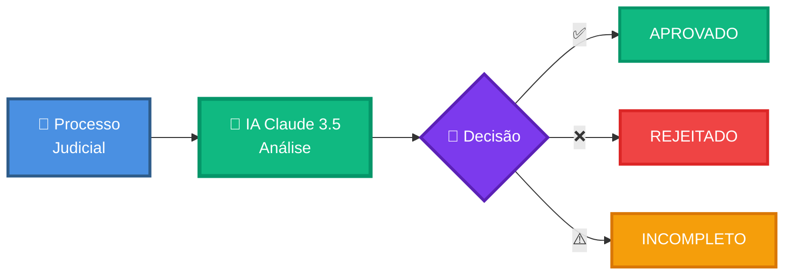
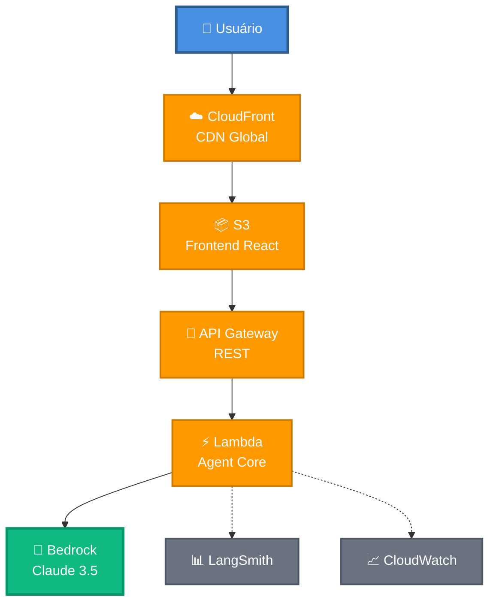

# 🏛️ JUSCASH - Verificador Inteligente de Processos Judiciais

Sistema automatizado de análise de processos judiciais utilizando **LLM (AWS Bedrock Claude 3.5)** para decisões de compra de créditos, baseado em políticas de negócio.


## 🌐 APLICAÇÃO ONLINE

### 🚀 Deploy Produção (AWS Serverless)

| Serviço | URL | Descrição |
|---------|-----|-----------|
| **Frontend** | `https://d26fvod1jq9hfb.cloudfront.net/` | Interface React + Material UI |
| **API** | `https://3p6xtd91q4.execute-api.us-east-1.amazonaws.com/prod/api/v1/verificar` | Endpoints REST |
| **Swagger** | `https://3p6xtd91q4.execute-api.us-east-1.amazonaws.com/prod/docs#/` | Documentação interativa |
| **Health** | `https://3p6xtd91q4.execute-api.us-east-1.amazonaws.com/prod/health` | Status da API |

> **Infraestrutura:** AWS Lambda + API Gateway + CloudFront + S3 + Bedrock + CloudWatch  
> **IaC:** Terraform  
> **Custo Aproximado:**  ~$26/mês para 10k requests

---

## 🎯 Visão Geral


```mermaid
graph LR
    A[📄 Processo<br/>Judicial]:::input --> B[🧠 IA Claude 3.5<br/>Análise]:::ai --> C{🎯 Decisão}:::decision
    C -->|✅| D[APROVADO]:::approved
    C -->|❌| E[REJEITADO]:::rejected
    C -->|⚠️| F[INCOMPLETO]:::incomplete
    
    classDef input fill:#4A90E2,stroke:#2E5C8A,stroke-width:3px,color:#fff
    classDef ai fill:#10B981,stroke:#059669,stroke-width:4px,color:#fff
    classDef decision fill:#7C3AED,stroke:#5B21B6,stroke-width:3px,color:#fff
    classDef approved fill:#10B981,stroke:#059669,stroke-width:3px,color:#fff
    classDef rejected fill:#EF4444,stroke:#DC2626,stroke-width:3px,color:#fff
    classDef incomplete fill:#F59E0B,stroke:#D97706,stroke-width:3px,color:#fff
```

**Cada decisão inclui:**
- Justificativa clara e objetiva
- Citações das políticas aplicadas (POL-1 a POL-8)
- Referências aos documentos analisados

---

## 🏗️ Arquitetura

### ☁️ AWS Serverless


```mermaid
graph TB
    User[👤 Usuário]:::user --> CF[☁️ CloudFront<br/>CDN Global]:::aws
    CF --> S3[📦 S3<br/>Frontend React]:::aws
    S3 --> API[🚪 API Gateway<br/>REST]:::aws
    API --> Lambda[⚡ Lambda<br/>Agent Core]:::aws
    Lambda --> Bedrock[🧠 Bedrock<br/>Claude 3.5]:::ai
    
    Lambda -.-> LS[📊 LangSmith]:::obs
    Lambda -.-> CW[📈 CloudWatch]:::obs
    
    classDef user fill:#4A90E2,stroke:#2E5C8A,stroke-width:3px,color:#fff
    classDef aws fill:#FF9900,stroke:#CC7A00,stroke-width:2px,color:#fff
    classDef ai fill:#10B981,stroke:#059669,stroke-width:3px,color:#fff
    classDef obs fill:#6B7280,stroke:#4B5563,stroke-width:2px,color:#fff
```

> 📊 **[Ver Arquitetura Completa](docs/ARCHITECTURE.md)** | **[Ver Fluxo de Sincronização](docs/SYNC_FLOW.md)**

**Componentes:**
- **CloudFront:** CDN global (200+ edge locations)
- **Lambda:** Serverless compute (auto-scaling)
- **Bedrock:** Claude 3.5 Sonnet (200k tokens)
- **LangSmith:** Observabilidade completa

---

## 📜 Políticas de Negócio

| ID | Regra | Ação |
|----|-------|------|
| **POL-1** | Transitado em julgado + fase de execução | Obrigatório |
| **POL-2** | Valor de condenação informado | Obrigatório |
| **POL-3** | Valor < R$ 1.000 | Rejeitar |
| **POL-4** | Esfera trabalhista | Rejeitar |
| **POL-5** | Óbito sem inventário | Rejeitar |
| **POL-6** | Substabelecimento sem reserva | Rejeitar |
| **POL-7** | Informar honorários | Obrigatório |
| **POL-8** | Documento essencial faltando | Incompleto |

---

## 🚀 Quick Start

### 🐳 Ambiente Local (Docker)

**Pré-requisitos:**
- Docker Desktop 20.10+
- Docker Compose 2.0+

**1. Clone e configure:**
```bash
git clone https://github.com/jcleitonss/JusCash_IA.git


# Edite .env com suas credenciais AWS
```

**2. Suba todos os serviços:**
```bash
cd app-local
docker-compose up --build
```

**3. Acesse:**
- **Frontend:** http://localhost:5173
- **API Docs:** http://localhost:8000/docs
- **LangFlow:** http://localhost:7860
- **Health:** http://localhost:8000/health

---

### ☁️ Deploy AWS (Docker + Terraform)

**Pré-requisitos:**
- Docker Desktop 20.10+
- Credenciais AWS em `keys/.env`

**1. Configure variáveis:**
```bash
cp keys/.env.example keys/.env
# Edite keys/.env com AWS_ACCESS_KEY_ID, AWS_SECRET_ACCESS_KEY, etc
```

**2. Deploy via Docker (não precisa instalar Terraform):**
```bash
cd app-remoto/infrastructure

# Inicializar Terraform
docker compose -f docker-compose.deploy.yml run --rm terraform-init

# Planejar mudanças
docker compose -f docker-compose.deploy.yml run --rm terraform-plan

# Aplicar infraestrutura
docker compose -f docker-compose.deploy.yml run --rm terraform-apply

# Deploy backend
docker compose -f docker-compose.deploy.yml run --rm deploy-backend

# Deploy frontend
docker compose -f docker-compose.deploy.yml run --rm deploy-frontend
```

**3. Obter URLs:**
```bash
docker compose -f docker-compose.deploy.yml run --rm terraform-output
```

**Atalhos via Makefile:**
```bash
make init      # Terraform init
make plan      # Terraform plan
make apply     # Terraform apply
make deploy    # Deploy completo (backend + frontend)
```

---

## 🔌 API Endpoints

### `GET /health`
Health check da API

**Response:**
```json
{
  "status": "ok",
  "service": "juscrash-api",
  "runtime": "aws-lambda",
  "bedrock_agent": {
    "agent_id": "XXXXXXXXXX",
    "status": "active"
  }
}
```

---

### `POST /api/v1/verificar`
Verifica processo judicial conforme políticas POL-1 a POL-8

**Request:**
```json
{
  "numeroProcesso": "0001234-56.2023.4.05.8100",
  "classe": "Cumprimento de Sentença contra a Fazenda Pública",
  "orgaoJulgador": "19ª VARA FEDERAL - SOBRAL/CE",
  "ultimaDistribuicao": "2024-11-18T23:15:44.130Z",
  "assunto": "Rural (Art. 48/51)",
  "segredoJustica": false,
  "justicaGratuita": true,
  "siglaTribunal": "TRF5",
  "esfera": "Federal",
  "documentos": [
    {
      "id": "DOC-1-2",
      "dataHoraJuntada": "2023-12-12T09:05:30.000",
      "nome": "Certidão de Trânsito em Julgado",
      "texto": "Certifico que a sentença transitou em julgado..."
    }
  ],
  "movimentos": [
    {
      "dataHora": "2024-01-20T11:22:33.000",
      "descricao": "Iniciado cumprimento definitivo de sentença."
    }
  ]
}
```

**Response (Aprovado):**
```json
{
  "decision": "approved",
  "rationale": "Processo transitado em julgado (POL-1) e em fase de execução. Valor de condenação R$ 67.592,00 informado (POL-2) e superior ao mínimo (POL-3). Esfera Federal (POL-4 não se aplica). Documentação completa.",
  "citacoes": ["POL-1", "POL-2"]
}
```

**Response (Rejeitado):**
```json
{
  "decision": "rejected",
  "rationale": "Valor de condenação R$ 800,00 inferior ao mínimo de R$ 1.000,00 estabelecido pela política.",
  "citacoes": ["POL-3"]
}
```

**Response (Incompleto):**
```json
{
  "decision": "incomplete",
  "rationale": "Falta certidão de trânsito em julgado. Documento essencial não localizado nos autos.",
  "citacoes": ["POL-8"]
}
```

---

## 🛠️ Tecnologias

### Backend
- **FastAPI** - Framework web moderno e rápido
- **LangChain** - Framework para aplicações LLM
- **LangGraph** - Orquestração de workflows
- **LangSmith** - Observabilidade e debugging
- **AWS Bedrock** - Claude 3.5 Sonnet (LLM)
- **Pydantic** - Validação de dados

### Frontend
- **React 18** - Biblioteca UI
- **Material UI** - Componentes prontos
- **Vite** - Build tool rápido
- **Axios** - Cliente HTTP

### Infraestrutura
- **Docker** - Containerização
- **Terraform** - Infrastructure as Code
- **AWS Lambda** - Compute serverless
- **API Gateway** - REST API gerenciada
- **CloudFront** - CDN global
- **S3** - Storage
- **CloudWatch** - Storage


### Orquestração

```mermaid
graph LR
    LF[🎨 LangFlow<br/>Editor Visual]:::lf <-->|⇄| SA[🔄 Sync Agent<br/>✅ Atual]:::sa
    Observação: O LangFlow precisa que você clique no link do log do Sync Agent pra poder fazer a primeira  visualização de um workflow importado.
    Você pode ver os links dos workflows importados nos logs do conteiner rodando no console docker.
    Já esta salvo um workflow.json que será importado e tem a estrutura do projeto para testes.
    SA <-->|⇄| FS[(💾 langflow-flows/<br/>workflow.json)]:::fs
    FS -.->|Identifica| ST[🔧 Sync Tradutor<br/>🔜 Futuro]:::st
    ST -.->|Gera| BE[⚙️ Backend<br/>workflow.py]:::be
    
    classDef lf fill:#7C3AED,stroke:#5B21B6,stroke-width:3px,color:#fff
    classDef sa fill:#10B981,stroke:#059669,stroke-width:3px,color:#fff
    classDef fs fill:#6B7280,stroke:#4B5563,stroke-width:2px,color:#fff
    classDef st fill:#F59E0B,stroke:#D97706,stroke-width:3px,color:#fff,stroke-dasharray: 5 5
    classDef be fill:#3B82F6,stroke:#1D4ED8,stroke-width:2px,color:#fff
```

> 📖 **[Ver Fluxo Completo de Sincronização](docs/SYNC_FLOW.md)** - Diagramas detalhados

**Componentes:**
- **LangFlow** - Editor visual drag-and-drop
- **Sync Agent** - Sincronização bidirecional LangFlow ⇄ Filesystem (✅ Implementado)
- **Sync Tradutor** - Tradução workflow.json → Python LangGraph (🔜 Futuro)

---

## 🎯 Decisões Técnicas

### Por que AWS Bedrock Claude 3.5 Sonnet? 

✅ **Raciocínio Jurídico:** Otimizado para análise de documentos legais  
✅ **Context Window:** 200k tokens (processa processos completos)  
✅ **Saída Estruturada:** JSON nativo com validação  
✅ **Latência:** ~2-3s por análise  
✅ **Custo:** $3/1M tokens input, $15/1M tokens output  
✅ **Integração AWS:** Nativa com Lambda, IAM, CloudWatch  
✅ **Compliance:** Segurança e privacidade AWS  

Obs: Futuramente usar o Claude 4.5 Sonnet.

### Por que LangGraph?

✅ **Workflow Visual + Código:** Melhor dos dois mundos  
✅ **Controle Total:** Fluxo determinístico  
✅ **Debug Facilitado:** Traces por nó  
✅ **Versionamento:** Git-friendly  
✅ **Testes:** Unitários por nó  

### Por que LangFlow?

✅ **Editor Drag-and-Drop:** Não-técnicos podem modificar  
✅ **Exportação JSON:** Sincronização automática  
✅ **Prototipagem Rápida:** Testar ideias rapidamente  
✅ **Sync Agent:** Versionamento automático no Git  

### Por que React + Material UI?

✅ **UX Profissional:** Melhor que Streamlit  
✅ **Componentização:** Código reutilizável  
✅ **Responsivo:** Mobile-first  
✅ **Pronto para Produção:** Enterprise-grade  

### Por que AWS Serverless?

✅ **Escalabilidade:** 0 a 10k requests/s automático  
✅ **Custo:** Paga apenas pelo uso (~$26/mês)  
✅ **Disponibilidade:** 99.99% SLA  
✅ **Global:** CloudFront em 200+ edge locations  
✅ **Manutenção:** Zero gerenciamento de servidores  

---

## 📁 Estrutura do Projeto

```
JusCash_AI/
│
├── app-local/                      # 🐳 Ambiente Local (Docker)
│   ├── backend/                    # FastAPI + LangGraph
│   │   ├── app/
│   │   │   ├── main.py            # Endpoints REST
│   │   │   ├── workflow.py        # LangGraph workflow
│   │   │   ├── models.py          # Pydantic schemas
│   │   │   ├── llm_service.py     # Bedrock client
│   │   │   └── observability.py   # LangSmith setup
│   │   ├── Dockerfile
│   │   ├── requirements.txt
│   │   └── .env.example
│   │
│   ├── frontend/                   # React + Material UI
│   │   ├── src/
│   │   │   ├── components/
│   │   │   ├── services/
│   │   │   └── App.jsx
│   │   ├── Dockerfile
│   │   └── package.json
│   │
│   ├── langflow/                   # Editor Visual
│   │   ├── docker-compose.yml
│   │   └── README.md
│   │
│   ├── sync-agent/                 # LangFlow → Git
│   │   ├── sync_agent.py
│   │   └── Dockerfile
│   │
│   └── docker-compose.yml          # Orquestra todos os serviços
│
├── app-remoto/                     # ☁️ Deploy AWS Serverless
│   ├── agent-core/                 # Lambda Function
│   │   ├── src/
│   │   │   ├── handler.py         # Lambda entry point
│   │   │   ├── workflow_bedrock.py
│   │   │   └── models.py
│   │   ├── Dockerfile
│   │   └── requirements.txt
│   │
│   ├── frontend/                   # React (S3 + CloudFront)
│   │   ├── src/
│   │   └── package.json
│   │
│   └── infrastructure/             # Terraform IaC
│       ├── Makefile               # Comandos de deploy
│       ├── main.tf
│       ├── lambda.tf
│       ├── apigateway.tf
│       ├── cloudfront.tf
│       └── s3.tf
│
│
└── README.md                       # Este arquivo
```

---

## 🧪 Testes

### Testar API Local

```bash
curl -X POST http://localhost:8000/api/v1/verificar \
  -H "Content-Type: application/json" \
  -d @data/processos_exemplo.json
```

### Testar API Remota

```bash
curl -X POST [SEU_API_GATEWAY_URL]/api/v1/verificar \
  -H "Content-Type: application/json" \
  -d @data/processos_exemplo.json
```

### Health Check

```bash
# Local
curl http://localhost:8000/health

# Remoto
curl [SEU_API_GATEWAY_URL]/health
```

---

## 📊 Observabilidade

### LangSmith (Traces)
- Latência por nó do workflow
- Tokens consumidos (input/output)
- Custo por request
- Prompts e respostas completas
- Debug de decisões

**Acesso:** https://smith.langchain.com

**📊 [Ver Exemplo de Trace Público](https://smith.langchain.com/public/187fd186-e39b-433c-bf9c-1c5fa15a9968/r)** - Análise completa de um processo judicial

### CloudWatch (AWS)
- Logs do Lambda
- Métricas de performance
- Alertas automáticos
- Dashboard customizado


---

## 🔐 Variáveis de Ambiente

### 🔑 keys/.env (Compartilhado)

**Arquivo:** `keys/.env`

```bash
# AWS Bedrock
AWS_ACCESS_KEY_ID=AKIA...
AWS_SECRET_ACCESS_KEY=...
AWS_REGION=us-east-1
BEDROCK_MODEL_ID=anthropic.claude-3-5-sonnet-20241022-v2:0

# LangSmith (Observabilidade)
LANGCHAIN_TRACING_V2=true
LANGCHAIN_API_KEY=lsv2_pt_...
LANGCHAIN_PROJECT=juscrash

# Git (para comandos Docker)
GITHUB_TOKEN=ghp_...
GITHUB_USER=seu-usuario
GITHUB_REPO=JUSCRASH

# API
LOG_LEVEL=INFO
```

### Backend Local (.env)

```bash
# Usa keys/.env automaticamente via docker-compose
```

### Frontend (.env)

```bash
# Local
VITE_API_URL=http://localhost:8000

# Remoto
VITE_API_URL=[SEU_API_GATEWAY_URL]
```

### Como Obter as Chaves

**AWS:**
1. Console AWS → IAM → Users → Security credentials
2. Create access key
3. Copiar `AWS_ACCESS_KEY_ID` e `AWS_SECRET_ACCESS_KEY`

**LangSmith:**
1. https://smith.langchain.com → Settings → API Keys
2. Create API Key
3. Copiar `LANGCHAIN_API_KEY`

**GitHub:**
1. GitHub → Settings → Developer settings → Personal access tokens
2. Generate new token (classic)
3. Permissões: `repo` (full control)
4. Copiar `GITHUB_TOKEN`

---

## 🚀 Comandos Úteis

### 🐳 Local (Docker Compose)

```bash
cd app-local

# Subir todos os serviços
docker-compose up --build

# Ver logs
docker-compose logs -f backend

# Parar tudo
docker-compose down

# Rebuild específico
docker-compose up --build backend
```

---

### ☁️ Remoto (Docker + Terraform + Git)

**Localização:**
```bash
cd app-remoto/infrastructure
```

#### 🔧 Git via Docker

```bash
# Inicializar repositório (primeira vez)
docker compose -f docker-compose.deploy.yml run --rm git-init

# Salvar mudanças em branch dev
docker compose -f docker-compose.deploy.yml run --rm -e MSG="feat: nova feature" git-save

# Ver status
docker compose -f docker-compose.deploy.yml run --rm git-status
```

**Atalhos Makefile:**
```bash
make git-init
make save MSG="feat: nova feature"
make status
```

---

#### 🏗️ Terraform via Docker

```bash
# Inicializar
docker compose -f docker-compose.deploy.yml run --rm terraform-init

# Planejar mudanças
docker compose -f docker-compose.deploy.yml run --rm terraform-plan

# Aplicar
docker compose -f docker-compose.deploy.yml run --rm terraform-apply

# Ver outputs (URLs)
docker compose -f docker-compose.deploy.yml run --rm terraform-output
```

**Atalhos Makefile:**
```bash
make init
make plan
make apply
make output
```

---

#### 🚀 Deploy AWS via Docker

```bash
# Deploy backend (Lambda)
docker compose -f docker-compose.deploy.yml run --rm deploy-backend

# Deploy frontend (S3)
docker compose -f docker-compose.deploy.yml run --rm deploy-frontend
```

**Atalhos Makefile:**
```bash
make deploy-backend
make deploy-frontend
make deploy  # ambos
```

---

#### 🔄 Workflow Completo

```bash
# 1. Salvar código em dev
make save MSG="feat: implementa nova funcionalidade"

# 2. Planejar infraestrutura
make plan

# 3. Aplicar mudanças AWS
make apply

# 4. Deploy aplicação
make deploy

# 5. Ver URLs públicas
make output

# 6. Ver logs Lambda
make logs

# 7. Testar API
make test
```

---

#### 📦 Workflow Produção

```bash
# Merge dev→main + tag + deploy
make prod
```

Este comando:
1. Incrementa versão automaticamente
2. Merge branch dev → main
3. Cria tag Git (ex: v1.0.1)
4. Push para GitHub
5. Deploy completo na AWS
6. Volta para branch dev

---


## 👤 Autor

**José Cleiton**

---
