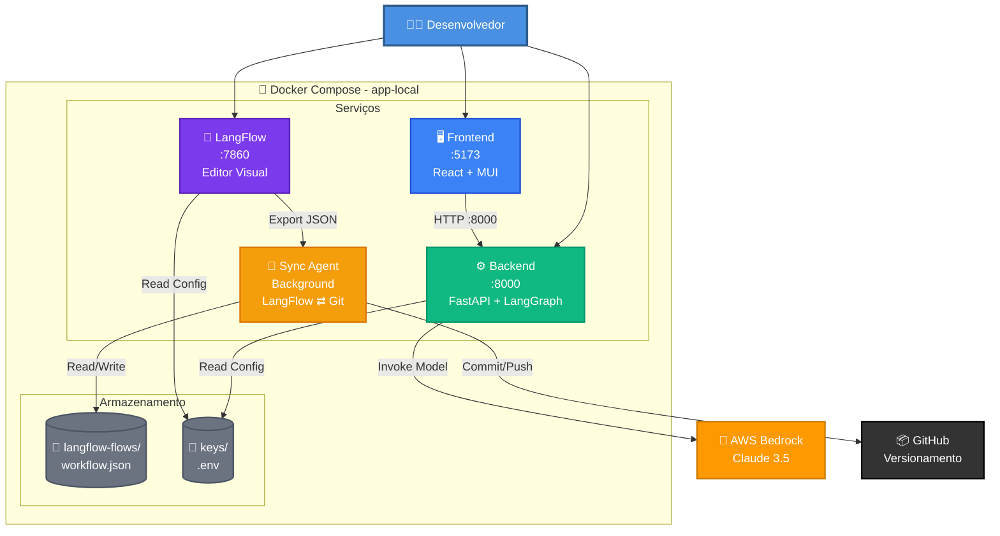
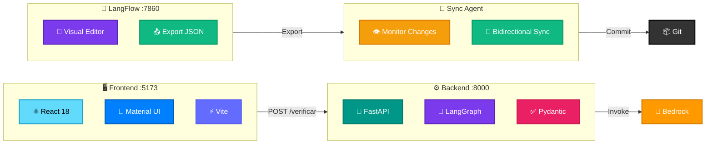

# 🐳 App Local - JUSCASH

Ambiente de desenvolvimento local com Docker Compose.

---

## 🏗️ Arquitetura Completa



---

## 📁 Estrutura

```
app-local/
├── backend/          # FastAPI + LangGraph
├── frontend/         # React + Material UI
├── langflow/         # Editor visual de workflows
├── sync-agent/       # Sincronização LangFlow ⇄ Git
├── langflow-flows/   # Workflows exportados (JSON)
├── keys/             # Credenciais AWS (não commitado)
└── docker-compose.yml
```

---

## 🚀 Quick Start

```bash
cd app-local
docker-compose up --build
```

**Acesse:**
- 🖥️ **Frontend:** http://localhost:5173
- ⚙️ **Backend:** http://localhost:8000
- 🎨 **LangFlow:** http://localhost:7860
- 📖 **API Docs:** http://localhost:8000/docs

---

## 🔧 Configuração

### **1. Credenciais AWS**

Edite `keys/.env`:

```bash
AWS_ACCESS_KEY_ID=AKIA...
AWS_SECRET_ACCESS_KEY=...
AWS_REGION=us-east-1
BEDROCK_MODEL_ID=anthropic.claude-sonnet-4-5-20250929-v1:0
```

📖 **Ver:** [docs/setup/AWS_SETUP.md](../docs/setup/AWS_SETUP.md)

---

### **2. Subir Serviços**

```bash
# Todos os serviços
docker-compose up --build

# Apenas backend
docker-compose up backend

# Apenas frontend
docker-compose up frontend

# Apenas LangFlow
docker-compose up langflow
```

---

## 📦 Serviços



### **Backend (porta 8000)**
- FastAPI + LangGraph
- Análise de processos via Bedrock
- Endpoints REST

### **Frontend (porta 5173)**
- React 18 + Material UI
- Interface para upload de processos
- Visualização de decisões

### **LangFlow (porta 7860)**
- Editor visual drag-and-drop
- Criação de workflows LLM
- Exportação para JSON

### **Sync Agent (background)**
- Sincronização automática LangFlow ⇄ Git
- Monitora mudanças em `langflow-flows/`
- Importa/exporta workflows

---

## 🧪 Testar

### **Health Check**

```bash
curl http://localhost:8000/health
```

### **Verificar Processo**

```bash
curl -X POST http://localhost:8000/api/v1/verificar \
  -H "Content-Type: application/json" \
  -d @data/processo_teste.json
```

---

## 🛑 Parar

```bash
docker-compose down
```

---

## 📊 Logs

```bash
# Todos os serviços
docker-compose logs -f

# Apenas backend
docker-compose logs -f backend

# Apenas frontend
docker-compose logs -f frontend
```

---

## 🐛 Troubleshooting

### **Porta já em uso**

```bash
# Parar containers antigos
docker-compose down
docker ps -a
docker rm -f $(docker ps -aq)
```

### **Erro de build**

```bash
# Rebuild sem cache
docker-compose build --no-cache
docker-compose up
```

### **Bedrock access denied**

- Verifique `keys/.env`
- Confirme modelo habilitado no console AWS

---

## 📚 Documentação Completa

- 📖 [Setup Local](../docs/setup/LOCAL_SETUP.md)
- 🔐 [Setup AWS](../docs/setup/AWS_SETUP.md)
- 🎨 [Setup LangFlow](../docs/setup/LANGFLOW_SETUP.md)
- ⚙️ [Backend](../docs/components/BACKEND.md)
- 🖥️ [Frontend](../docs/components/FRONTEND.md)
