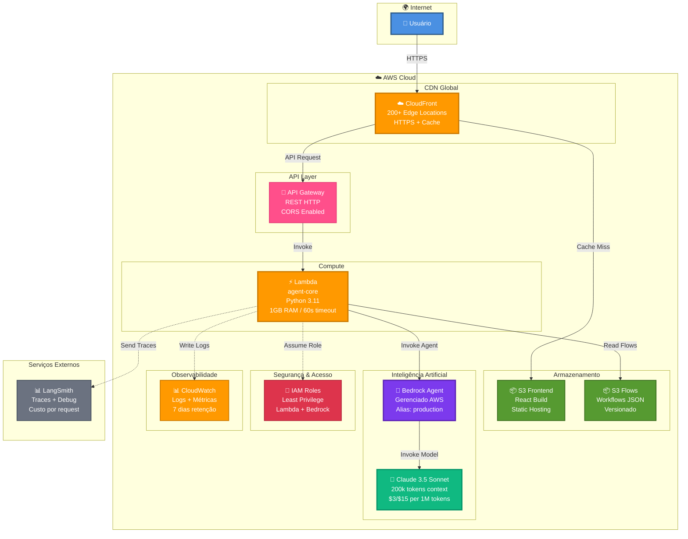
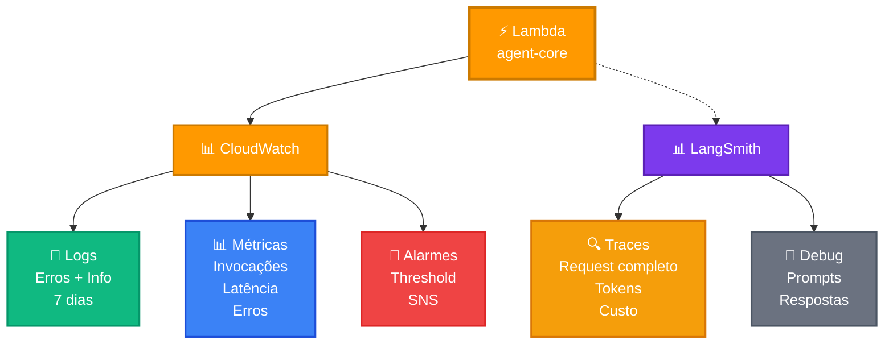

# ☁️ App Remoto - JUSCASH

Deploy serverless na AWS com Terraform.

---

## 🏗️ Arquitetura AWS Serverless Completa



---

## 📁 Estrutura

```
app-remoto/
├── agent-core/        # Lambda function (Python)
├── frontend/          # React build para S3
├── infrastructure/    # Terraform IaC
│   ├── main.tf
│   ├── lambda.tf
│   ├── apigateway.tf
│   ├── cloudfront.tf
│   ├── s3.tf
│   ├── bedrock-agent.tf
│   └── Makefile
└── .version           # Versionamento semântico
```

---

## 🚀 Quick Start

```bash
cd app-remoto/infrastructure

# 1. Inicializar Terraform
make init

# 2. Planejar mudanças
make plan

# 3. Aplicar infraestrutura
make apply

# 4. Deploy aplicação
make deploy
```

📖 **Ver:** [docs/deploy/QUICKSTART.md](../docs/deploy/QUICKSTART.md)

---

## 🏗️ Infraestrutura AWS

```mermaid
graph LR
    subgraph Terraform["🏗️ Terraform IaC"]
        Main[main.tf<br/>Provider + Backend]:::tfStyle
        Lambda[lambda.tf<br/>Function + IAM]:::tfStyle
        API[apigateway.tf<br/>HTTP API]:::tfStyle
        CF[cloudfront.tf<br/>CDN]:::tfStyle
        S3[s3.tf<br/>Buckets]:::tfStyle
        Bedrock[bedrock-agent.tf<br/>Agent]:::tfStyle
    end
    
    subgraph Deploy["🚀 Deploy Tools"]
        Make[Makefile<br/>Comandos]:::makeStyle
        Docker[🐳 Docker<br/>Containers]:::dockerStyle
        Git[📦 Git<br/>Versionamento]:::gitStyle
    end
    
    Terraform -->|terraform apply| AWS[☁️ AWS<br/>7 Recursos]:::awsStyle
    Deploy -->|Executa| Terraform
    
    classDef tfStyle fill:#7C3AED,stroke:#5B21B6,stroke-width:2px,color:#fff
    classDef makeStyle fill:#10B981,stroke:#059669,stroke-width:2px,color:#fff
    classDef dockerStyle fill:#2496ED,stroke:#1D7FBD,stroke-width:2px,color:#fff
    classDef gitStyle fill:#333,stroke:#000,stroke-width:2px,color:#fff
    classDef awsStyle fill:#FF9900,stroke:#CC7A00,stroke-width:3px,color:#fff
```



### **Recursos Criados:**

- ☁️ **CloudFront** - CDN global (200+ edge locations)
- 📦 **S3** - Frontend + Flows storage (versionado)
- ⚡ **Lambda** - Agent core Python 3.11 (1GB/60s)
- 🚪 **API Gateway** - REST HTTP (CORS enabled)
- 🧠 **Bedrock Agent** - Claude 3.5 Sonnet
- 👮 **IAM** - Roles com least privilege
- 📊 **CloudWatch** - Logs (7 dias) + Métricas

---

## 💰 Custos Estimados

| Recurso | Custo/mês (10k req) |
|---------|---------------------|
| CloudFront | $5.00 |
| Lambda | $5.00 |
| API Gateway | $0.35 |
| S3 | $0.50 |
| Bedrock | $15.00 |
| **Total** | **~$26/mês** |

---

## 🔧 Configuração

### **1. Credenciais AWS**

Edite `keys/.env`:

```bash
AWS_ACCESS_KEY_ID=AKIA...
AWS_SECRET_ACCESS_KEY=...
AWS_REGION=us-east-1
```

---

### **2. Variáveis Terraform**

Edite `infrastructure/terraform.tfvars`:

```hcl
aws_region   = "us-east-1"
environment  = "prod"
project_name = "juscrash"
```

---

## 📋 Comandos Makefile

### **Terraform**

```bash
make init      # Inicializar
make plan      # Planejar mudanças
make apply     # Aplicar infraestrutura
make output    # Ver URLs
```

### **Deploy**

```bash
make deploy-backend   # Deploy Lambda
make deploy-frontend  # Deploy React
make deploy           # Deploy completo
```

### **Git Workflow**

```bash
make save MSG="feat: nova feature"  # Salvar em dev
make stage                          # Deploy staging
make deploy-prod                    # Deploy produção
```

📖 **Ver:** [docs/deploy/GIT_WORKFLOW.md](../docs/deploy/GIT_WORKFLOW.md)

---

### **Monitoramento**

```bash
make logs      # Ver logs Lambda
make test-api  # Testar API
make status    # Status AWS
```

---

## 🌐 URLs Produção

Após deploy, obtenha as URLs:

```bash
make output
```

**Saída:**
```
frontend_url = "https://d26fvod1jq9hfb.cloudfront.net"
api_url = "https://3p6xtd91q4.execute-api.us-east-1.amazonaws.com/prod"
```

---

## 🔄 Workflow Git

```
dev (desenvolvimento) → staging (testes) → main (produção)
```

### **Desenvolvimento Diário**

```bash
make save MSG="feat: implementa POL-3"
```

### **Deploy Staging**

```bash
make stage
```

### **Deploy Produção**

```bash
make deploy-prod
# Versão: 0.1.0 → 0.1.1
```

---

## 🏷️ Versionamento

```bash
make version       # Ver versão atual
make bump-patch    # 0.1.0 → 0.1.1
make bump-minor    # 0.1.0 → 0.2.0
make bump-major    # 0.1.0 → 1.0.0
```

---

## 🧪 Testar

### **Health Check**

```bash
curl https://YOUR_API_URL/health
```

### **Verificar Processo**

```bash
curl -X POST https://YOUR_API_URL/api/v1/verificar \
  -H "Content-Type: application/json" \
  -d @agent-core/test_processo.json
```

---

## 📊 Monitoramento



### **Logs Lambda**

```bash
make logs

# Ou direto
aws logs tail /aws/lambda/juscrash-agent-core --follow
```

### **Métricas CloudWatch**

```bash
aws cloudwatch get-metric-statistics \
  --namespace AWS/Lambda \
  --metric-name Invocations \
  --dimensions Name=FunctionName,Value=juscrash-agent-core \
  --start-time $(date -u -d '1 hour ago' +%Y-%m-%dT%H:%M:%S) \
  --end-time $(date -u +%Y-%m-%dT%H:%M:%S) \
  --period 300 \
  --statistics Sum
```

---

## 🐛 Troubleshooting

### **Lambda não atualiza**

```bash
make deploy-backend
```

### **Frontend não carrega**

```bash
# Invalidar cache CloudFront
aws cloudfront create-invalidation \
  --distribution-id $(terraform output -raw cloudfront_distribution_id) \
  --paths "/*"
```

### **Terraform state locked**

```bash
# Forçar unlock
terraform force-unlock <LOCK_ID>
```

---

## 🗑️ Destruir Infraestrutura

⚠️ **CUIDADO:** Deleta TODOS os recursos!

```bash
cd infrastructure
terraform destroy
```

---

## 📚 Documentação Completa

- 🚀 [Quick Start](../docs/deploy/QUICKSTART.md)
- 🏗️ [Terraform](../docs/deploy/TERRAFORM.md)
- 🐳 [Docker Deploy](../docs/deploy/DOCKER_DEPLOY.md)
- 🔄 [Git Workflow](../docs/deploy/GIT_WORKFLOW.md)
- 🧠 [Bedrock Agent](../docs/deploy/BEDROCK_AGENT.md)
- ⚡ [Lambda](../docs/components/LAMBDA.md)
