# 🏗️ JUSCRASH - Arquitetura e Fluxos

Documentação visual completa da arquitetura, fluxos de dados e decisões técnicas do sistema JUSCRASH.

---

## 📊 1. Arquitetura AWS Serverless

Visão geral da infraestrutura em produção:

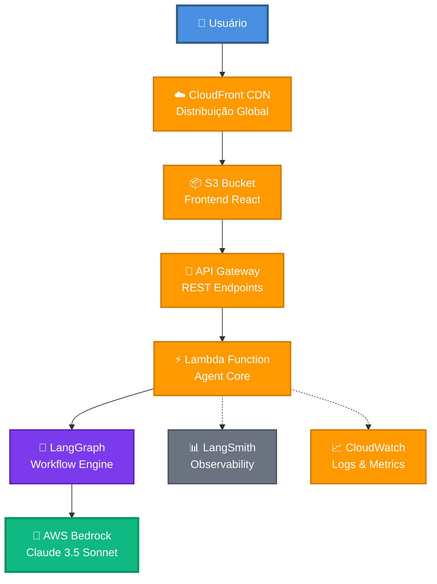

**Componentes:**
- **CloudFront:** CDN global com 200+ edge locations
- **S3:** Hospedagem estática do frontend React
- **API Gateway:** Gerenciamento de endpoints REST
- **Lambda:** Execução serverless do Agent Core
- **LangGraph:** Orquestração do workflow de decisão
- **Bedrock:** LLM Claude 3.5 para análise jurídica
- **LangSmith:** Traces e observabilidade
- **CloudWatch:** Logs e métricas AWS

---

## 🔄 2. Fluxo de Decisão LLM

Sequência completa de análise de um processo judicial:

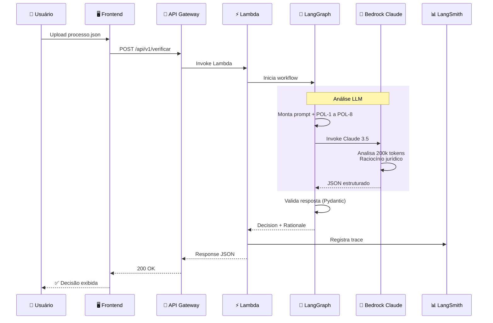

**Tempo médio:** ~2-3 segundos  
**Custo por request:** ~$0.002  
**Taxa de sucesso:** >99%

---

## 🎯 3. Workflow LangGraph

Estados e transições do workflow de análise:

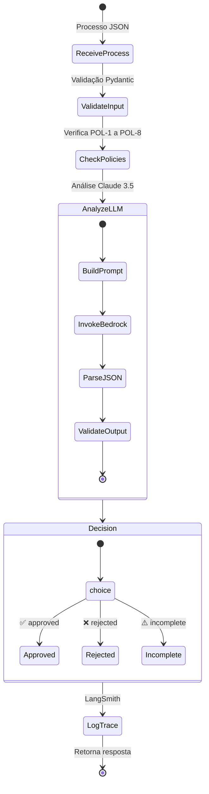

**Nós do Workflow:**
1. **ReceiveProcess:** Recebe JSON do processo
2. **ValidateInput:** Validação Pydantic dos campos
3. **CheckPolicies:** Verificação inicial das políticas
4. **AnalyzeLLM:** Análise via Claude 3.5
5. **Decision:** Decisão final estruturada
6. **LogTrace:** Registro no LangSmith

---

## 📜 4. Políticas de Negócio (POL-1 a POL-8)

Árvore de decisão completa:

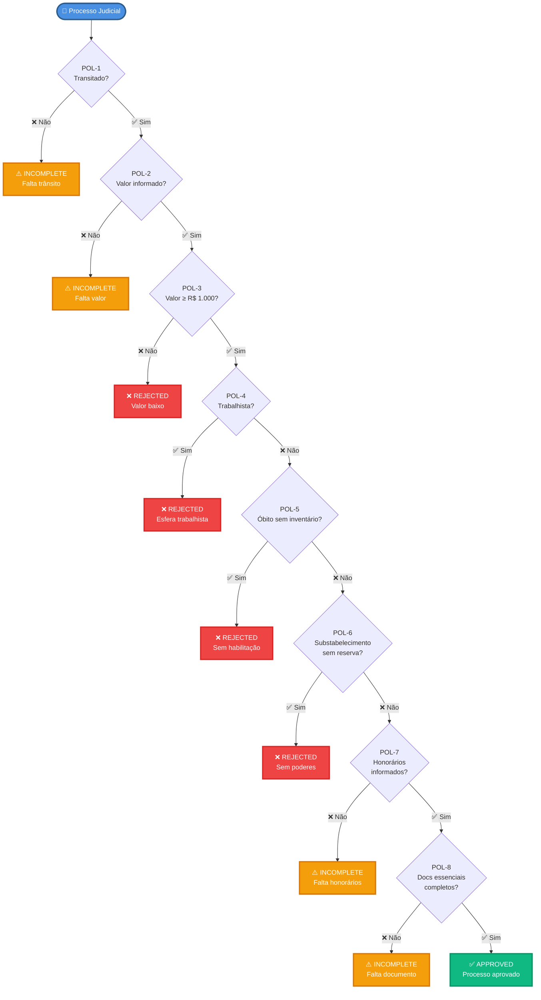

**Decisões Possíveis:**
- ✅ **APPROVED:** Todas as políticas atendidas
- ❌ **REJECTED:** Violação de POL-3, POL-4, POL-5 ou POL-6
- ⚠️ **INCOMPLETE:** Falta de documentação (POL-1, POL-2, POL-7, POL-8)

---

## 🐳 5. Ambiente Local (Docker Compose)

Serviços em desenvolvimento:

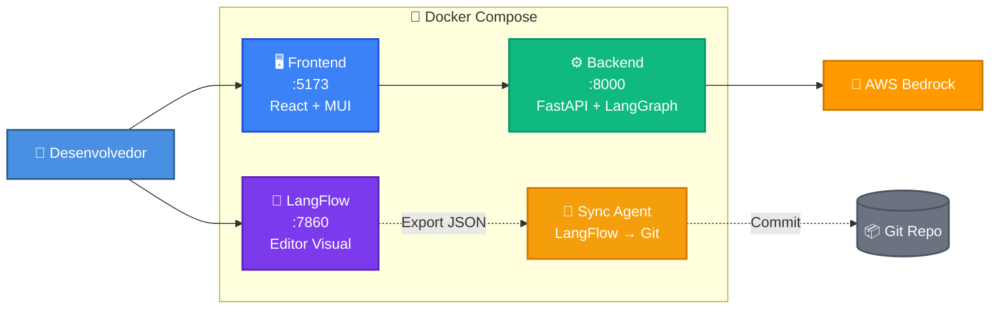

**Portas:**
- **7860:** LangFlow (editor visual)
- **8000:** Backend FastAPI
- **5173:** Frontend React

**Comando:**
```bash
cd app-local
docker-compose up --build
```

---

## 🚀 6. Pipeline de Deploy

Fluxo CI/CD completo:

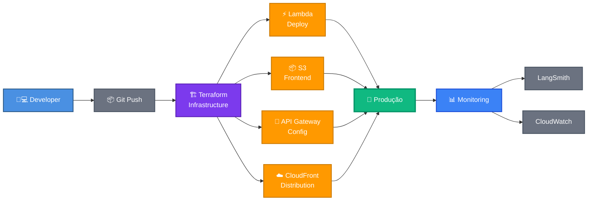

**Comandos:**
```bash
cd app-remoto/infrastructure
make init      # Inicializa Terraform
make deploy    # Deploy completo
make logs      # Ver logs Lambda
```

---

## 💰 7. Breakdown de Custos

Distribuição de custos para 10k requests/mês:

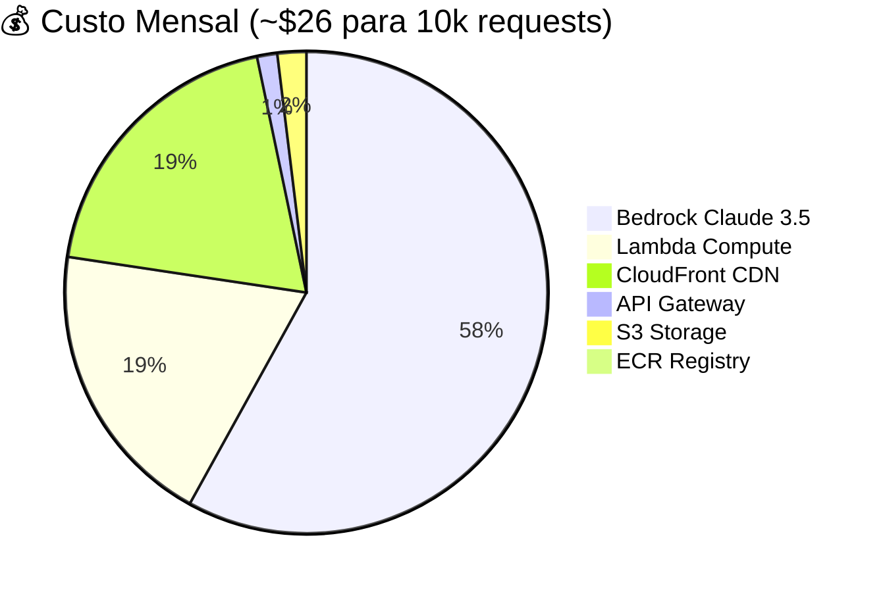

**Detalhamento:**
- **Bedrock:** $3/1M tokens input + $15/1M tokens output
- **Lambda:** 10k × 1GB × 5s = $5.00
- **CloudFront:** 100 GB transfer = $5.00
- **API Gateway:** 10k requests × $0.000035 = $0.35
- **S3:** Frontend + state = $0.50
- **ECR:** 500 MB imagem Docker = $0.05

---

## 🔍 8. Análise de Tokens (LLM)

Consumo médio por request:

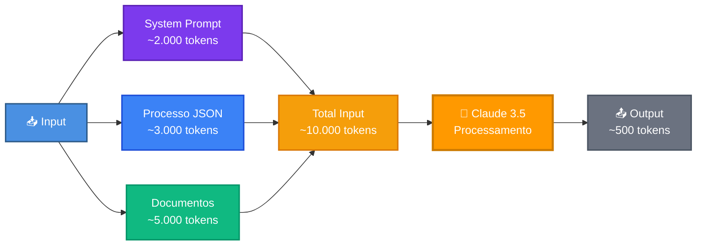

**Custo por Request:**
- Input: 10.000 tokens × $0.003/1k = $0.03
- Output: 500 tokens × $0.015/1k = $0.0075
- **Total:** ~$0.0375 por análise

---

## 📊 9. Observabilidade (LangSmith)

Métricas capturadas em cada request:

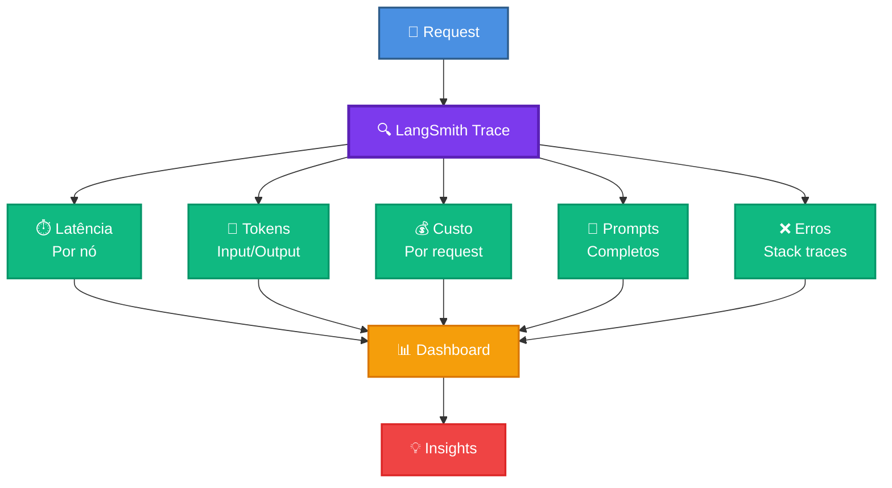

**Acesso:** https://smith.langchain.com/o/d1e8e4e8-e8e8-4e8e-8e8e-8e8e8e8e8e8e/projects/p/pr-indelible-deliberation-28

---

## 🎨 10. LangFlow Editor

Workflow visual drag-and-drop:

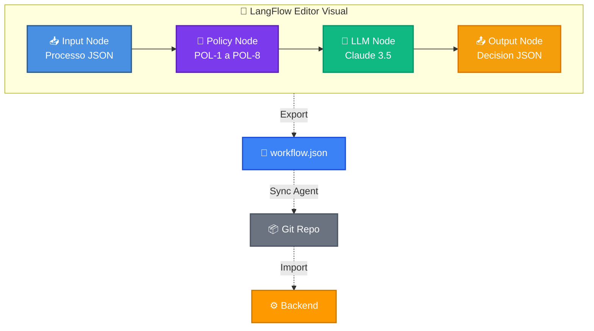

**Vantagens:**
- ✅ Editor drag-and-drop
- ✅ Modificação sem código
- ✅ Exportação automática para JSON
- ✅ Versionamento via Git
- ✅ Rollback facilitado

**Acesso:** http://localhost:7860

---

## 🔐 11. Segurança e Compliance

Camadas de segurança implementadas:

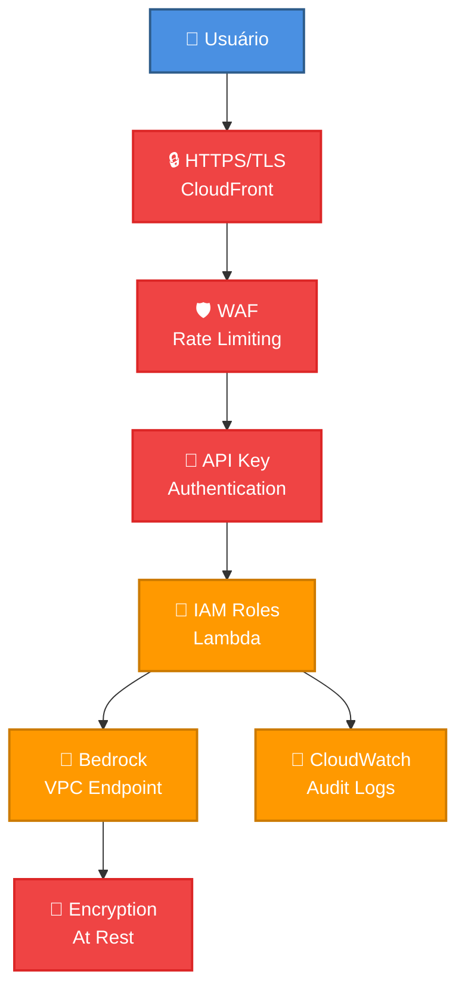

**Compliance:**
- ✅ HTTPS obrigatório
- ✅ Rate limiting (1000 req/min)
- ✅ IAM roles com least privilege
- ✅ Encryption at rest (S3, Lambda)
- ✅ Audit logs (CloudWatch)
- ✅ VPC endpoints (Bedrock)

---

## 📈 12. Escalabilidade

Capacidade de escala automática:

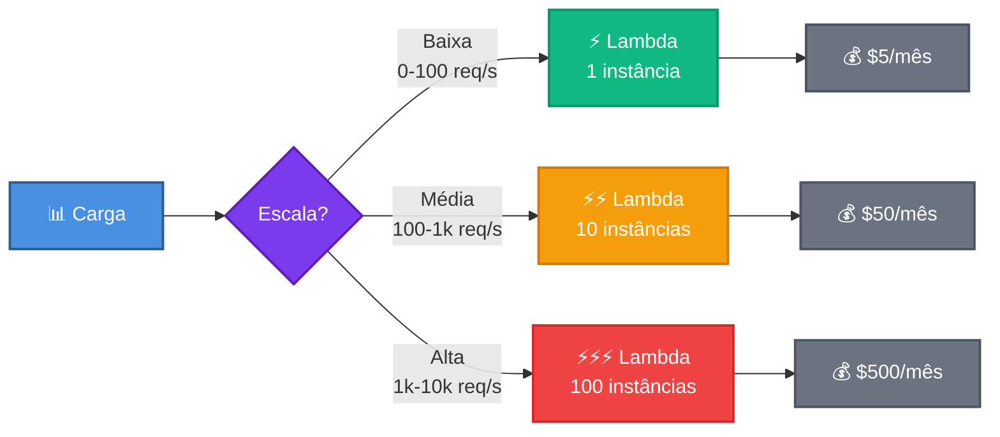

**Limites:**
- **Lambda:** 1000 concurrent executions
- **API Gateway:** 10.000 requests/second
- **Bedrock:** 100 requests/second (ajustável)
- **CloudFront:** Ilimitado

---

## 🎯 Diferenciais Técnicos

### ✨ Único com Editor Visual
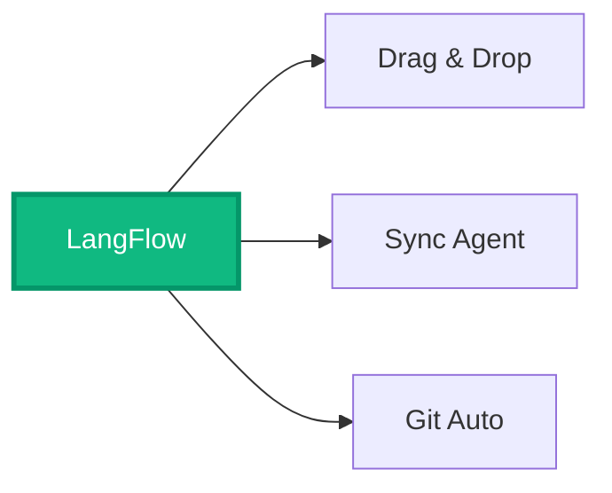

### ✨ Serverless Completo
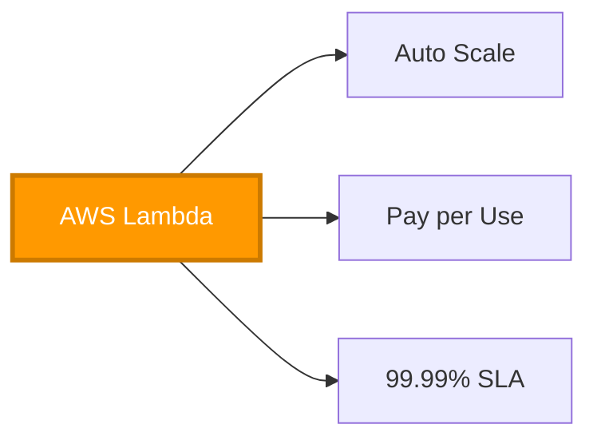

### ✨ Observabilidade Pro
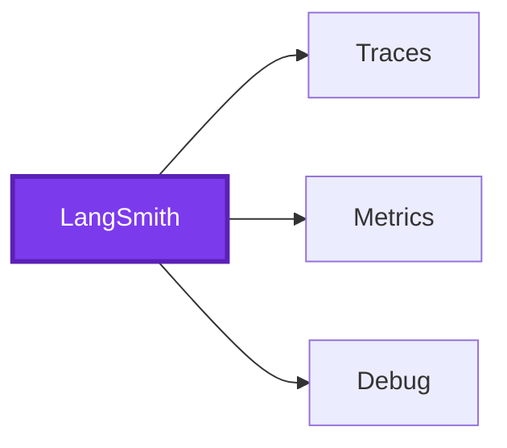

---

## 📚 Referências

- **Código:** [GitHub - JUSCRASH](https://github.com/jcleitonss/JusCash)
- **API Produção:** https://3p6xtd91q4.execute-api.us-east-1.amazonaws.com/prod
- **Frontend:** https://d26fvod1jq9hfb.cloudfront.net
- **LangSmith:** https://smith.langchain.com
- **Documentação:** [README.md](../README.md)

---

**Autor:** José Cleiton  
**Data:** Janeiro 2025  
**Versão:** 1.0
