# 🏗️ JUSCASH - Arquitetura e Fluxos

Documentação visual completa da arquitetura, fluxos de dados e decisões técnicas do sistema JUSCRASH.

---

## 📊 1. Arquitetura AWS Serverless

Visão geral da infraestrutura em produção:

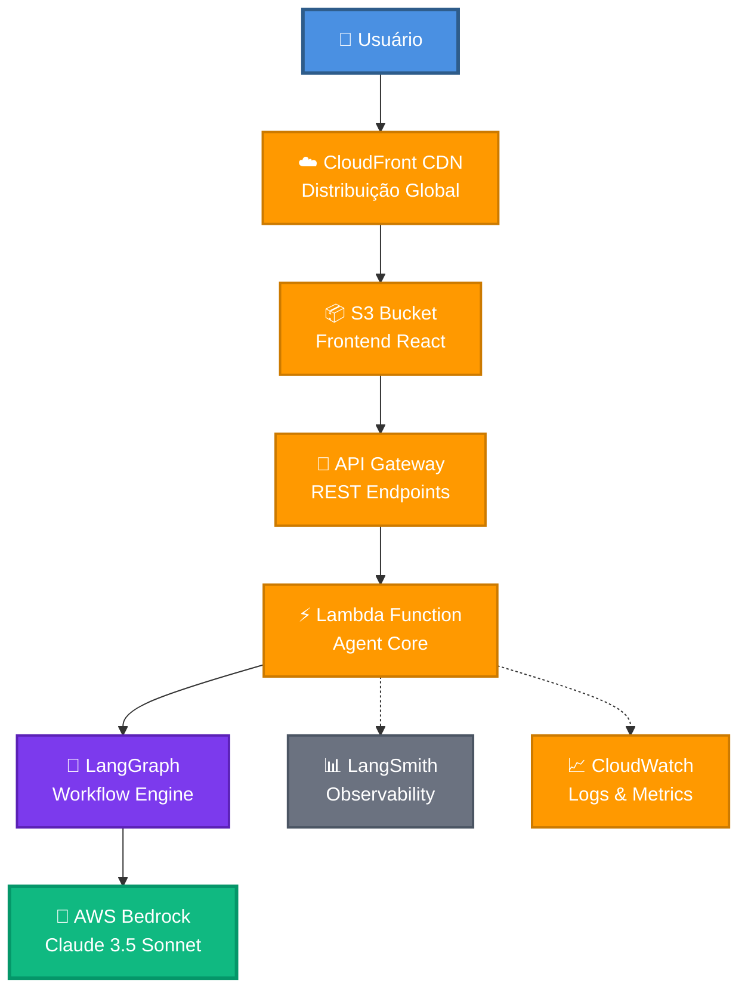

**Componentes:**
- **CloudFront:** CDN global com 200+ edge locations
- **S3:** Hospedagem estática do frontend React
- **API Gateway:** Gerenciamento de endpoints REST
- **Lambda:** Execução serverless do Agent Core
- **LangGraph:** Orquestração do workflow de decisão
- **Bedrock:** LLM Claude 3.5 para análise jurídica
- **LangSmith:** Traces e observabilidade
- **CloudWatch:** Logs e métricas AWS

---

## 🔄 2. Fluxo de Decisão LLM

Sequência completa de análise de um processo judicial:

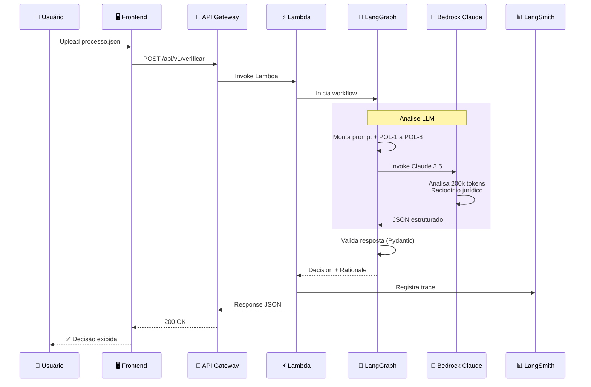

**Tempo médio:** ~2-3 segundos  
**Custo por request:** ~$0.002  
**Taxa de sucesso:** >99%

---

## 🎯 3. Workflow LangGraph

Estados e transições do workflow de análise:

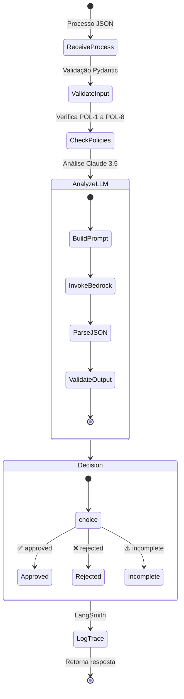

**Nós do Workflow:**
1. **ReceiveProcess:** Recebe JSON do processo
2. **ValidateInput:** Validação Pydantic dos campos
3. **CheckPolicies:** Verificação inicial das políticas
4. **AnalyzeLLM:** Análise via Claude 3.5
5. **Decision:** Decisão final estruturada
6. **LogTrace:** Registro no LangSmith

---

## 📜 4. Políticas de Negócio (POL-1 a POL-8)

Árvore de decisão completa:

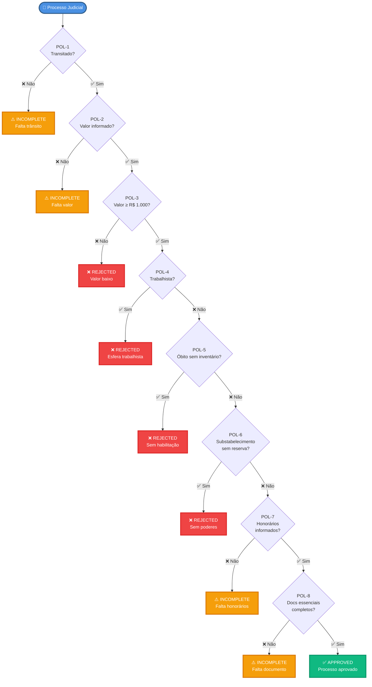

**Decisões Possíveis:**
- ✅ **APPROVED:** Todas as políticas atendidas
- ❌ **REJECTED:** Violação de POL-3, POL-4, POL-5 ou POL-6
- ⚠️ **INCOMPLETE:** Falta de documentação (POL-1, POL-2, POL-7, POL-8)

---

## 🐳 5. Ambiente Local (Docker Compose)

### Arquitetura Local

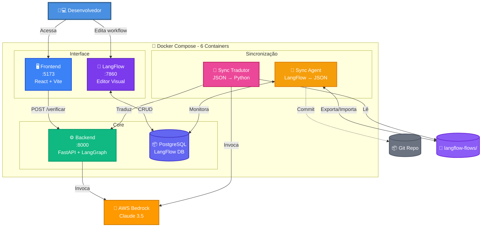

### Serviços Disponíveis

| Serviço | Porta | Descrição | URL |
|---------|-------|------------|-----|
| 🖥️ **Frontend** | 5173 | Interface React para upload de processos | http://localhost:5173 |
| ⚙️ **Backend** | 8000 | API FastAPI + LangGraph + Bedrock | http://localhost:8000 |
| 📝 **Docs** | 8000 | Swagger UI interativo | http://localhost:8000/docs |
| 🎨 **LangFlow** | 7860 | Editor visual de workflows | http://localhost:7860 |
| 📦 **PostgreSQL** | 5432 | Banco de dados do LangFlow | - |
| 🔄 **Sync Agent** | - | LangFlow ↔ JSON (bidirecional) | Background |
| 🔧 **Sync Tradutor** | - | JSON → Python (via Claude 4.5) | Background |

### Quick Start

```bash
# 1. Configurar credenciais
cp keys/.env.example keys/.env
vim keys/.env  # Adicionar AWS_ACCESS_KEY_ID, LANGCHAIN_API_KEY

# 2. Subir todos os serviços
cd app-local
docker-compose up --build

# 3. Acessar
# Frontend: http://localhost:5173
# Backend:  http://localhost:8000/docs
# LangFlow: http://localhost:7860
```

### Fluxo de Desenvolvimento

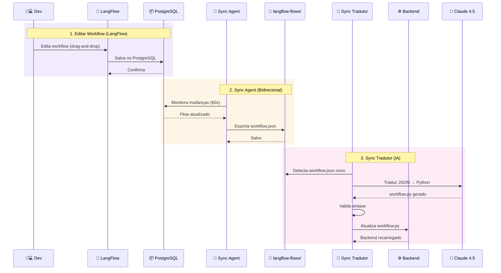

### Comandos Úteis

```bash
# Ver logs de todos os serviços
docker-compose logs -f

# Ver logs de um serviço específico
docker-compose logs -f backend
docker-compose logs -f frontend
docker-compose logs -f langflow

# Parar todos os serviços
docker-compose down

# Rebuild específico
docker-compose up --build backend

# Limpar volumes
docker-compose down -v
```

### Variáveis de Ambiente

**Arquivo:** `keys/.env`

```bash
# AWS Bedrock
AWS_ACCESS_KEY_ID=AKIA...
AWS_SECRET_ACCESS_KEY=...
AWS_REGION=us-east-1
BEDROCK_MODEL_ID=anthropic.claude-3-5-sonnet-20241022-v2:0

# LangSmith (Observabilidade)
LANGCHAIN_TRACING_V2=true
LANGCHAIN_API_KEY=lsv2_pt_...
LANGCHAIN_PROJECT=juscrash-local

# Git (Sync Agent)
GITHUB_TOKEN=ghp_...
GITHUB_USER=seu-usuario
GITHUB_REPO=JusCash_IA
```

### Troubleshooting

| Problema | Solução |
|----------|----------|
| Porta já em uso | `docker-compose down` e verificar processos |
| Erro de credenciais AWS | Verificar `keys/.env` |
| LangFlow não carrega | Aguardar 30s após `docker-compose up` |
| Sync Agent não commita | Verificar `GITHUB_TOKEN` em `keys/.env` |
| Backend timeout | Aumentar `timeout` em `docker-compose.yml` |

---

## 🚀 6. Pipeline de Deploy

Fluxo CI/CD completo:

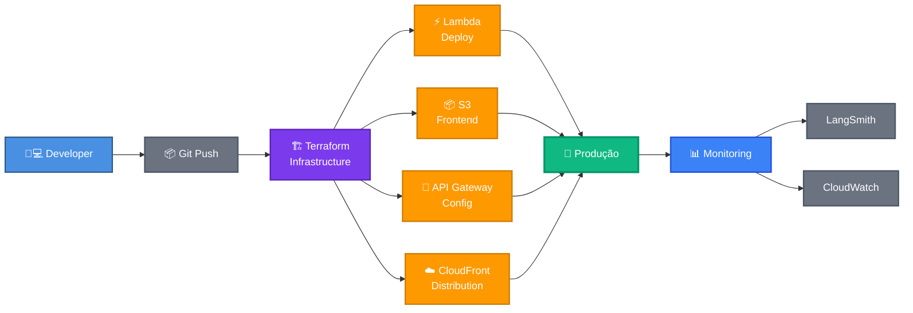

**Comandos:**
```bash
cd app-remoto/infrastructure
make init      # Inicializa Terraform
make deploy    # Deploy completo
make logs      # Ver logs Lambda
```

---

## 💰 7. Breakdown de Custos

Distribuição de custos para 10k requests/mês:

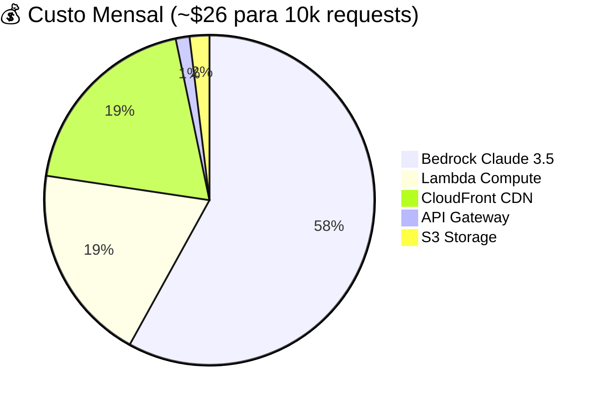

**Detalhamento:**
- **Bedrock:** $3/1M tokens input + $15/1M tokens output
- **Lambda:** 10k × 1GB × 5s = $5.00
- **CloudFront:** 100 GB transfer = $5.00
- **API Gateway:** 10k requests × $0.000035 = $0.35
- **S3:** Frontend + state = $0.50

---

## 🔍 8. Análise de Tokens (LLM)

Consumo médio por request:

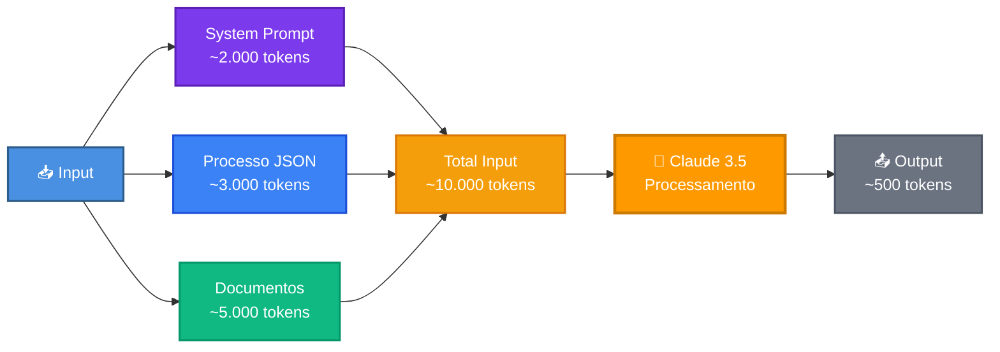

**Custo por Request:**
- Input: 10.000 tokens × $0.003/1k = $0.03
- Output: 500 tokens × $0.015/1k = $0.0075
- **Total:** ~$0.0375 por análise

---

## 📊 9. Observabilidade

### Stack de Monitoramento

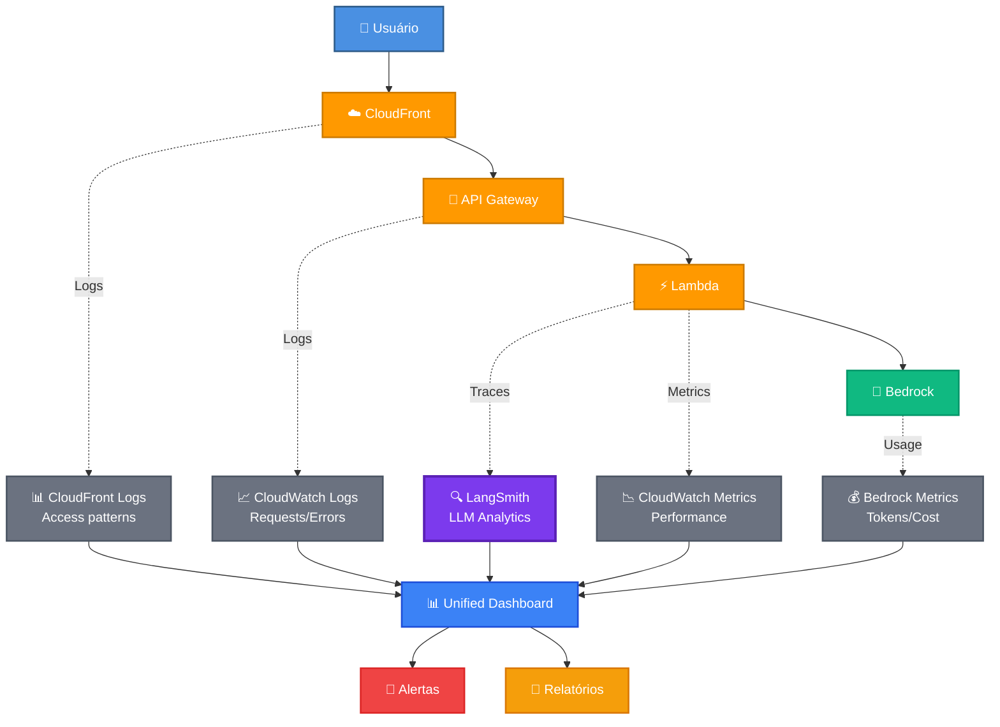

### Métricas por Camada

| Camada | Ferramenta | Métricas | Acesso |
|--------|-----------|----------|--------|
| **CDN** | CloudFront Logs | Cache hit rate, latência edge, geo-distribuição | AWS Console |
| **API** | CloudWatch Logs | Requests/s, status codes, latência | AWS Console |
| **Compute** | CloudWatch Metrics | Invocações, duração, memória, erros | AWS Console |
| **LLM** | LangSmith | Tokens, custo, prompts, traces | https://smith.langchain.com |
| **AI** | Bedrock Metrics | Model invocations, throttling | AWS Console |

### LangSmith (Análise LLM)

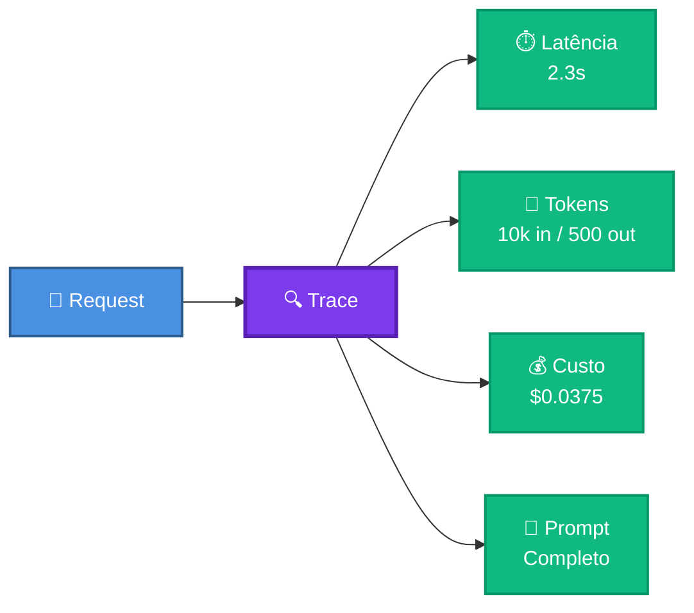

**Exemplo de trace público:** https://smith.langchain.com/public/187fd186-e39b-433c-bf9c-1c5fa15a9968/r

### CloudWatch Dashboard

**Métricas principais:**
- Lambda invocations (count)
- Lambda duration (ms)
- Lambda errors (count)
- API Gateway 4xx/5xx (count)
- Bedrock throttling (count)

**Comandos:**
```bash
# Ver logs Lambda
aws logs tail /aws/lambda/juscrash-agent-core --follow

# Métricas Lambda
aws cloudwatch get-metric-statistics \
  --namespace AWS/Lambda \
  --metric-name Invocations \
  --dimensions Name=FunctionName,Value=juscrash-agent-core
```

### Alertas Configurados

| Alerta | Condição | Ação |
|--------|----------|------|
| Lambda Errors | > 5 erros/min | SNS → Email |
| API Latency | > 5s p99 | SNS → Email |
| Bedrock Throttling | > 10/min | SNS → Email |
| CloudFront 5xx | > 1% requests | SNS → Email |

---

## 🎨 10. LangFlow Editor (Ambiente Local)

Workflow visual drag-and-drop:

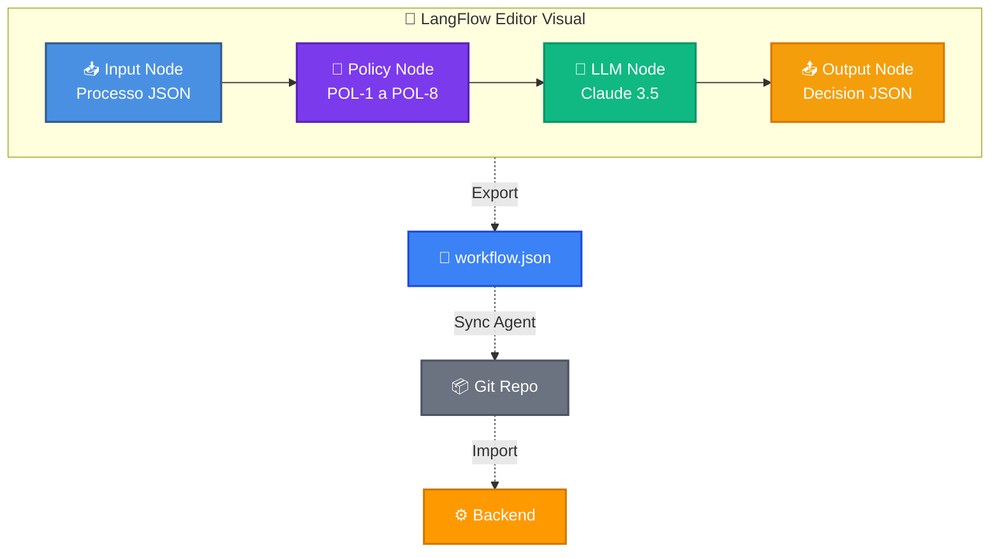

**Vantagens:**
- ✅ Editor drag-and-drop
- ✅ Modificação sem código
- ✅ Exportação automática para JSON
- ✅ Versionamento via Git
- ✅ Rollback facilitado

**Acesso:** http://localhost:7860

---

## 🔐 11. Segurança e Compliance

Camadas de segurança implementadas:

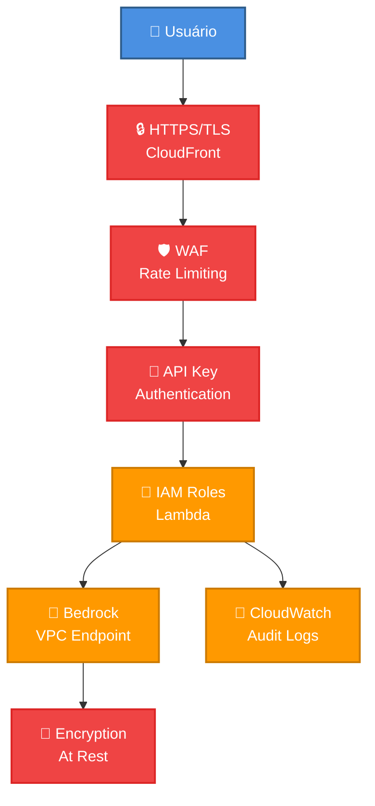

**Compliance:**
- ✅ HTTPS obrigatório
- ✅ Rate limiting (1000 req/min)
- ✅ IAM roles com least privilege
- ✅ Encryption at rest (S3, Lambda)
- ✅ Audit logs (CloudWatch)
- ✅ VPC endpoints (Bedrock)

---

## 📈 12. Escalabilidade

Capacidade de escala automática:

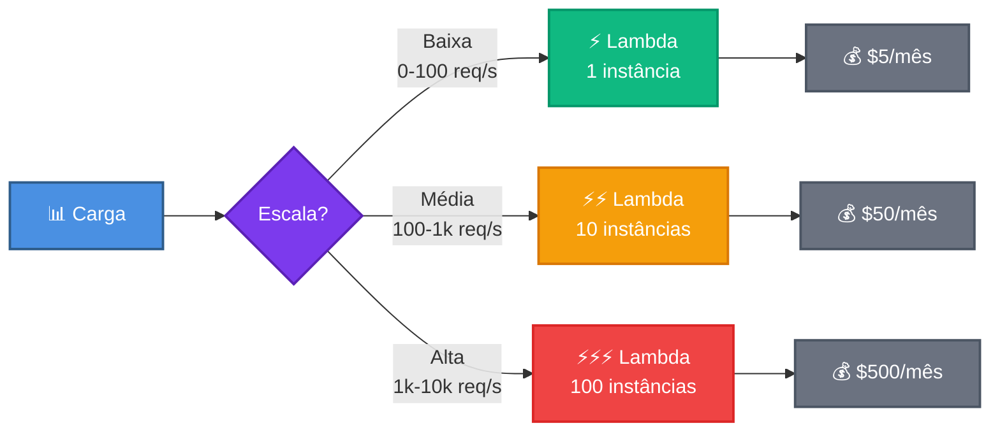

**Limites:**
- **Lambda:** 1000 concurrent executions
- **API Gateway:** 10.000 requests/second
- **Bedrock:** 100 requests/second (ajustável)
- **CloudFront:** Ilimitado

---

## 📚 Referências

- **Código:** [https://github.com/jcleitonss/JusCash_IA)
- **API Produção:** https://3p6xtd91q4.execute-api.us-east-1.amazonaws.com/prod
- **Frontend:** https://d26fvod1jq9hfb.cloudfront.net
- **LangSmith:** https://smith.langchain.com
- **Documentação:** [README.md](../README.md)

---

**Autor:** José Cleiton  
  
**Versão:** 1.0
