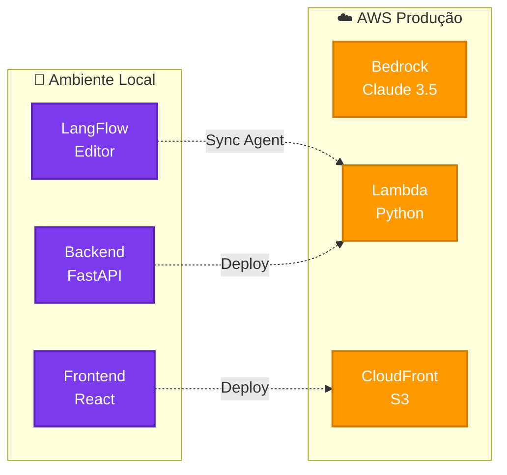
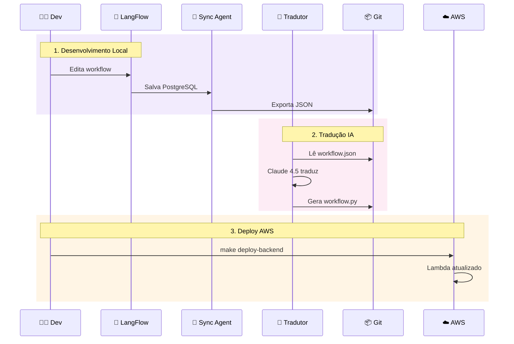
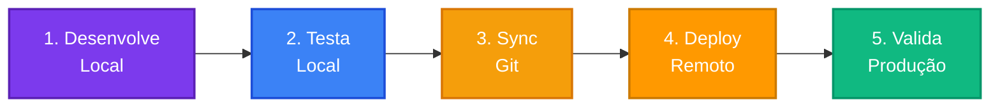

# 🔄 JUSCASH - Paridade Local vs Remoto

Comparação entre ambiente de desenvolvimento (Local) e produção (AWS).

---

## 🎯 Visão Geral



---

## 📊 Comparação Completa

### 🖥️ Frontend

| Aspecto | 🐳 Local | ☁️ Remoto |
|---------|----------|-----------|
| **Runtime** | Vite Dev Server | CloudFront + S3 |
| **Porta** | 5173 | 443 (HTTPS) |
| **Hot Reload** | ✅ Sim | ❌ Não |
| **Build** | Desenvolvimento | Produção otimizado |
| **CDN** | ❌ Não | ✅ 200+ edge locations |
| **HTTPS** | ❌ HTTP | ✅ HTTPS obrigatório |
| **Cache** | ❌ Não | ✅ CloudFront cache |
| **Deploy** | `docker-compose up` | `make deploy-frontend` |

---

### ⚙️ Backend

| Aspecto | 🐳 Local | ☁️ Remoto |
|---------|----------|-----------|
| **Runtime** | FastAPI + Uvicorn | AWS Lambda |
| **Porta** | 8000 | API Gateway |
| **Container** | Docker | Lambda ZIP |
| **Escalabilidade** | 1 instância | Auto-scaling (0-1000) |
| **Timeout** | Ilimitado | 60s |
| **Memória** | Configurável | 1GB |
| **Cold Start** | ❌ Não | ✅ ~2s |
| **Logs** | Docker logs | CloudWatch |
| **Deploy** | `docker-compose up` | `make deploy-backend` |

---

### 🧠 LLM (Claude)

| Aspecto | 🐳 Local | ☁️ Remoto |
|---------|----------|-----------|
| **Serviço** | AWS Bedrock | AWS Bedrock |
| **Modelo** | Claude 3.5 Sonnet | Claude 3.5 Sonnet |
| **Credenciais** | Access Keys (.env) | IAM Role |
| **Rate Limit** | Compartilhado | Dedicado |
| **Custo** | Por uso | Por uso |
| **Latência** | ~2-3s | ~2-3s |

**✅ Paridade:** 100% - Mesmo modelo e comportamento

---

### 🎨 Workflow (LangFlow)

| Aspecto | 🐳 Local | ☁️ Remoto |
|---------|----------|-----------|
| **Editor** | ✅ LangFlow UI | ❌ Não disponível |
| **Edição Visual** | ✅ Drag-and-drop | ❌ Código apenas |
| **PostgreSQL** | ✅ Container | ❌ Não usado |
| **Sync Agent** | ✅ Ativo | ❌ Não usado |
| **Sync Tradutor** | ✅ Ativo | ❌ Não usado |
| **workflow.json** | ✅ Exportado | ❌ Não usado |
| **workflow.py** | ✅ Gerado por IA | ✅ Deployado |

**⚠️ Diferença:** Local tem editor visual, Remoto usa código Python final

---

## 🔄 Fluxo de Sincronização

### Local → Remoto



**Tempo total:** ~5 minutos (edição → deploy)

---

## 📦 Estrutura de Código

### workflow.py (Mesmo em Local e Remoto)

```python
# app-local/backend/app/workflow.py
# app-remoto/agent-core/src/workflow_bedrock.py

from langgraph.graph import StateGraph, END
from app.models import Processo, DecisionResponse
from app.llm_service import llm

# Mesmo código LangGraph
def analyze_node(state):
    result = chain.invoke({"processo": state["processo"]})
    return state

workflow = StateGraph(WorkflowState)
workflow.add_node("analyze", analyze_node)
app_workflow = workflow.compile()
```

**✅ Paridade:** 100% - Mesmo código LangGraph

---

## 🔐 Credenciais

| Tipo | 🐳 Local | ☁️ Remoto |
|------|----------|-----------|
| **AWS** | Access Keys (.env) | IAM Role (Lambda) |
| **Bedrock** | Access Keys | IAM Role |
| **LangSmith** | API Key (.env) | API Key (Lambda env) |
| **Segurança** | Arquivo local | AWS Secrets Manager |

---


## 🧪 Testes

### Local

```bash
# Backend
curl http://localhost:8000/health

# Frontend
open http://localhost:5173

# LangFlow
open http://localhost:7860
```

### Remoto

```bash
# Backend
curl https://3p6xtd91q4.execute-api.us-east-1.amazonaws.com/prod/health

# Frontend
open https://d26fvod1jq9hfb.cloudfront.net
```

---

## 🎯 Quando Usar Cada Ambiente

### 🐳 Use Local Para:

- ✅ Desenvolvimento de features
- ✅ Edição visual de workflows (LangFlow)
- ✅ Testes rápidos
- ✅ Debug com hot reload
- ✅ Experimentação sem custo

### ☁️ Use Remoto Para:

- ✅ Produção
- ✅ Testes de carga
- ✅ Validação de latência
- ✅ Demonstrações para clientes
- ✅ Escalabilidade automática

---

## 🔄 Workflow Recomendado



**Ciclo:** 1-2 horas (desenvolvimento → produção)

---

## 📊 Matriz de Paridade

| Componente | Paridade | Observação |
|------------|----------|------------|
| **Frontend React** | 🟢 100% | Mesmo código, build diferente |
| **Backend FastAPI** | 🟢 100% | Mesmo código, runtime diferente |
| **LangGraph Workflow** | 🟢 100% | Mesmo código Python |
| **Claude 3.5 Sonnet** | 🟢 100% | Mesmo modelo Bedrock |
| **Pydantic Models** | 🟢 100% | Mesmos schemas |
| **LangFlow Editor** | 🔴 0% | Apenas local |
| **PostgreSQL** | 🔴 0% | Apenas local |
| **Sync Agent** | 🔴 0% | Apenas local |
| **Sync Tradutor** | 🔴 0% | Apenas local |

**Paridade Geral:** 🟢 **90%** (componentes críticos)

---

## 🚀 Comandos Rápidos

### Local

```bash
# Subir tudo
cd app-local && docker-compose up

# Ver logs
docker-compose logs -f backend

# Parar
docker-compose down
```

### Remoto

```bash
# Deploy completo
cd app-remoto/infrastructure && make deploy

# Ver logs
make logs

# Testar
make test
```

---

## 📚 Referências

- [ARCHITECTURE.md](ARCHITECTURE.md) - Arquitetura completa
- [SYNC_FLOW.md](SYNC_FLOW.md) - Sincronização local
- [BACKEND.md](deploy/BACKEND.md) - Deploy backend
- [FRONTEND.md](deploy/FRONTEND.md) - Deploy frontend

---

**Autor:** José Cleiton  
**Projeto:** JUSCASH  
**Versão:** 1.0
