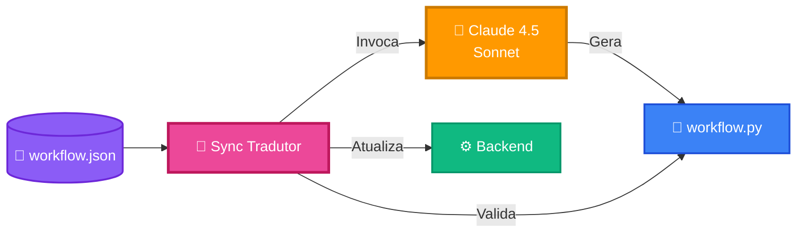
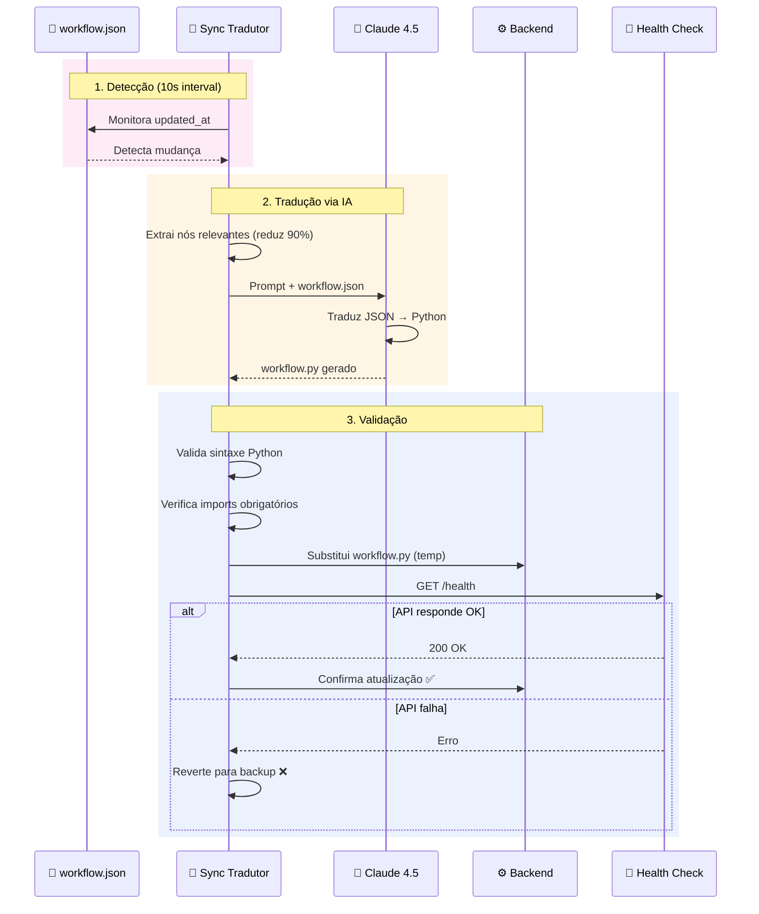
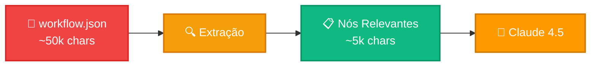
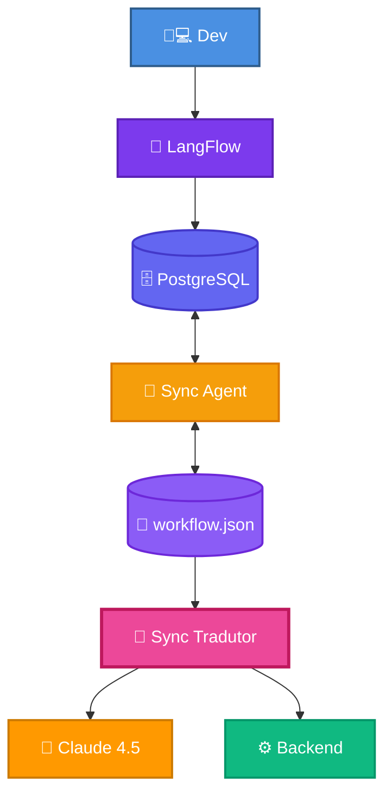

# 🔧 JUSCRASH - Sync Tradutor

Tradução automática de workflows LangFlow (JSON) para LangGraph (Python) usando Claude 4.5 Sonnet.

---

## 🎯 Visão Geral



**Função:** Traduz automaticamente `workflow.json` → `workflow.py` usando IA

**Modelo:** `us.anthropic.claude-sonnet-4-5-20250929-v1:0` (Bedrock Inference Profile)

---

## 🔄 Fluxo de Tradução



**Tempo médio:** ~30-40 segundos  
**Rate limit:** 30s entre requests Bedrock

---

## 🧠 Prompt Engineering

### Estratégia de Redução



**Redução:** ~90% do tamanho original

**Campos extraídos:**
- Tipo do nó
- ID do nó
- Campos essenciais (sem `code`, `tools_metadata`)
- Conexões (edges)

### Prompt Template

```python
prompt = f"""Você é um tradutor de workflows LangFlow para LangGraph.

## 🎯 TAREFA
Reconstrua o arquivo workflow.py mantendo a estrutura do arquivo de referência, 
mas USANDO o system_prompt do Agent do LangFlow.

## 📋 NÓS RELEVANTES DO LANGFLOW
```json
{relevant_nodes}
```

## 📚 ARQUIVOS DE REFERÊNCIA
- workflow.py ATUAL (MANTENHA ESTA ESTRUTURA)
- models.py (schemas Pydantic - NÃO MODIFIQUE)
- llm_service.py (USE o llm daqui - NÃO CRIE NOVO)

## ⚠️ REGRAS CRÍTICAS
1. PRESERVE a estrutura EXATA do workflow.py atual
2. USE o campo 'system_prompt' do nó Agent do LangFlow
3. Use 'from app.llm_service import llm'
4. Use 'from app.models import Processo, DecisionResponse'
5. Mantenha: WorkflowState, prompt, chain, analyze_node, create_workflow
6. Retorne APENAS o código Python completo

Gere o workflow.py:
"""
```

---

## ✅ Validação em 3 Camadas

### 1. Sintaxe Python

```python
def validate_python_syntax(code: str) -> tuple[bool, list[str]]:
    try:
        compile(code, '<string>', 'exec')
        ast.parse(code)
        return True, []
    except SyntaxError as e:
        return False, [f"Erro linha {e.lineno}: {e.msg}"]
```

### 2. Imports Obrigatórios

```python
required = [
    'from langgraph.graph',
    'from app.models',
    'from app.llm_service'
]
```

### 3. Health Check API

```python
# Substitui workflow.py temporariamente
# Testa GET /health
# Se OK: confirma
# Se erro: reverte
```

---

## 📦 Estrutura de Arquivos

```
app-local/
├── langflow-flows/
│   ├── workflow.json          # Input (gerado pelo Sync Agent)
│   └── .workflow_hash         # Tracking de mudanças
├── backend/app/
│   ├── workflow.py            # Output (gerado pelo Tradutor)
│   ├── workflow.py.bak.*      # Backups automáticos
│   ├── workflow.py.failed.*   # Tentativas falhadas (debug)
│   ├── models.py              # Referência (não modifica)
│   └── llm_service.py         # Referência (não modifica)
└── sync-agent/
    └── sync_tradutor.py       # Código do tradutor
```

---

## 🔧 Configuração

### Variáveis de Ambiente

**Arquivo:** `keys/.env`

```bash
# AWS Bedrock
AWS_ACCESS_KEY_ID=AKIA...
AWS_SECRET_ACCESS_KEY=...
AWS_REGION=us-east-1
BEDROCK_MODEL_ID=us.anthropic.claude-sonnet-4-5-20250929-v1:0
```

### Docker Compose

```yaml
sync-tradutor:
  build: ./sync-agent
  volumes:
    - ./langflow-flows:/app/langflow-flows
    - ./backend/app:/app/backend/app
  env_file:
    - ../keys/.env
  networks:
    - juscrash-network
  depends_on:
    - sync-agent
    - backend
  command: ["python", "-u", "sync_tradutor.py"]
```

---

## 📊 Logs

```bash
# Ver logs do Sync Tradutor
docker logs -f juscrash-sync-tradutor

# Exemplo de saída
🔄 SYNC TRADUTOR - 2025-01-20 10:30:00
[10:30:00] 💾 Flow salvo (2025-01-20T10:29:55) - Iniciando tradução...
[10:30:00] 🔄 Iniciando tradução...
[10:30:00] 📥 Arquivos lidos:
  - workflow.json: 45000 chars
  - 8 nós, 7 conexões
[10:30:05] 🤖 Invocando Bedrock Converse API...
[10:30:35] ✅ Resposta recebida (3500 chars)
[10:30:35] 📊 Tokens: 8500 input / 1200 output
[10:30:35] 🧪 Iniciando validação...
[10:30:35] ✅ Sintaxe válida
[10:30:37] 🧪 Testando workflow via API...
[10:30:39] ✅ API respondeu OK
[10:30:39] 💾 Criando backup...
[10:30:39] ✅ workflow.py atualizado
[10:30:39] ✅ TRADUÇÃO CONCLUÍDA COM SUCESSO!
```

---

## 💰 Custos

**Claude 4.5 Sonnet (Bedrock):**
- Input: ~8.500 tokens × $0.003/1k = $0.0255
- Output: ~1.200 tokens × $0.015/1k = $0.018
- **Total por tradução:** ~$0.04

**Frequência:** Apenas quando workflow.json é modificado

---

## 🐛 Troubleshooting

| Problema | Solução |
|----------|---------|
| ThrottlingException | Rate limit de 30s entre requests (automático) |
| Sintaxe inválida | Código salvo em `workflow.py.failed.*` para debug |
| API não responde | Reverte para backup automaticamente |
| Bedrock não conecta | Verificar credenciais AWS em `keys/.env` |

### Debug de Falhas

```bash
# Ver tentativas falhadas
ls -la app-local/backend/app/workflow.py.failed.*

# Ver backups
ls -la app-local/backend/app/workflow.py.bak.*

# Restaurar backup manualmente
cp app-local/backend/app/workflow.py.bak.1234567890 \
   app-local/backend/app/workflow.py
```

---

## 🔄 Workflow Completo (Sync Agent + Tradutor)



**Fluxo:**
1. Dev edita no LangFlow
2. Sync Agent exporta para JSON
3. Sync Tradutor detecta mudança
4. Claude 4.5 traduz JSON → Python
5. Backend atualizado automaticamente

---

## 📚 Referências

- [SYNC_FLOW.md](SYNC_FLOW.md) - Sync Agent (LangFlow ⇄ JSON)
- [ARCHITECTURE.md](ARCHITECTURE.md) - Arquitetura completa
- Código: `app-local/sync-agent/sync_tradutor.py`

---

**Autor:** José Cleiton  
**Projeto:** JUSCASH  
**Versão:** 1.0
