# 📊 JUSCRASH - Diagramas Técnicos

Coleção completa de diagramas Mermaid para copiar e colar em documentações.

---

## 🎯 Fluxo Simplificado (3 Passos)

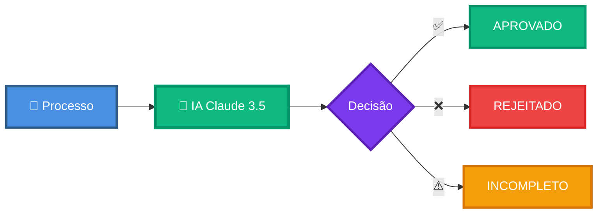

---

## 🏗️ Arquitetura AWS Completa

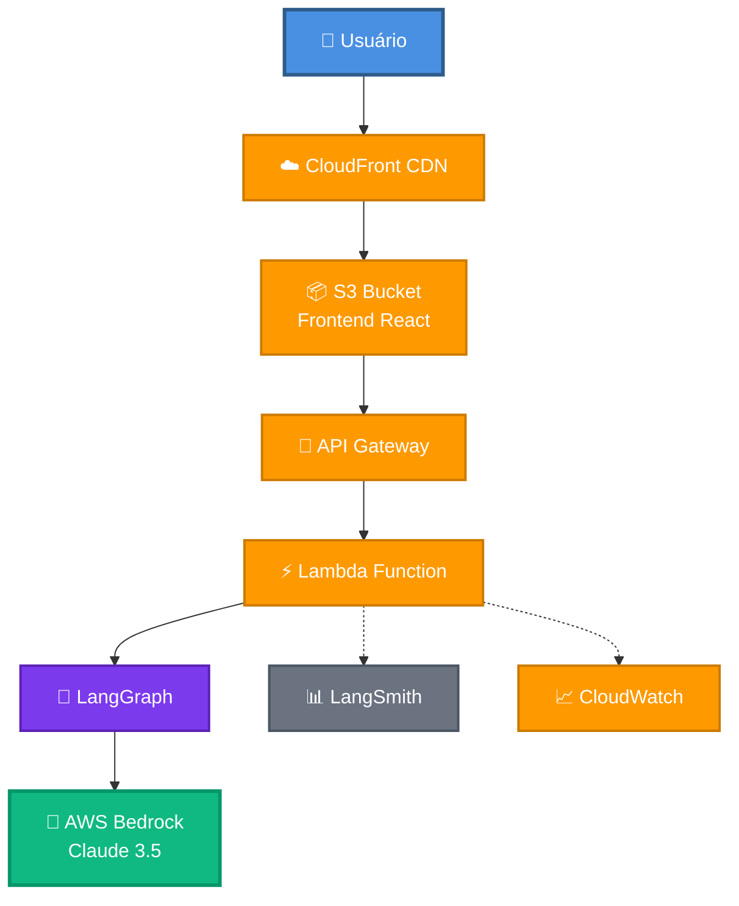

---

## 🔄 Sequência de Análise

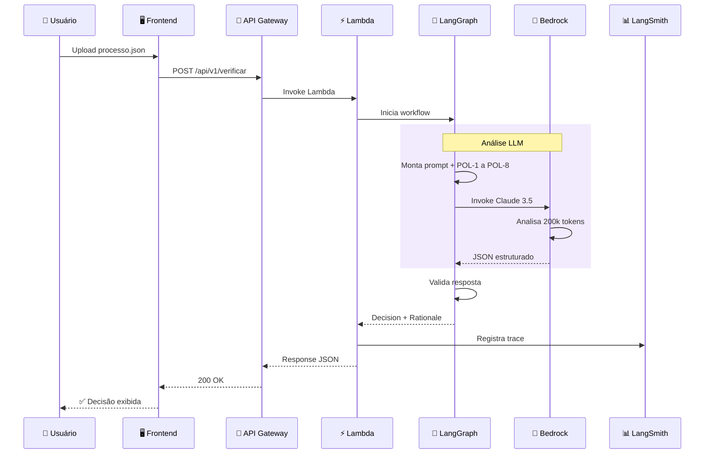

---

## 🎯 Árvore de Políticas

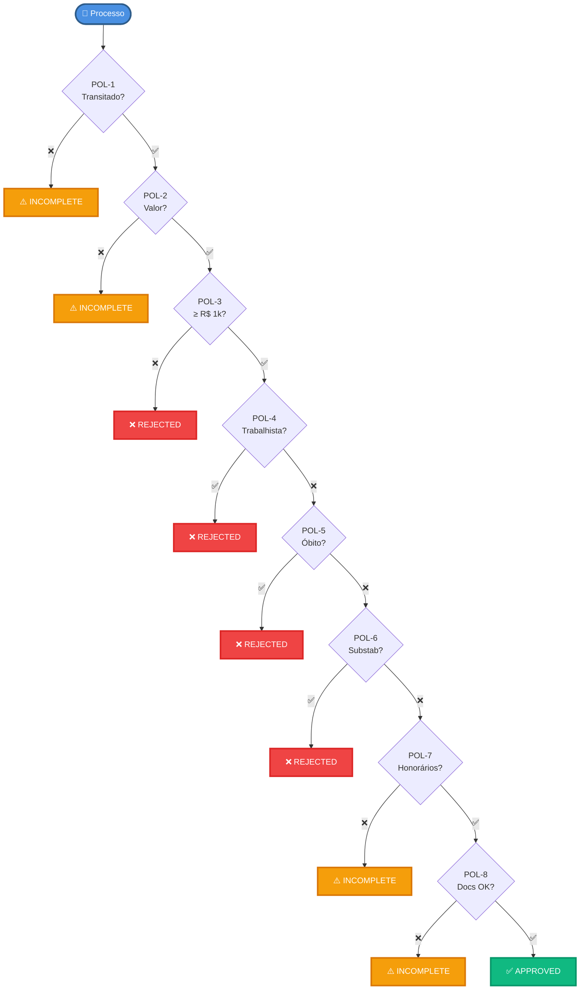

---

## 🐳 Docker Compose Local

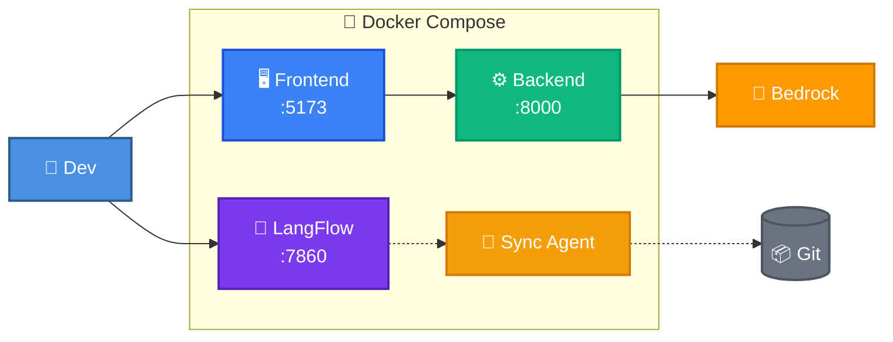

---

## 🚀 Pipeline Deploy

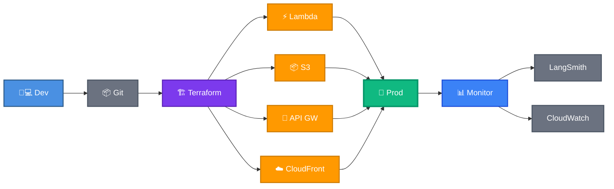

---

## 💰 Breakdown de Custos

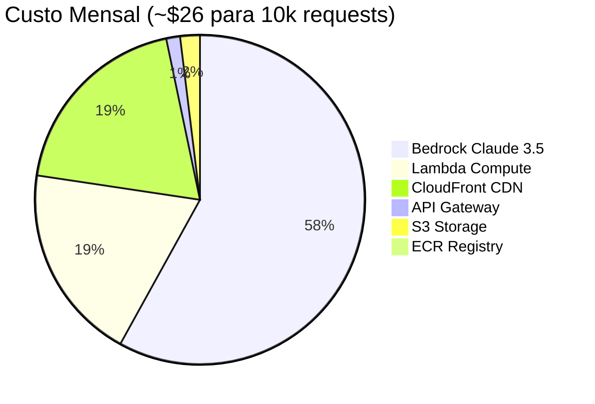

---

## 🔍 Workflow LangGraph

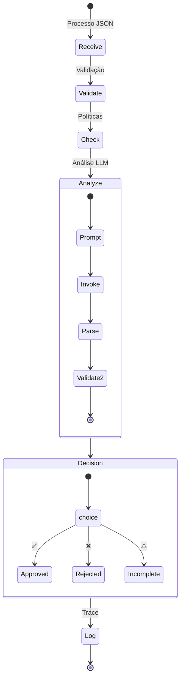

---

## 📊 Tokens LLM

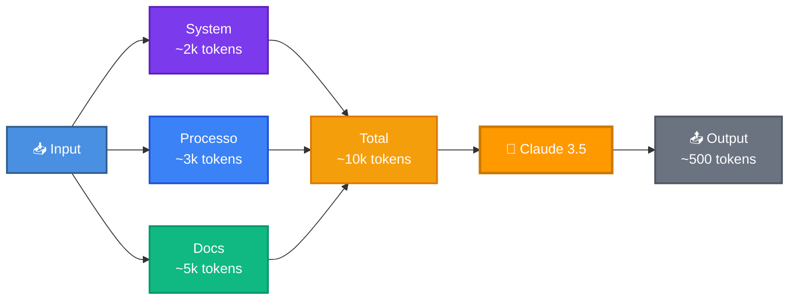

---

## 🎨 LangFlow Editor

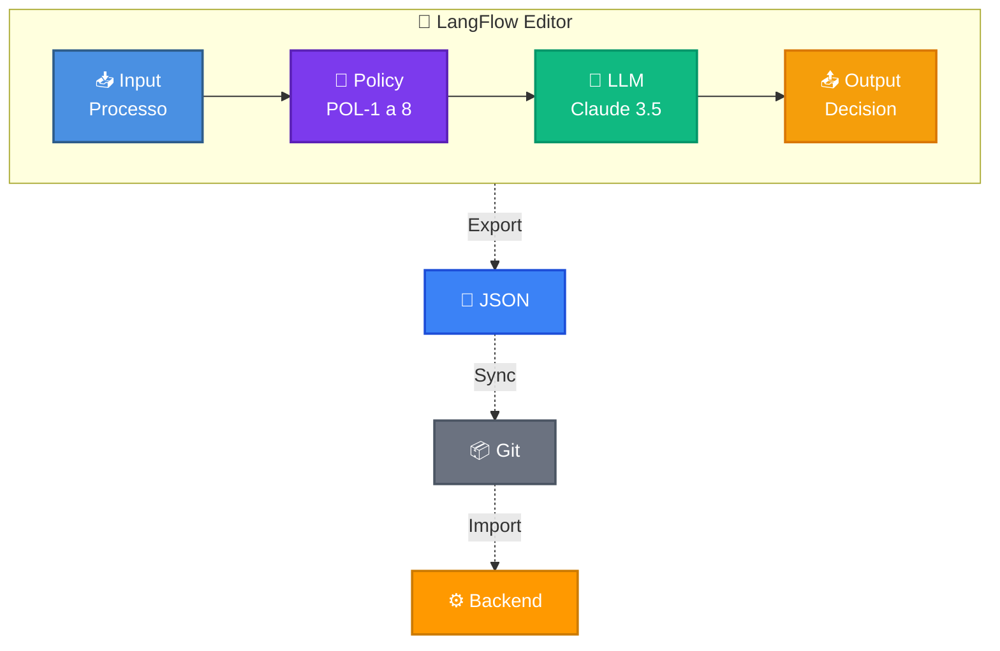

---

## 🔐 Segurança

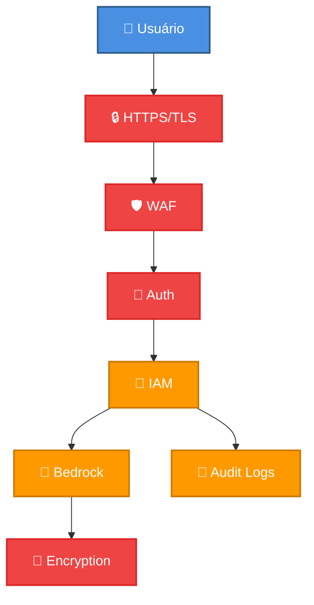

---

## 📈 Escalabilidade

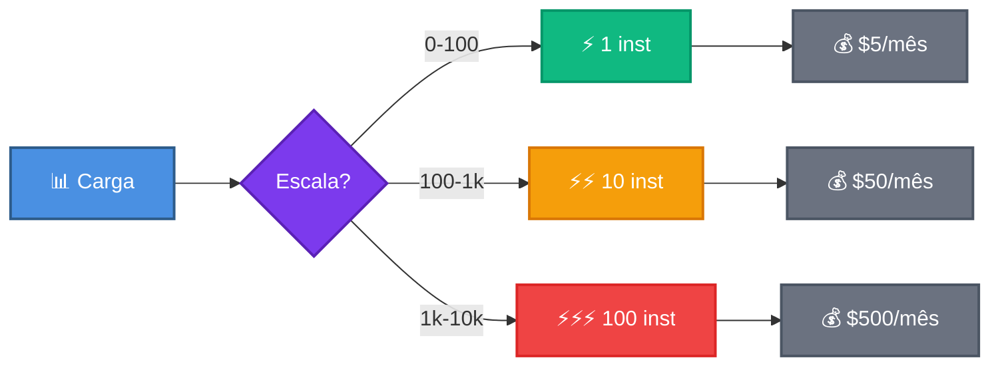

---

## 🎯 Mindmap Políticas

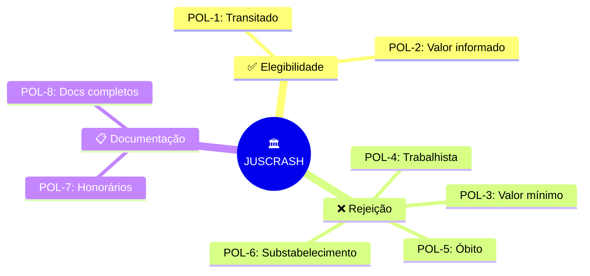

---

## 📅 Timeline Roadmap

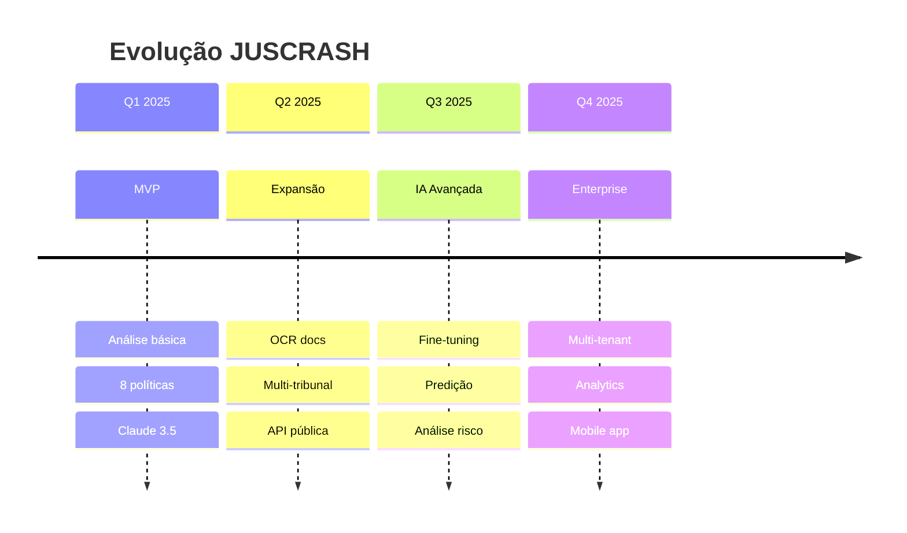

---

## 🏆 Comparação

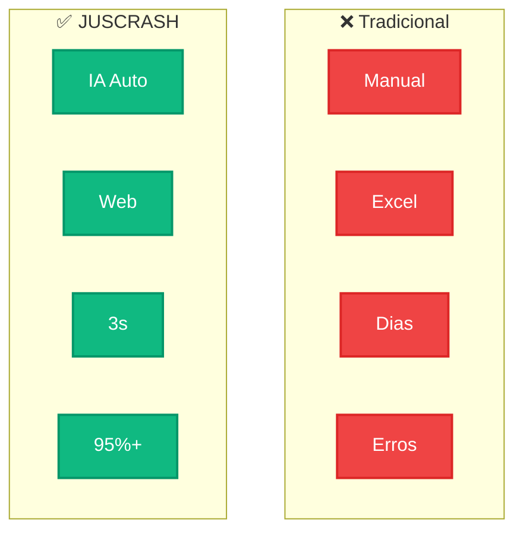

---

## 💡 Stack Tech

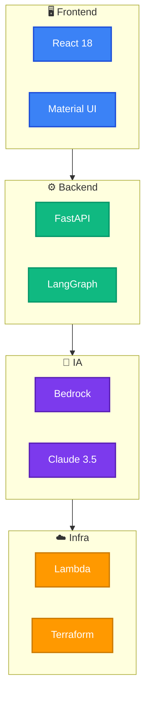

---

## 📊 Observabilidade

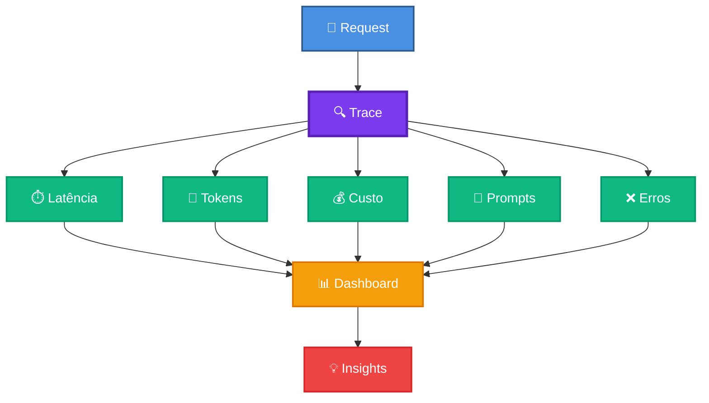

---

## 🎯 ROI

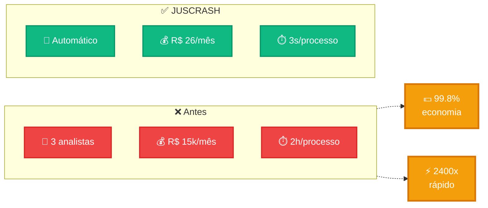

---

## 📝 Como Usar

1. Copie o código Mermaid desejado
2. Cole no seu README.md ou documentação
3. O diagrama renderiza automaticamente no GitHub/GitLab
4. Personalize cores e textos conforme necessário

**Compatível com:**
- ✅ GitHub
- ✅ GitLab
- ✅ VS Code (extensão Mermaid)
- ✅ Notion
- ✅ Confluence
- ✅ Markdown Preview Enhanced

---

**Autor:** José Cleiton  
**Projeto:** JUSCRASH  
**Data:** Janeiro 2025
