# 📁 JUSCRASH - Visão Geral dos Arquivos

Catálogo completo de todos os arquivos de documentação criados.

---

## 📊 Resumo Executivo

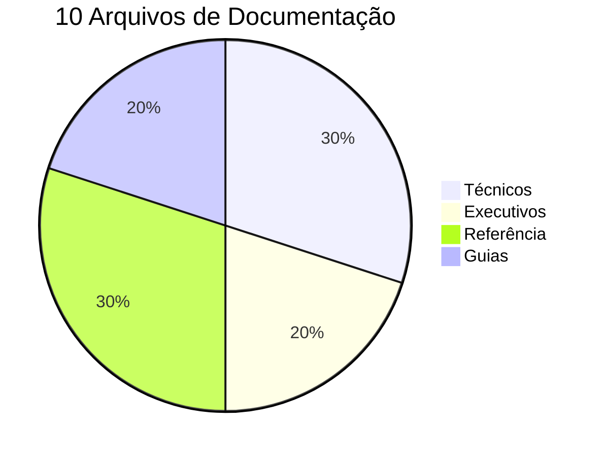

**Total:** 10 arquivos Markdown + 25+ diagramas Mermaid

---

## 📁 Estrutura Completa

```
docs/
├── 📄 ONE_PAGE.md              ⚡ 2 min  - Resumo em 1 página
├── ⚡ QUICK_REFERENCE.md       ⚡ 5 min  - Referência rápida
├── 🎯 PRESENTATION.md          🕐 10 min - Apresentação executiva
├── 🏗️ ARCHITECTURE.md          🕐 20 min - Arquitetura técnica
├── 📊 DIAGRAMS.md              📚 Ref   - Biblioteca de diagramas
├── 📄 JUSCRASH_Fluxo_LLM.md    🕐 30 min - Documentação técnica
├── 📚 INDEX.md                 🗺️ Nav   - Índice de navegação
├── 📖 README.md                📖 Guia  - Guia da pasta docs
├── 📋 SUMMARY.md               📋 Sum   - Sumário completo
├── 🎨 MERMAID_GUIDE.md         🎓 Guia  - Guia Mermaid
└── 📁 FILES_OVERVIEW.md        📁 Este  - Este arquivo
```

---

## 📄 Detalhamento por Arquivo

### 1. ONE_PAGE.md

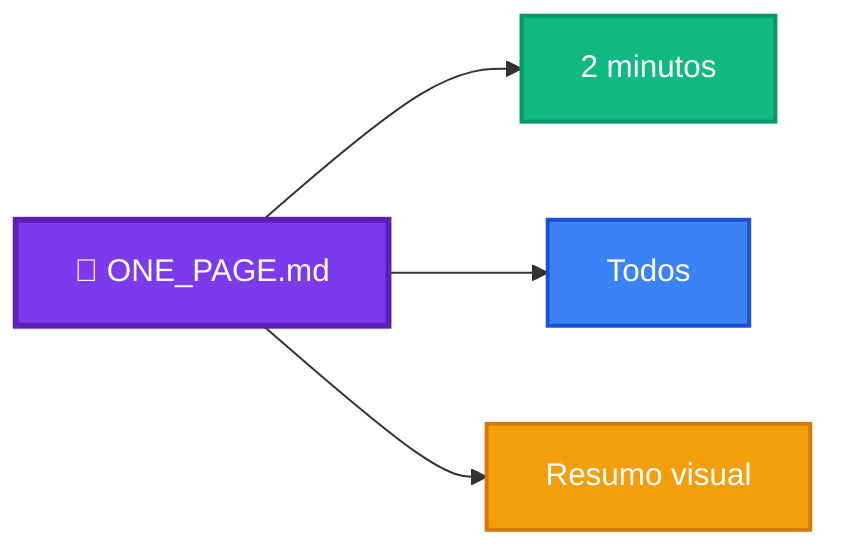

**Descrição:** Resumo completo em uma única página  
**Público:** Todos  
**Tempo:** 2 minutos  
**Conteúdo:**
- O que é JUSCRASH
- Como funciona (3 passos)
- 3 Decisões possíveis
- 8 Políticas (mindmap)
- Arquitetura simplificada
- Custos (pie chart)
- Stack tecnológico
- Deploy
- Métricas
- Links

**Quando usar:** Primeira leitura, overview rápido

---

### 2. QUICK_REFERENCE.md

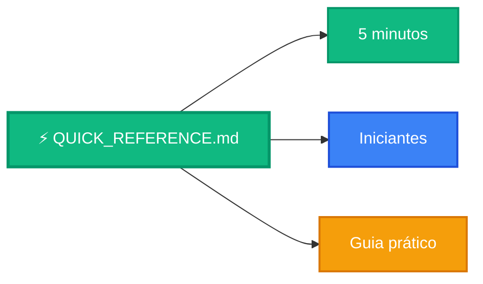

**Descrição:** Referência rápida para entender o JUSCRASH  
**Público:** Iniciantes, usuários finais  
**Tempo:** 5 minutos  
**Conteúdo:**
- O que é e como funciona
- 3 Decisões (graph)
- 8 Políticas (mindmap)
- Arquitetura simplificada
- Custos e ROI
- Stack tecnológico
- Fluxo completo (sequence)
- Exemplo de uso
- Ambiente local
- Deploy AWS
- Diferenciais
- Links rápidos

**Quando usar:** Entender o básico, referência rápida

---

### 3. PRESENTATION.md

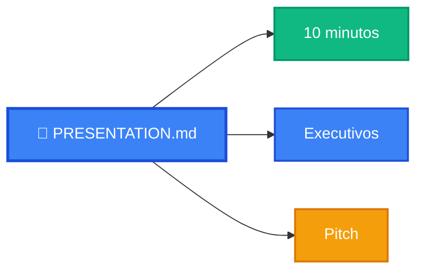

**Descrição:** Apresentação executiva com visualizações  
**Público:** Executivos, investidores, stakeholders  
**Tempo:** 10 minutos  
**Conteúdo:**
- Fluxo simplificado
- Como funciona (3 passos)
- Mindmap de políticas
- Arquitetura simplificada
- Comparação tradicional vs JUSCRASH
- ROI e economia
- Stack tecnológico
- Custo por request
- Jornada do usuário
- Roadmap futuro
- Segurança
- Conclusão

**Quando usar:** Apresentar para stakeholders, pitch

---

### 4. ARCHITECTURE.md

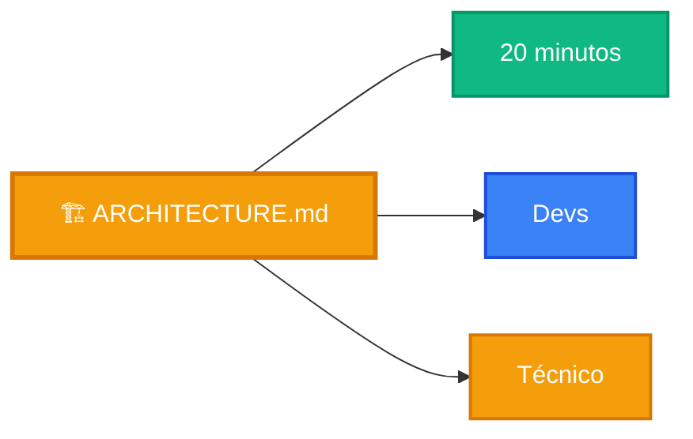

**Descrição:** Documentação técnica completa com diagramas  
**Público:** Desenvolvedores, arquitetos  
**Tempo:** 20 minutos  
**Conteúdo:**
- Arquitetura AWS serverless (graph)
- Fluxo de decisão LLM (sequence)
- Workflow LangGraph (stateDiagram)
- Árvore de políticas (graph)
- Docker Compose local (graph)
- Pipeline de deploy (graph)
- Breakdown de custos (pie)
- Análise de tokens (graph)
- Observabilidade (graph)
- LangFlow editor (graph)
- Segurança (graph)
- Escalabilidade (graph)
- Diferenciais técnicos

**Quando usar:** Implementar, modificar, entender arquitetura

---

### 5. DIAGRAMS.md

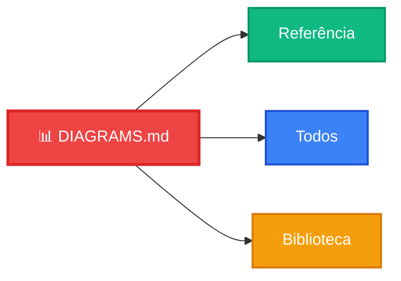

**Descrição:** Biblioteca completa de diagramas Mermaid  
**Público:** Documentadores, desenvolvedores  
**Tempo:** Referência  
**Conteúdo:**
- 20+ diagramas prontos para copiar
- Fluxo simplificado
- Arquitetura AWS completa
- Sequência de análise
- Árvore de políticas
- Docker Compose local
- Pipeline deploy
- Breakdown de custos
- Workflow LangGraph
- Tokens LLM
- LangFlow editor
- Segurança
- Escalabilidade
- Mindmap políticas
- Timeline roadmap
- Comparação
- Stack tech
- Observabilidade
- ROI

**Quando usar:** Copiar diagramas, criar documentação

---

### 6. JUSCRASH_Fluxo_LLM.md

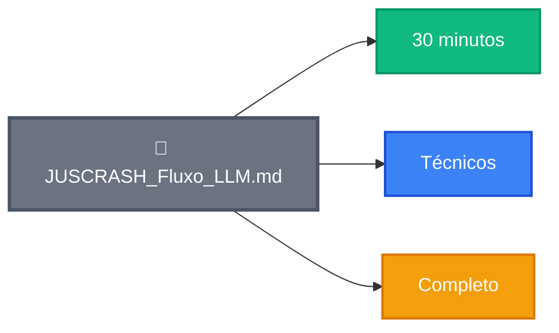

**Descrição:** Documentação técnica oficial completa  
**Público:** Equipe técnica, onboarding  
**Tempo:** 30 minutos  
**Conteúdo:**
- Visão geral detalhada
- Arquitetura serverless (atualizada com Mermaid)
- Uso do LLM (Bedrock)
- Fluxo de análise LLM (sequence)
- Prompt engineering
- Orquestração LangGraph (stateDiagram)
- Observabilidade LangSmith
- LangFlow editor
- Diferenciais técnicos
- Fluxo completo passo a passo (sequence)

**Quando usar:** Onboarding técnico, documentação oficial

---

### 7. INDEX.md

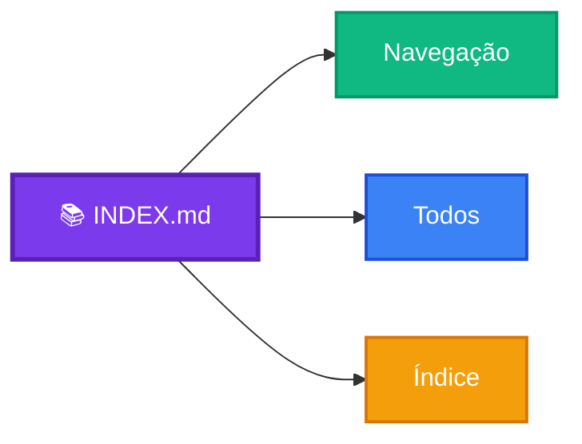

**Descrição:** Índice completo de navegação  
**Público:** Todos  
**Tempo:** Navegação  
**Conteúdo:**
- Mapa de navegação
- Documentos principais
- Busca por público-alvo
- Busca por tempo disponível
- Busca por objetivo
- Diagramas por categoria
- Estilos e cores
- Ícones usados
- Checklist de leitura
- Links úteis

**Quando usar:** Navegar pela documentação, encontrar conteúdo

---

### 8. README.md (docs)

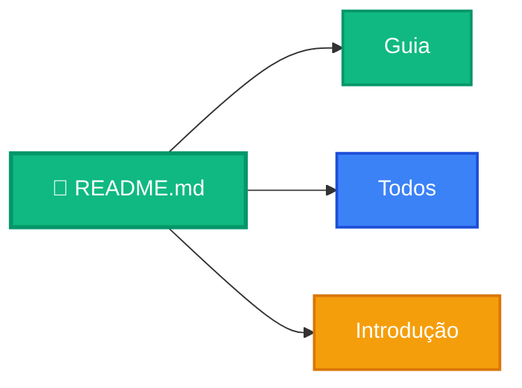

**Descrição:** Guia da pasta docs  
**Público:** Todos  
**Tempo:** Guia  
**Conteúdo:**
- Começar aqui (graph)
- Documentos disponíveis
- Fluxo de leitura recomendado
- Busca rápida
- Estatísticas
- Padrões visuais
- Links úteis
- Contribuindo
- Checklist
- Qualidade

**Quando usar:** Primeira vez na pasta docs

---

### 9. SUMMARY.md

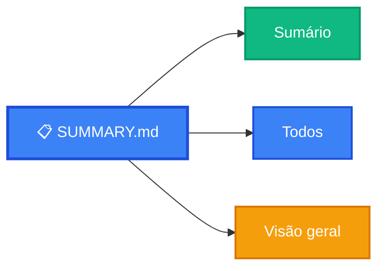

**Descrição:** Sumário completo da documentação  
**Público:** Todos  
**Tempo:** Sumário  
**Conteúdo:**
- Documentos criados (graph)
- Estatísticas
- Estrutura de arquivos
- Documentos por público
- Tipos de diagramas
- Paleta de cores
- Métricas de qualidade
- Interligação
- Fluxo de leitura
- Diferenciais
- Checklist

**Quando usar:** Ver visão geral completa

---

### 10. MERMAID_GUIDE.md

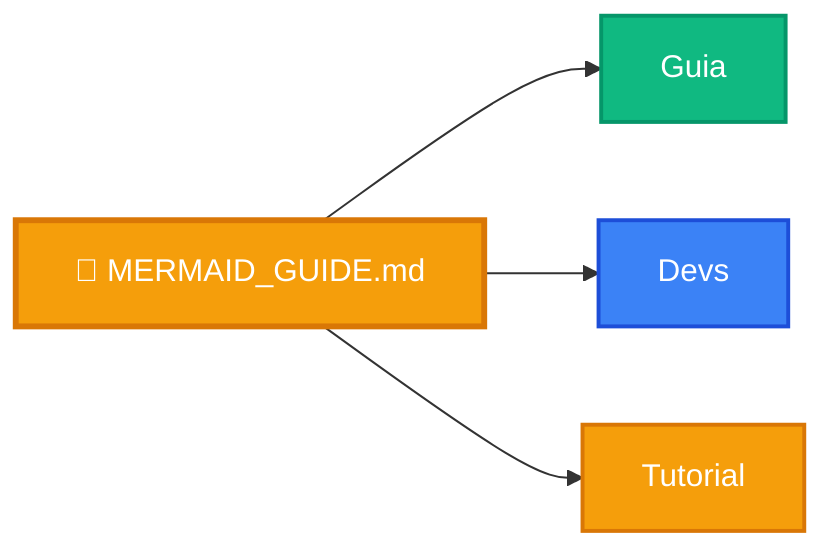

**Descrição:** Guia completo de Mermaid  
**Público:** Desenvolvedores, documentadores  
**Tempo:** Guia/Tutorial  
**Conteúdo:**
- O que é Mermaid
- Como usar (GitHub, VS Code, Online)
- Tipos de diagramas (8 tipos)
- Estilização (classes CSS)
- Paleta JUSCRASH
- Ícones emoji
- Templates prontos
- Dicas e truques
- Limitações
- Troubleshooting
- Recursos
- Exercícios
- Checklist

**Quando usar:** Aprender Mermaid, criar diagramas

---

## 🗺️ Mapa de Relacionamentos

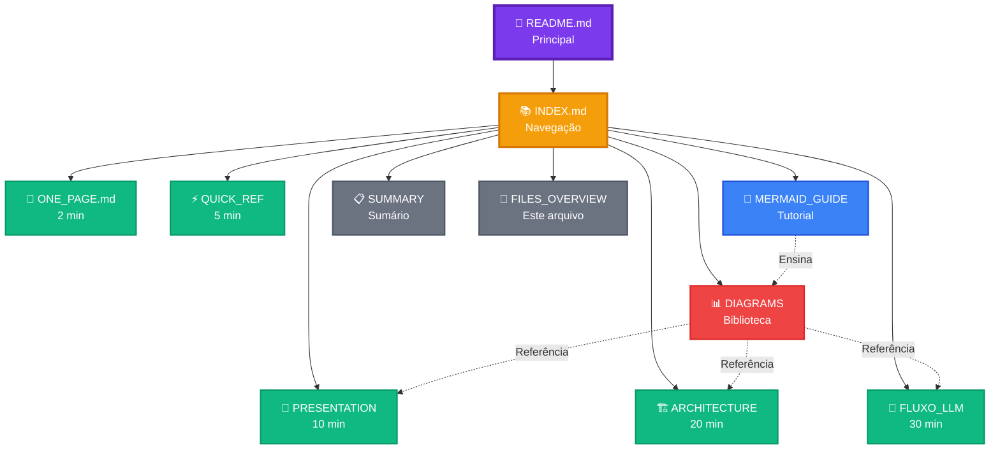

---

## 📊 Estatísticas Gerais

### Por Tipo

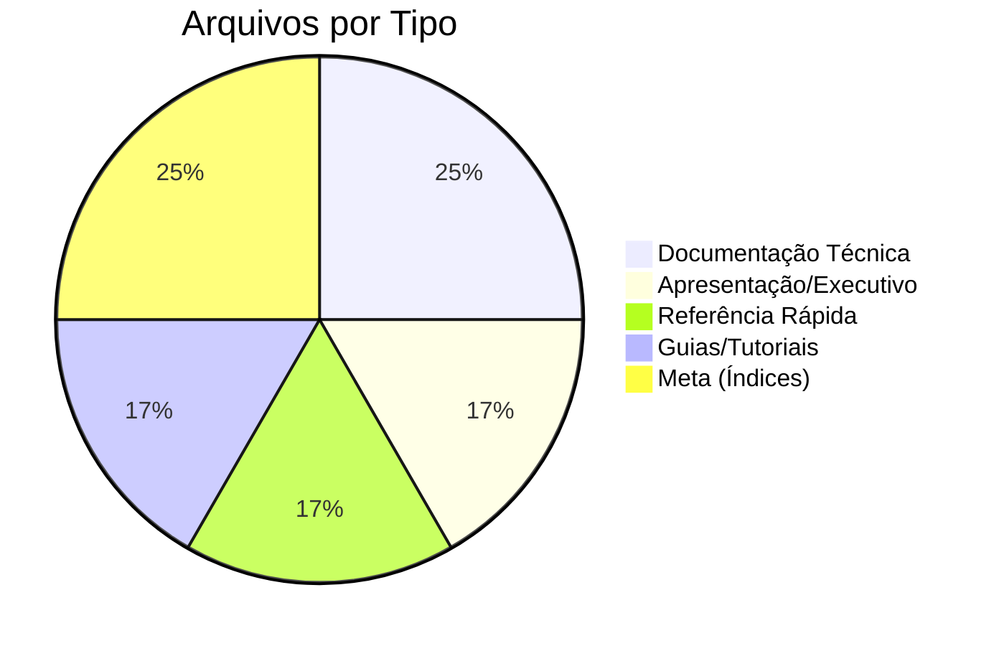

### Por Tempo de Leitura

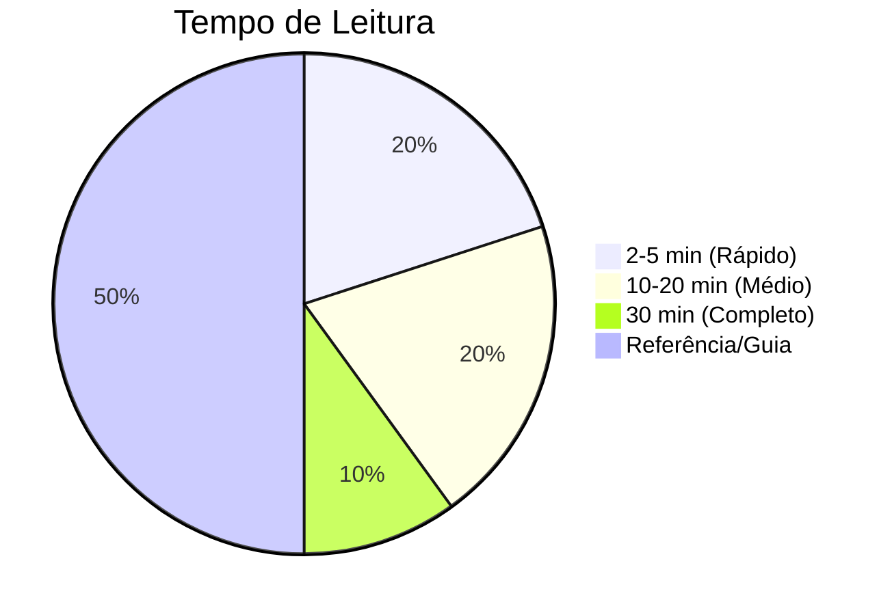

### Por Público

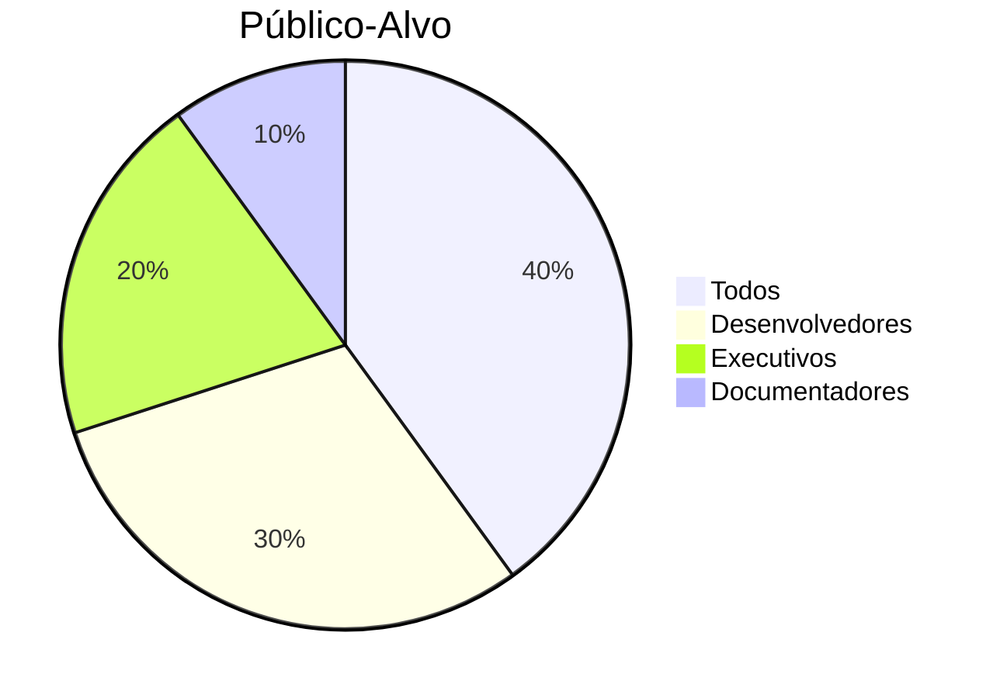

---

## 🎯 Matriz de Uso

| Arquivo | Iniciante | Intermediário | Avançado | Executivo |
|---------|-----------|---------------|----------|-----------|
| ONE_PAGE.md | ✅✅✅ | ✅✅ | ✅ | ✅✅✅ |
| QUICK_REFERENCE.md | ✅✅✅ | ✅✅ | ✅ | ✅✅ |
| PRESENTATION.md | ✅✅ | ✅✅✅ | ✅ | ✅✅✅ |
| ARCHITECTURE.md | ✅ | ✅✅✅ | ✅✅✅ | ✅ |
| DIAGRAMS.md | ✅ | ✅✅ | ✅✅✅ | ✅ |
| JUSCRASH_Fluxo_LLM.md | - | ✅✅ | ✅✅✅ | - |
| INDEX.md | ✅✅✅ | ✅✅✅ | ✅✅✅ | ✅✅ |
| README.md | ✅✅✅ | ✅✅ | ✅ | ✅✅ |
| SUMMARY.md | ✅✅ | ✅✅ | ✅✅ | ✅✅ |
| MERMAID_GUIDE.md | ✅ | ✅✅ | ✅✅✅ | - |

**Legenda:**
- ✅✅✅ Altamente recomendado
- ✅✅ Recomendado
- ✅ Opcional
- - Não aplicável

---

## 🚀 Fluxos de Leitura

### Fluxo 1: Iniciante (15 min)

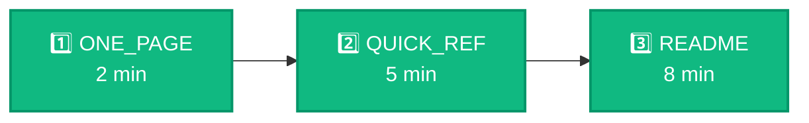

---

### Fluxo 2: Executivo (20 min)

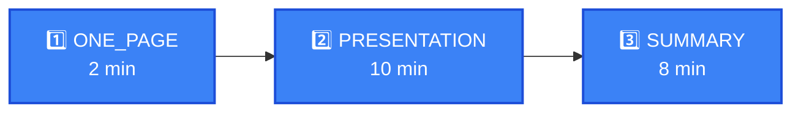

---

### Fluxo 3: Desenvolvedor (60 min)


---

### Fluxo 4: Documentador (40 min)

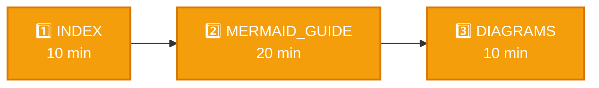

---

## 📈 Métricas de Qualidade

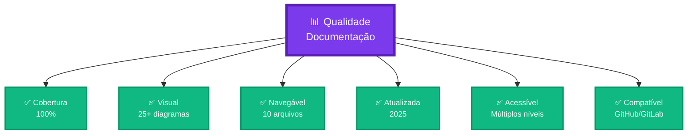

---

## 🎯 Conclusão

```mermaid
graph TB
    Start[🎯 Objetivo]:::start --> Docs[📚 10 Arquivos<br/>Criados]:::docs
    
    Docs --> R1[✅ Completa]:::result
    Docs --> R2[✅ Visual]:::result
    Docs --> R3[✅ Navegável]:::result
    Docs --> R4[✅ Profissional]:::result
    
    classDef start fill:#4A90E2,stroke:#2E5C8A,stroke-width:3px,color:#fff
    classDef docs fill:#7C3AED,stroke:#5B21B6,stroke-width:4px,color:#fff,font-size:16px
    classDef result fill:#10B981,stroke:#059669,stroke-width:2px,color:#fff
```

**Documentação JUSCRASH:**
- ✅ 10 arquivos principais
- ✅ 25+ diagramas Mermaid
- ✅ 100% visual e interativo
- ✅ Navegação facilitada
- ✅ Múltiplos públicos
- ✅ Múltiplos níveis
- ✅ Cobertura completa

---

**Autor:** José Cleiton  
**Projeto:** JUSCRASH  
**Data:** Janeiro 2025  
**Status:** ✅ Completo

---

**🎯 Próximo passo:** Comece por [INDEX.md](INDEX.md) para navegar ou [ONE_PAGE.md](ONE_PAGE.md) para resumo rápido!
