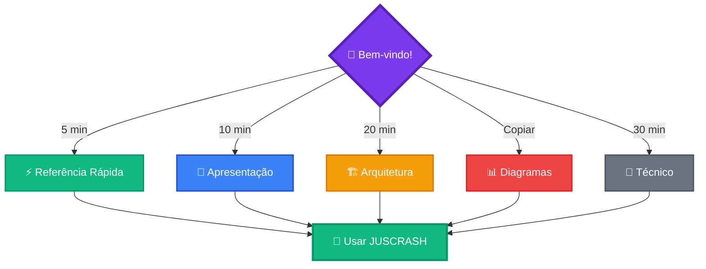
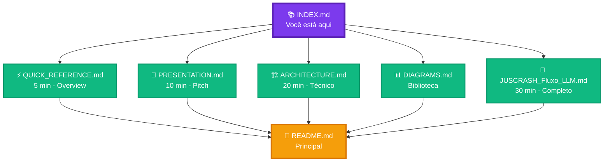
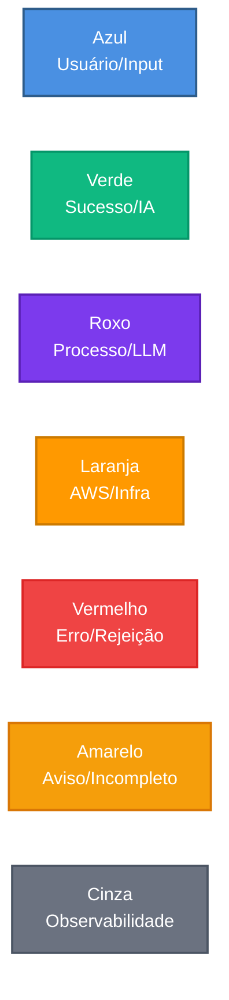

# 📚 JUSCRASH - Índice de Documentação

Navegação completa de toda a documentação visual do projeto.

---

## 🎯 Começar Aqui

---

## 📖 Documentos Principais

### ⚡ [QUICK_REFERENCE.md](QUICK_REFERENCE.md)
**Tempo:** 5 minutos  
**Para:** Quem quer entender rápido

**Conteúdo:**
- ✅ O que é JUSCRASH
- ✅ Como funciona (3 passos)
- ✅ 8 Políticas resumidas
- ✅ Arquitetura simplificada
- ✅ Custos e ROI
- ✅ Links rápidos

**Ideal para:** Primeira leitura, overview geral

---

### 🎯 [PRESENTATION.md](PRESENTATION.md)
**Tempo:** 10 minutos  
**Para:** Apresentações e pitches

**Conteúdo:**
- ✅ Fluxo simplificado
- ✅ Mindmap de políticas
- ✅ Comparação tradicional vs JUSCRASH
- ✅ Stack tecnológico
- ✅ ROI e economia
- ✅ Roadmap futuro
- ✅ Jornada do usuário

**Ideal para:** Apresentar para stakeholders, investidores

---

### 🏗️ [ARCHITECTURE.md](ARCHITECTURE.md)
**Tempo:** 20 minutos  
**Para:** Desenvolvedores e arquitetos

**Conteúdo:**
- ✅ Arquitetura AWS completa
- ✅ Fluxo de decisão LLM
- ✅ Workflow LangGraph
- ✅ Árvore de políticas
- ✅ Docker Compose local
- ✅ Pipeline de deploy
- ✅ Breakdown de custos
- ✅ Análise de tokens
- ✅ Observabilidade
- ✅ LangFlow editor
- ✅ Segurança
- ✅ Escalabilidade

**Ideal para:** Entender implementação técnica

---

### 📊 [DIAGRAMS.md](DIAGRAMS.md)
**Tempo:** Referência  
**Para:** Copiar diagramas

**Conteúdo:**
- ✅ 20+ diagramas Mermaid
- ✅ Prontos para copiar
- ✅ Personalizáveis
- ✅ Compatível GitHub/GitLab

**Ideal para:** Criar sua própria documentação

---

### 📄 [JUSCRASH_Fluxo_LLM.md](JUSCRASH_Fluxo_LLM.md)
**Tempo:** 30 minutos  
**Para:** Documentação técnica completa

**Conteúdo:**
- ✅ Visão geral detalhada
- ✅ Arquitetura serverless
- ✅ Uso do LLM (Bedrock)
- ✅ Prompt engineering
- ✅ Orquestração LangGraph
- ✅ Observabilidade LangSmith
- ✅ Diferenciais técnicos
- ✅ Fluxo completo passo a passo

**Ideal para:** Documentação oficial, onboarding

---

## 🗺️ Mapa de Navegação

---

## 📊 Diagramas por Categoria

### 🎯 Fluxos e Processos

| Diagrama | Arquivo | Tipo |
|----------|---------|------|
| Fluxo Simplificado (3 passos) | QUICK_REFERENCE.md | Graph |
| Sequência de Análise | ARCHITECTURE.md | Sequence |
| Workflow LangGraph | ARCHITECTURE.md | StateDiagram |
| Fluxo Completo (8 passos) | ARCHITECTURE.md | Sequence |
| Jornada do Usuário | PRESENTATION.md | Journey |

### 🏗️ Arquitetura

| Diagrama | Arquivo | Tipo |
|----------|---------|------|
| Arquitetura AWS Completa | ARCHITECTURE.md | Graph |
| Arquitetura Simplificada | QUICK_REFERENCE.md | Graph |
| Docker Compose Local | ARCHITECTURE.md | Graph |
| Pipeline de Deploy | ARCHITECTURE.md | Graph |

### 📜 Políticas e Decisões

| Diagrama | Arquivo | Tipo |
|----------|---------|------|
| Árvore de Decisão Completa | ARCHITECTURE.md | Graph |
| Árvore Simplificada | DIAGRAMS.md | Graph |
| Mindmap Políticas | PRESENTATION.md | Mindmap |
| 3 Decisões Possíveis | QUICK_REFERENCE.md | Graph |

### 💰 Custos e ROI

| Diagrama | Arquivo | Tipo |
|----------|---------|------|
| Breakdown de Custos | ARCHITECTURE.md | Pie |
| ROI Comparativo | PRESENTATION.md | Graph |
| Escalabilidade e Custos | ARCHITECTURE.md | Graph |

### 🛠️ Tecnologia

| Diagrama | Arquivo | Tipo |
|----------|---------|------|
| Stack Tecnológico | PRESENTATION.md | Graph |
| Análise de Tokens | ARCHITECTURE.md | Graph |
| LangFlow Editor | ARCHITECTURE.md | Graph |
| Observabilidade | ARCHITECTURE.md | Graph |

### 🔐 Segurança e Compliance

| Diagrama | Arquivo | Tipo |
|----------|---------|------|
| Camadas de Segurança | ARCHITECTURE.md | Graph |
| Escalabilidade | ARCHITECTURE.md | Graph |

---

## 🎨 Estilos de Diagramas

### Cores Padrão

### Ícones Usados

| Ícone | Significado | Uso |
|-------|-------------|-----|
| 👤 | Usuário | Interação humana |
| 🧠 | IA/LLM | Claude 3.5, Bedrock |
| ☁️ | Cloud | AWS, CloudFront |
| ⚡ | Lambda | Serverless compute |
| 🔄 | Workflow | LangGraph, processos |
| 📊 | Observabilidade | LangSmith, métricas |
| 🐳 | Docker | Containers |
| 📦 | Storage | S3, Git |
| 🚪 | API | API Gateway |
| 🔐 | Segurança | Encryption, IAM |
| 💰 | Custo | Pricing, ROI |
| ✅ | Aprovado | Decisão positiva |
| ❌ | Rejeitado | Decisão negativa |
| ⚠️ | Incompleto | Falta informação |

---

## 🔍 Busca Rápida

### Por Público-Alvo

| Público | Documento Recomendado |
|---------|----------------------|
| **Executivo/Gestor** | [PRESENTATION.md](PRESENTATION.md) |
| **Desenvolvedor** | [ARCHITECTURE.md](ARCHITECTURE.md) |
| **Arquiteto** | [ARCHITECTURE.md](ARCHITECTURE.md) + [JUSCRASH_Fluxo_LLM.md](JUSCRASH_Fluxo_LLM.md) |
| **Investidor** | [PRESENTATION.md](PRESENTATION.md) |
| **Usuário Final** | [QUICK_REFERENCE.md](QUICK_REFERENCE.md) |
| **Documentador** | [DIAGRAMS.md](DIAGRAMS.md) |

### Por Tempo Disponível

| Tempo | Documento |
|-------|-----------|
| **5 minutos** | [QUICK_REFERENCE.md](QUICK_REFERENCE.md) |
| **10 minutos** | [PRESENTATION.md](PRESENTATION.md) |
| **20 minutos** | [ARCHITECTURE.md](ARCHITECTURE.md) |
| **30 minutos** | [JUSCRASH_Fluxo_LLM.md](JUSCRASH_Fluxo_LLM.md) |
| **1 hora** | Todos os documentos |

### Por Objetivo

| Objetivo | Documento |
|----------|-----------|
| **Entender o projeto** | [QUICK_REFERENCE.md](QUICK_REFERENCE.md) |
| **Apresentar para stakeholders** | [PRESENTATION.md](PRESENTATION.md) |
| **Implementar/Modificar** | [ARCHITECTURE.md](ARCHITECTURE.md) |
| **Criar documentação** | [DIAGRAMS.md](DIAGRAMS.md) |
| **Onboarding técnico** | [JUSCRASH_Fluxo_LLM.md](JUSCRASH_Fluxo_LLM.md) |

---

## 📝 Checklist de Leitura

### Iniciante
- [ ] Ler [QUICK_REFERENCE.md](QUICK_REFERENCE.md)
- [ ] Ver diagramas principais
- [ ] Entender as 8 políticas
- [ ] Conhecer as 3 decisões

### Intermediário
- [ ] Ler [PRESENTATION.md](PRESENTATION.md)
- [ ] Entender arquitetura AWS
- [ ] Conhecer stack tecnológico
- [ ] Analisar ROI

### Avançado
- [ ] Ler [ARCHITECTURE.md](ARCHITECTURE.md)
- [ ] Estudar workflow LangGraph
- [ ] Entender prompt engineering
- [ ] Analisar observabilidade
- [ ] Ler [JUSCRASH_Fluxo_LLM.md](JUSCRASH_Fluxo_LLM.md)

### Expert
- [ ] Todos os documentos
- [ ] Copiar diagramas de [DIAGRAMS.md](DIAGRAMS.md)
- [ ] Modificar e personalizar
- [ ] Contribuir com melhorias

---

## 🚀 Próximos Passos

1. **Ler documentação:** Escolha o documento adequado acima
2. **Testar local:** `docker-compose up --build`
3. **Deploy AWS:** `make deploy`
4. **Usar em produção:** Integrar com seus sistemas

---

## 🔗 Links Úteis

| Recurso | URL |
|---------|-----|
| 📖 **README Principal** | [../README.md](../README.md) |
| 🌐 **Frontend Produção** | https://d26fvod1jq9hfb.cloudfront.net |
| 🔌 **API Produção** | https://3p6xtd91q4.execute-api.us-east-1.amazonaws.com/prod |
| 📊 **LangSmith** | https://smith.langchain.com |
| 💻 **GitHub** | https://github.com/jcleitonss/JusCash |

---

## 📞 Suporte

**Dúvidas sobre a documentação?**
- Abra uma issue no GitHub
- Entre em contato com o desenvolvedor
- Consulte o README principal

---

**Autor:** José Cleiton  
**Projeto:** JUSCRASH  
**Última atualização:** Janeiro 2025

---

**🎯 Comece por aqui:** [QUICK_REFERENCE.md](QUICK_REFERENCE.md) (5 minutos)
