# 🎨 Guia Mermaid - JUSCRASH

Guia completo para usar e personalizar os diagramas Mermaid do projeto.

---

## 📚 O que é Mermaid?

Mermaid é uma linguagem de diagramação baseada em texto que renderiza automaticamente em gráficos visuais.

**Vantagens:**
- ✅ Versionável (texto puro)
- ✅ Renderiza no GitHub/GitLab
- ✅ Fácil de editar
- ✅ Não precisa de ferramentas externas
- ✅ Mantém consistência visual

---

## 🚀 Como Usar

### 1. No GitHub/GitLab

Simplesmente adicione o código Mermaid entre ` ```mermaid ` e ` ``` `:

````markdown
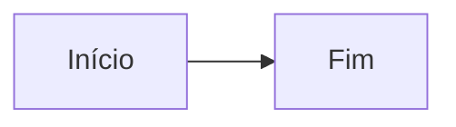
````

**Resultado:**


---

### 2. No VS Code

**Instale a extensão:**
- Nome: "Markdown Preview Mermaid Support"
- ID: `bierner.markdown-mermaid`

**Use:**
1. Abra arquivo `.md`
2. Pressione `Ctrl+Shift+V` (preview)
3. Veja o diagrama renderizado

---

### 3. Online

**Editor oficial:** https://mermaid.live

1. Cole o código Mermaid
2. Veja preview em tempo real
3. Exporte como PNG/SVG

---

## 🎨 Tipos de Diagramas

### 1. Graph (Fluxograma)

**Sintaxe básica:**
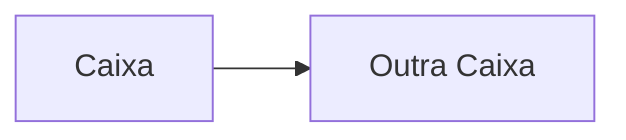

**Direções:**
- `LR` - Left to Right (esquerda → direita)
- `TB` - Top to Bottom (cima → baixo)
- `RL` - Right to Left (direita → esquerda)
- `BT` - Bottom to Top (baixo → cima)

**Formas:**
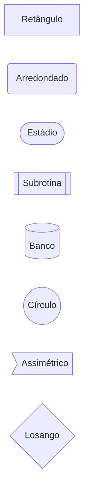

**Setas:**
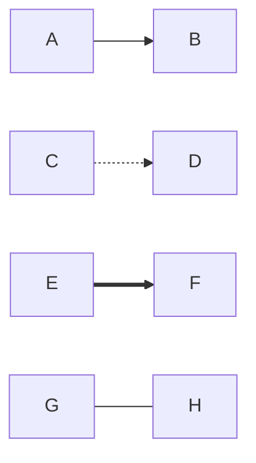

---

### 2. Sequence (Sequência)

**Sintaxe:**
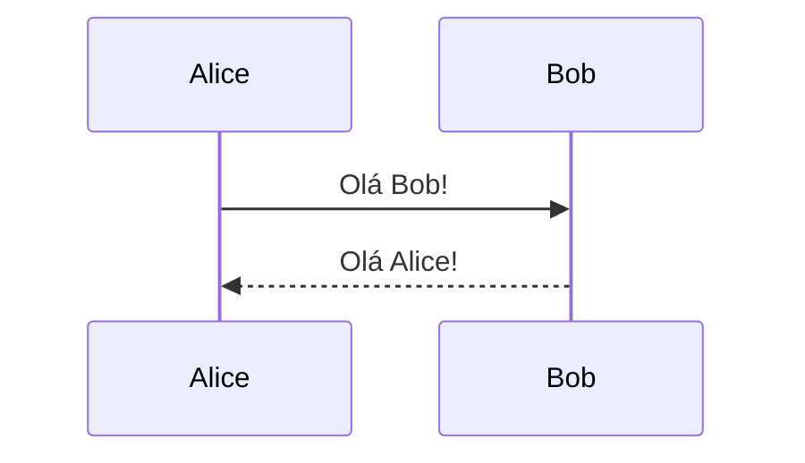

**Tipos de setas:**
- `->` Linha sólida sem ponta
- `-->` Linha tracejada sem ponta
- `->>` Linha sólida com ponta
- `-->>` Linha tracejada com ponta

**Notas:**
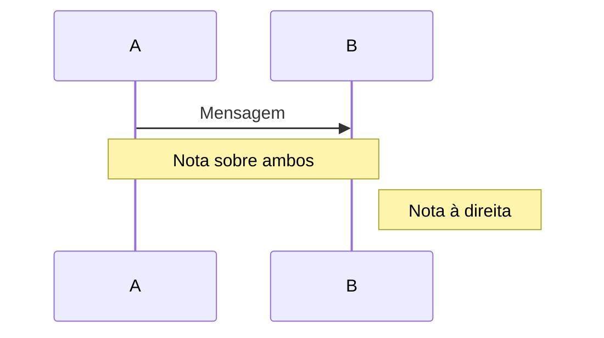

---

### 3. Pie (Pizza)

**Sintaxe:**
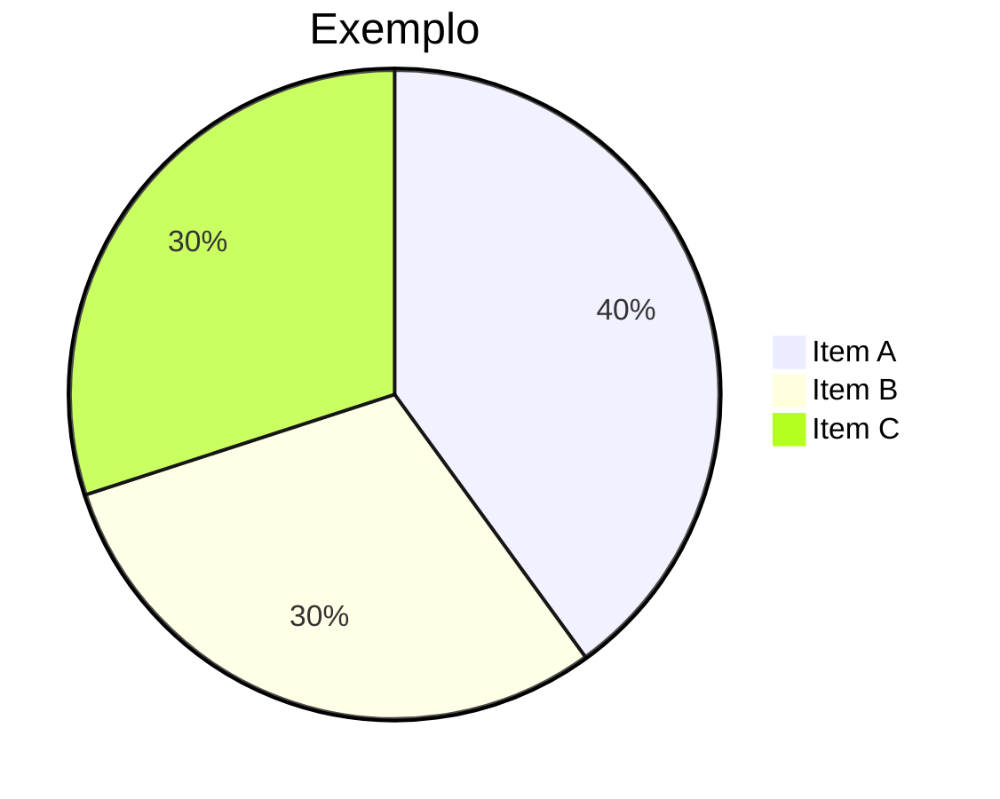

---

### 4. StateDiagram (Estados)

**Sintaxe:**
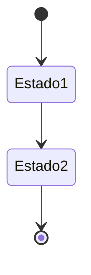

**Estados compostos:**
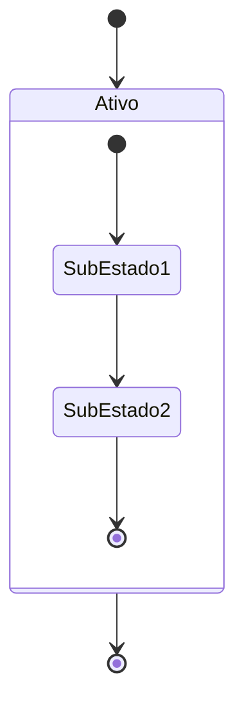

---

### 5. Mindmap (Mapa Mental)

**Sintaxe:**
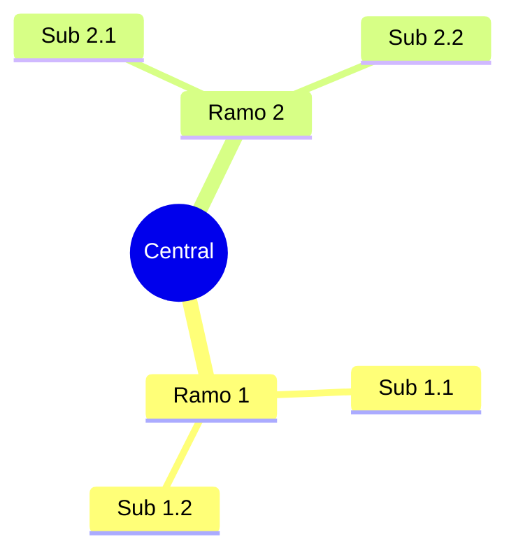

---

### 6. Timeline (Linha do Tempo)

**Sintaxe:**
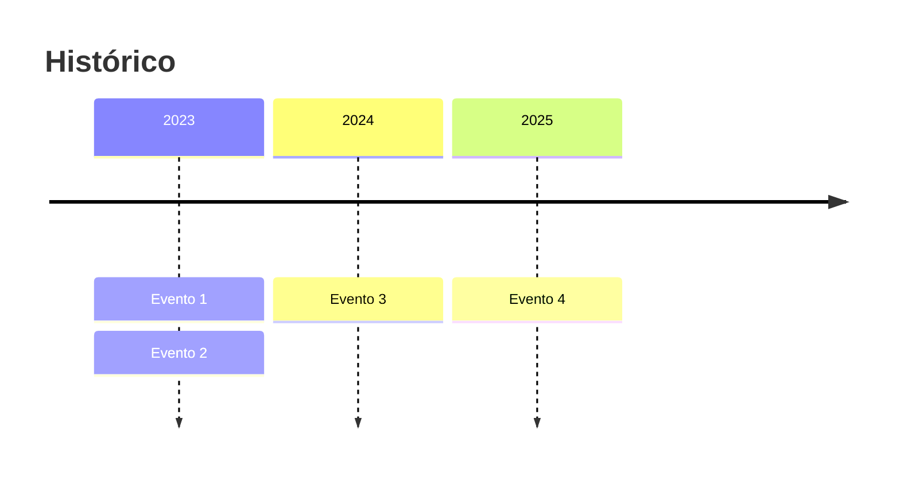

---

### 7. Journey (Jornada)

**Sintaxe:**
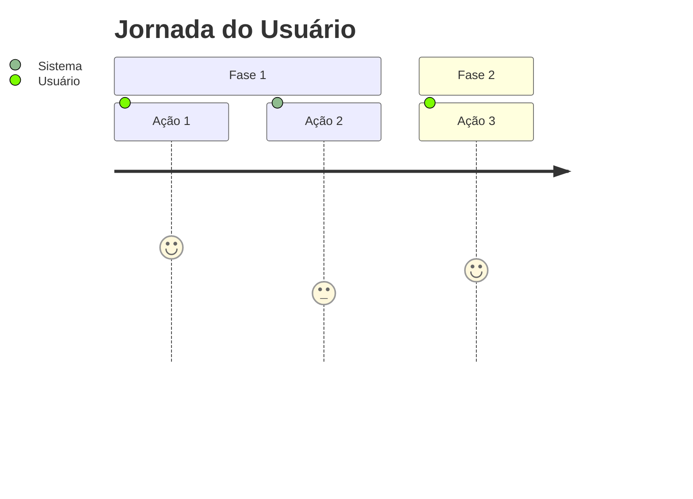

---

### 8. Quadrant (Quadrante)

**Sintaxe:**
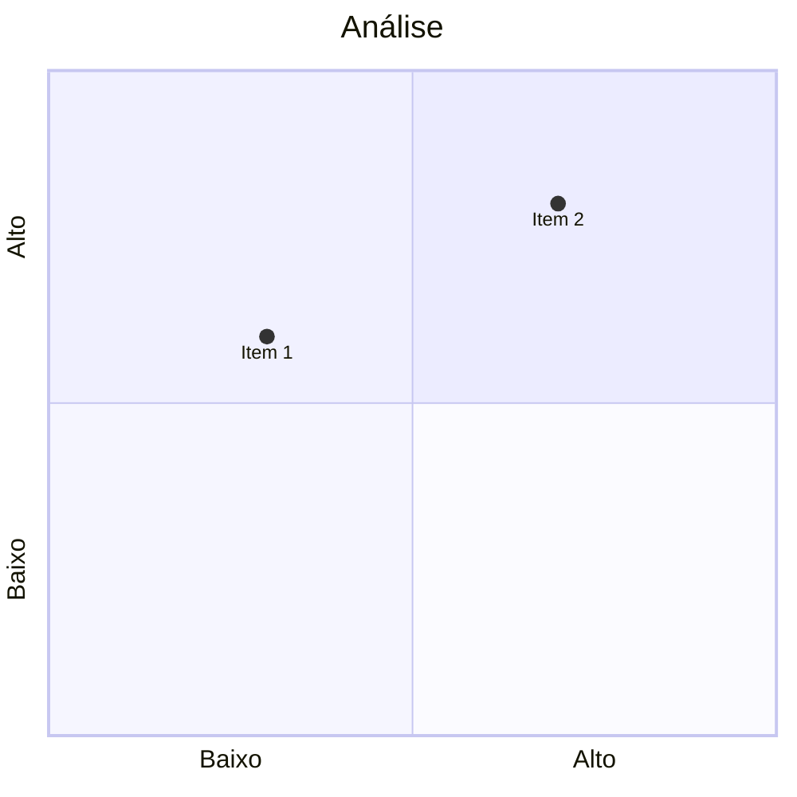

---

## 🎨 Estilização

### Classes CSS

**Definir classe:**
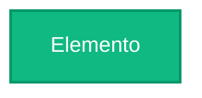

**Propriedades:**
- `fill` - Cor de fundo
- `stroke` - Cor da borda
- `stroke-width` - Largura da borda
- `color` - Cor do texto

---

### Paleta JUSCRASH

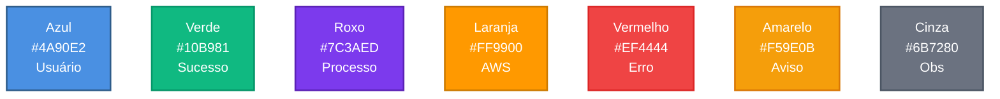

**Código para copiar:**
```
classDef blue fill:#4A90E2,stroke:#2E5C8A,stroke-width:2px,color:#fff
classDef green fill:#10B981,stroke:#059669,stroke-width:2px,color:#fff
classDef purple fill:#7C3AED,stroke:#5B21B6,stroke-width:2px,color:#fff
classDef orange fill:#FF9900,stroke:#CC7A00,stroke-width:2px,color:#fff
classDef red fill:#EF4444,stroke:#DC2626,stroke-width:2px,color:#fff
classDef yellow fill:#F59E0B,stroke:#D97706,stroke-width:2px,color:#fff
classDef gray fill:#6B7280,stroke:#4B5563,stroke-width:2px,color:#fff
```

---

## 🎯 Ícones Emoji

### Pessoas e Usuários
- 👤 Usuário
- 👥 Usuários
- 👨💻 Desenvolvedor
- 👔 Executivo
- 👮 Admin/IAM

### Tecnologia
- 🧠 IA/LLM
- 💻 Código/Dev
- ⚙️ Backend
- 🖥️ Frontend
- 🐳 Docker
- ☁️ Cloud
- ⚡ Lambda/Rápido
- 🔄 Workflow/Processo

### Dados e Storage
- 📦 Storage/S3
- 📊 Métricas/Dados
- 📈 Crescimento
- 📉 Redução
- 📄 Documento
- 📝 Texto/Logs
- 🗂️ Arquivo

### Status
- ✅ Aprovado/Sucesso
- ❌ Rejeitado/Erro
- ⚠️ Aviso/Incompleto
- 🔴 Crítico
- 🟡 Atenção
- 🟢 OK

### Ações
- 🚀 Deploy/Lançar
- 🔍 Buscar/Analisar
- 🔐 Segurança
- 🔑 Autenticação
- 🔒 Criptografia
- 🛡️ Proteção

### Negócio
- 💰 Custo/Dinheiro
- 💵 Economia
- 📊 Dashboard
- 🎯 Objetivo/Meta
- 🏆 Sucesso/Vitória
- 📈 ROI

---

## 📝 Templates Prontos

### Template: Fluxo Simples

```mermaid
graph LR
    A[Início]:::start --> B[Processo]:::process --> C[Fim]:::end
    
    classDef start fill:#4A90E2,stroke:#2E5C8A,stroke-width:2px,color:#fff
    classDef process fill:#7C3AED,stroke:#5B21B6,stroke-width:2px,color:#fff
    classDef end fill:#10B981,stroke:#059669,stroke-width:2px,color:#fff
```

---

### Template: Decisão

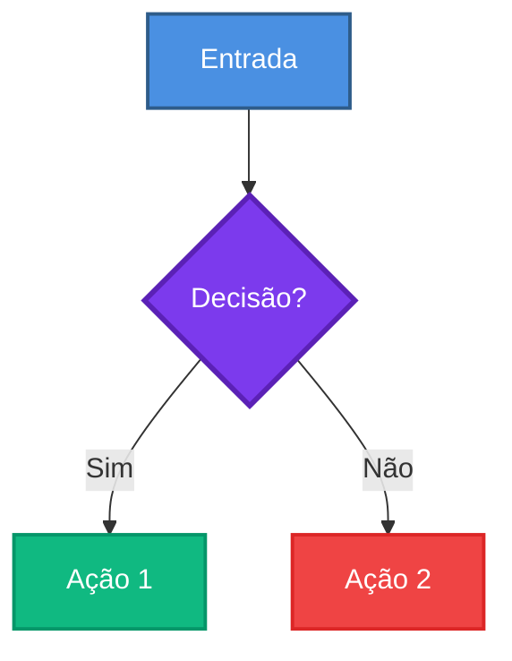

---

### Template: Arquitetura

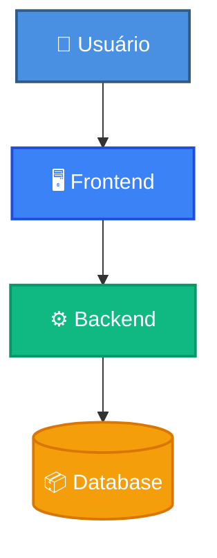

---

### Template: Sequência API

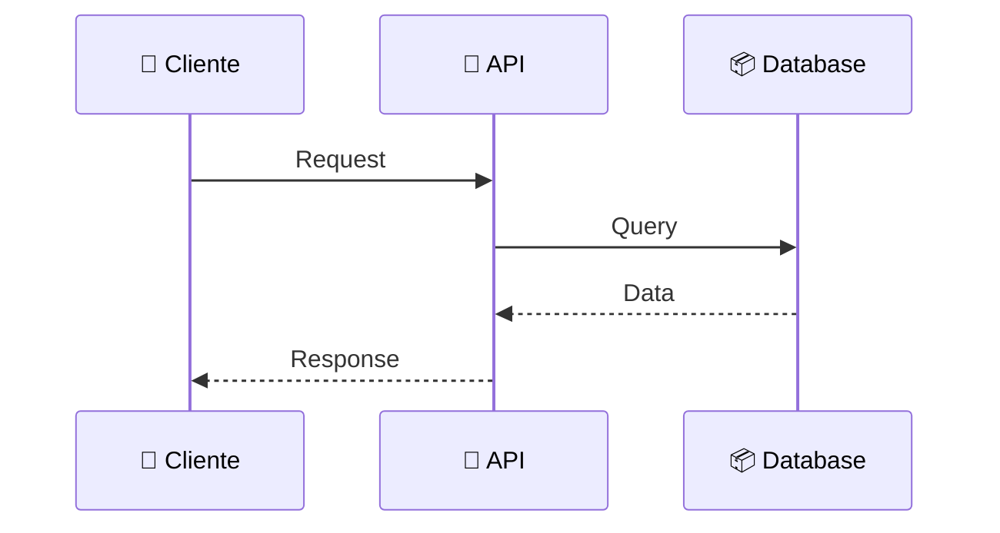

---

### Template: Custos

```mermaid
pie title Custos Mensais
    "Serviço A" : 40
    "Serviço B" : 30
    "Serviço C" : 20
    "Outros" : 10
```

---

## 🛠️ Dicas e Truques

### 1. Subgrafos

Agrupe elementos relacionados:

```mermaid
graph TB
    subgraph Frontend
        A[React]
        B[Vue]
    end
    
    subgraph Backend
        C[Node]
        D[Python]
    end
    
    Frontend --> Backend
```

---

### 2. Links

Adicione links clicáveis:

```mermaid
graph LR
    A[GitHub]
    click A "https://github.com" "Ir para GitHub"
```

---

### 3. Notas em Sequence

```mermaid
sequenceDiagram
    A->>B: Mensagem
    
    rect rgb(200, 150, 255)
        Note over A,B: Área destacada
        A->>B: Outra mensagem
    end
```

---

### 4. Múltiplas Classes

Aplique várias classes:

```mermaid
graph LR
    A[Elemento]:::classe1,classe2
    
    classDef classe1 fill:#10B981
    classDef classe2 stroke:#059669,stroke-width:3px
```

---

## ⚠️ Limitações

### O que NÃO funciona

❌ **Animações:** Mermaid é estático  
❌ **Interatividade:** Sem hover effects  
❌ **Imagens:** Não suporta imagens externas  
❌ **Fontes customizadas:** Usa fonte padrão  

### Workarounds

✅ Use emojis para ícones  
✅ Use cores para destacar  
✅ Use subgrafos para organizar  
✅ Use notas para explicações  

---

## 🐛 Troubleshooting

### Diagrama não renderiza

**Problema:** Código não aparece como diagrama

**Soluções:**
1. Verifique se está entre ` ```mermaid ` e ` ``` `
2. Verifique sintaxe (ponto e vírgula, aspas)
3. Teste em https://mermaid.live
4. Veja console do navegador

---

### Cores não aparecem

**Problema:** Classes CSS não funcionam

**Soluções:**
1. Defina `classDef` antes de usar
2. Use `:::nomeClasse` após o elemento
3. Verifique sintaxe das cores (#RRGGBB)

---

### Texto cortado

**Problema:** Texto muito longo

**Soluções:**
1. Use `<br/>` para quebrar linha
2. Abrevie o texto
3. Use notas para detalhes

---

## 📚 Recursos

### Documentação Oficial
- **Site:** https://mermaid.js.org
- **Docs:** https://mermaid.js.org/intro/
- **Editor:** https://mermaid.live

### Exemplos JUSCRASH
- [DIAGRAMS.md](DIAGRAMS.md) - Biblioteca completa
- [ARCHITECTURE.md](ARCHITECTURE.md) - Diagramas técnicos
- [PRESENTATION.md](PRESENTATION.md) - Diagramas executivos

---

## 🎓 Exercícios

### Exercício 1: Fluxo Básico

Crie um fluxo: Usuário → Sistema → Banco de Dados

<details>
<summary>Ver solução</summary>

```mermaid
graph LR
    A[👤 Usuário] --> B[⚙️ Sistema]
    B --> C[(📦 Database)]
```
</details>

---

### Exercício 2: Decisão

Crie uma decisão: Se valor > 1000 → Aprovar, senão → Rejeitar

<details>
<summary>Ver solução</summary>

```mermaid
graph TD
    A[Valor] --> B{> 1000?}
    B -->|Sim| C[✅ Aprovar]
    B -->|Não| D[❌ Rejeitar]
```
</details>

---

### Exercício 3: Sequência

Crie uma sequência: Cliente faz request → API processa → Retorna response

<details>
<summary>Ver solução</summary>

```mermaid
sequenceDiagram
    Cliente->>API: Request
    API->>API: Processa
    API-->>Cliente: Response
```
</details>

---

## ✅ Checklist de Qualidade

Antes de publicar seu diagrama:

- [ ] Sintaxe correta (testa em mermaid.live)
- [ ] Cores consistentes (paleta JUSCRASH)
- [ ] Emojis apropriados
- [ ] Texto legível (não muito longo)
- [ ] Classes CSS definidas
- [ ] Direção apropriada (LR, TB, etc)
- [ ] Renderiza no GitHub

---

## 🎯 Conclusão

```mermaid
graph LR
    A[📚 Aprender<br/>Mermaid]:::learn --> B[🎨 Criar<br/>Diagramas]:::create
    B --> C[📊 Documentar<br/>Projeto]:::doc
    C --> D[✅ Sucesso!]:::success
    
    classDef learn fill:#4A90E2,stroke:#2E5C8A,stroke-width:2px,color:#fff
    classDef create fill:#7C3AED,stroke:#5B21B6,stroke-width:2px,color:#fff
    classDef doc fill:#F59E0B,stroke:#D97706,stroke-width:2px,color:#fff
    classDef success fill:#10B981,stroke:#059669,stroke-width:3px,color:#fff
```

**Mermaid é poderoso para:**
- ✅ Documentação versionável
- ✅ Diagramas consistentes
- ✅ Colaboração facilitada
- ✅ Manutenção simples

---

**Autor:** José Cleiton  
**Projeto:** JUSCRASH  
**Data:** Janeiro 2025

---

**🎯 Próximo passo:** Pratique com [DIAGRAMS.md](DIAGRAMS.md) e crie seus próprios diagramas!
