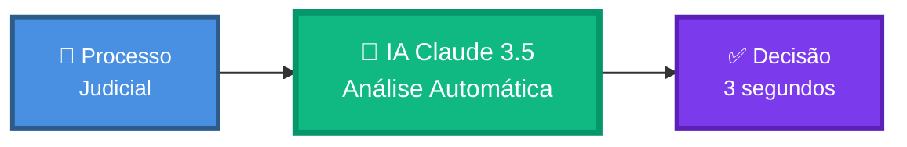
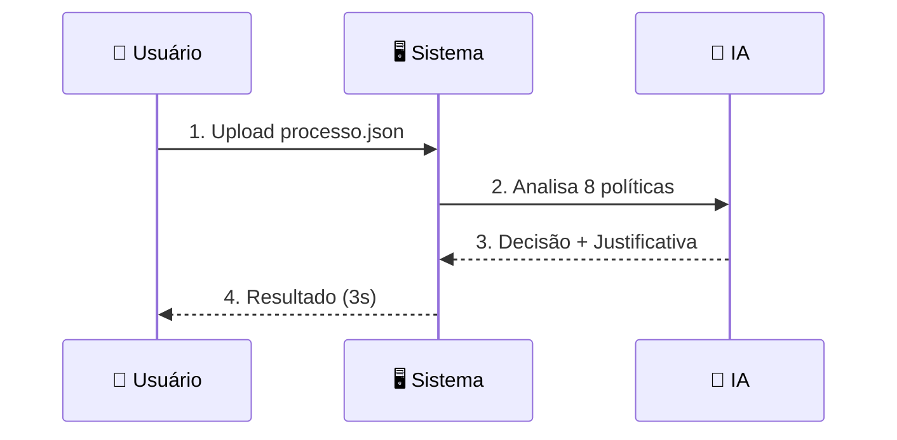
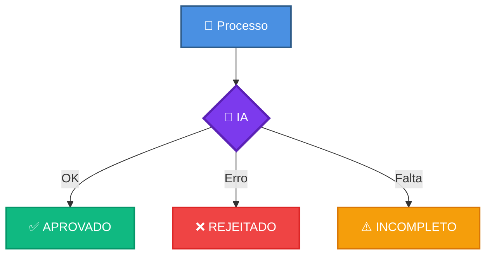
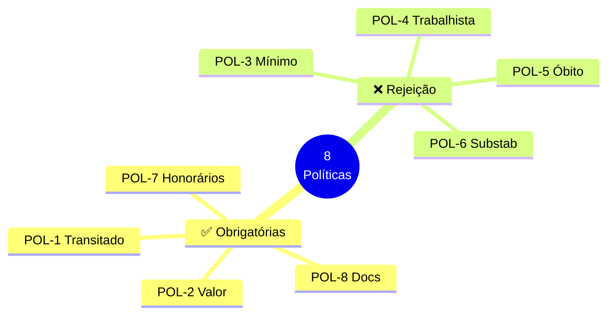
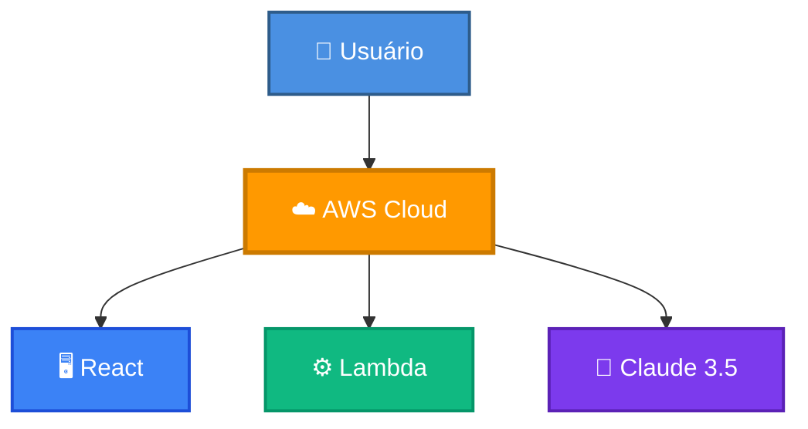
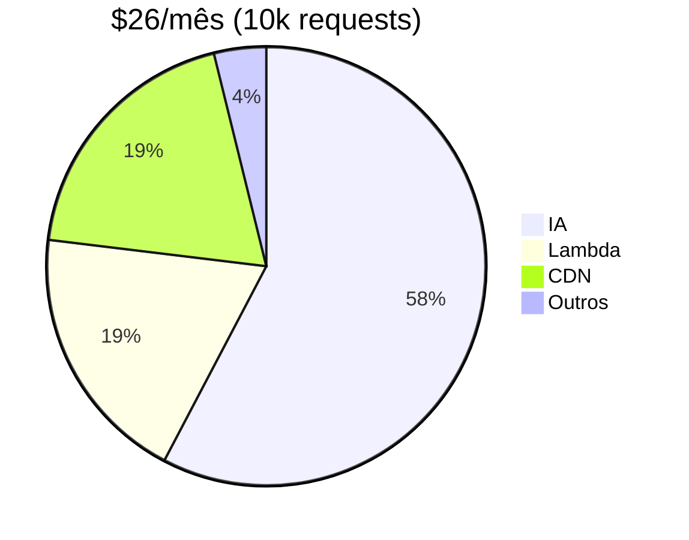
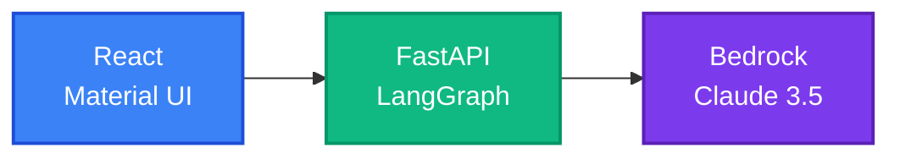
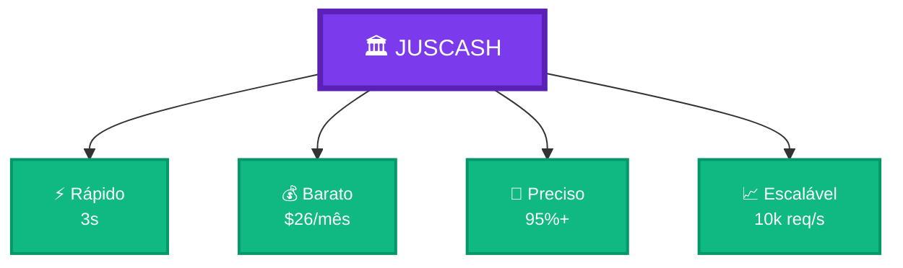

# 🏛️ JUSCASH - Resumo Visual em Uma Página

Tudo que você precisa saber sobre o JUSCASH em uma única página.

---

## 🎯 O que é?



Sistema que analisa processos judiciais e decide automaticamente se devem ser aprovados para compra de crédito usando IA.

---

## ⚡ Como Funciona?



---

## 🎯 3 Decisões



---

## 📜 8 Políticas



---

## 🏗️ Arquitetura



**100% Serverless:** CloudFront + S3 + API Gateway + Lambda + Bedrock

---

## 💰 Custo



**ROI:** 99% economia vs analistas manuais

---

## 🛠️ Stack



---

## 🚀 Deploy


**Comandos:** `make init` → `make deploy` → Pronto!

---

## 🏆 Diferenciais

| Diferencial | Descrição |
|-------------|-----------|
| 🎨 **Editor Visual** | LangFlow drag-and-drop |
| ☁️ **100% Serverless** | AWS Lambda + API Gateway |
| 📊 **Observabilidade** | LangSmith traces completos |
| 🧠 **IA Avançada** | Claude 3.5 Sonnet |
| ⚡ **Rápido** | 3 segundos por análise |
| 💰 **Barato** | $26/mês para 10k requests |

---

## 📊 Métricas

| Métrica | Valor |
|---------|-------|
| ⏱️ **Tempo** | 3 segundos |
| 💰 **Custo** | $0.04/análise |
| 🎯 **Precisão** | 95%+ |
| 📈 **Escala** | 10k req/s |
| 🔒 **SLA** | 99.99% |

---

## 🔗 Links

| Recurso | URL |
|---------|-----|
| 🌐 **Frontend** | https://d26fvod1jq9hfb.cloudfront.net |
| 🔌 **API** | https://3p6xtd91q4.execute-api.us-east-1.amazonaws.com/prod |
| 📖 **Docs** | [/docs](https://3p6xtd91q4.execute-api.us-east-1.amazonaws.com/prod/docs) |
| 💻 **GitHub** | https://github.com/jcleitonss/JusCash_IA |

---

## 🐳 Local

```bash
# Subir
docker-compose up --build

# Acessar
http://localhost:5173  # Frontend
http://localhost:8000  # Backend
http://localhost:7860  # LangFlow
```

---

## ☁️ AWS

```bash
cd app-remoto/infrastructure
make init      # Inicializa
make deploy    # Deploy
make logs      # Logs
```

---

## 📚 Docs


- ⚡ [QUICK_REFERENCE.md](QUICK_REFERENCE.md) - 5 min
- 🎯 [PRESENTATION.md](PRESENTATION.md) - 10 min
- 🏗️ [ARCHITECTURE.md](ARCHITECTURE.md) - 20 min
- 📊 [DIAGRAMS.md](DIAGRAMS.md) - Biblioteca
- 📚 [INDEX.md](INDEX.md) - Índice completo

---

## 🎓 Próximos Passos


1. Ler [QUICK_REFERENCE.md](QUICK_REFERENCE.md)
2. Testar local com Docker
3. Deploy AWS com Terraform
4. Usar em produção

---

## 📞 Contato

**Desenvolvedor:** José Cleiton  
**GitHub:** https://github.com/jcleitonss/JusCash_IA
**Projeto:** JUSCASH

---

## 🎯 Resumo Executivo



**JUSCASH transforma análise jurídica manual em decisões automáticas, rápidas e precisas usando IA.**

---

**⚡ Desenvolvido em 7 dias | 🚀 100% Funcional | ✅ Pronto para Produção**

---

**📖 Quer mais detalhes?** Veja [INDEX.md](INDEX.md) para navegação completa da documentação.
