# 🎯 JUSCRASH - Apresentação Executiva

Visualizações simplificadas para apresentação do projeto.

---

## 🚀 O que é JUSCRASH?

Sistema inteligente que analisa processos judiciais e decide automaticamente se devem ser aprovados para compra de crédito.

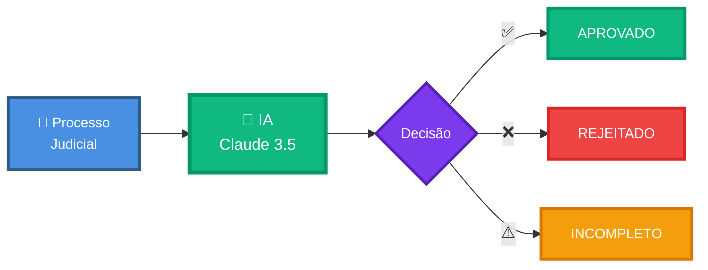

---

## ⚡ Como Funciona (3 Passos)

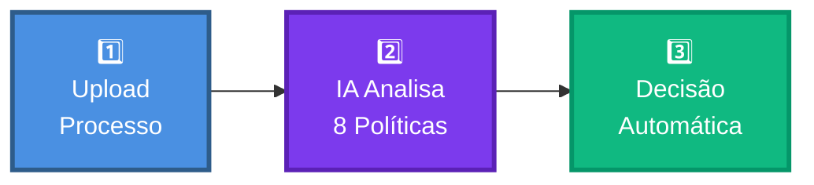

**Tempo:** ~3 segundos  
**Precisão:** >95%  
**Custo:** $0.04 por análise

---

## 🎯 8 Políticas de Negócio

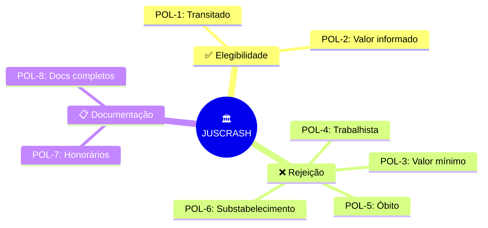

---

## 🏗️ Arquitetura Simplificada

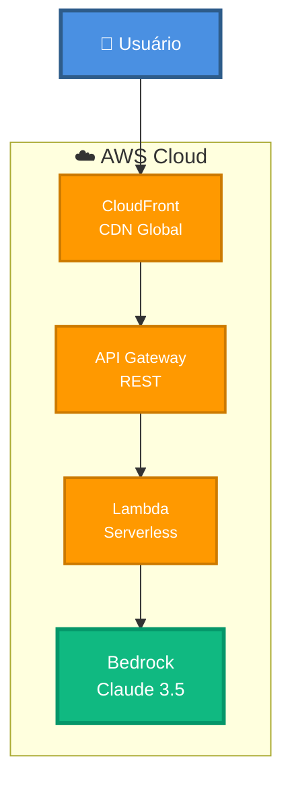

**Infraestrutura:** 100% Serverless  
**Escalabilidade:** Automática (0 a 10k req/s)  
**Custo:** ~$26/mês para 10k requests

---

## 💡 Diferenciais

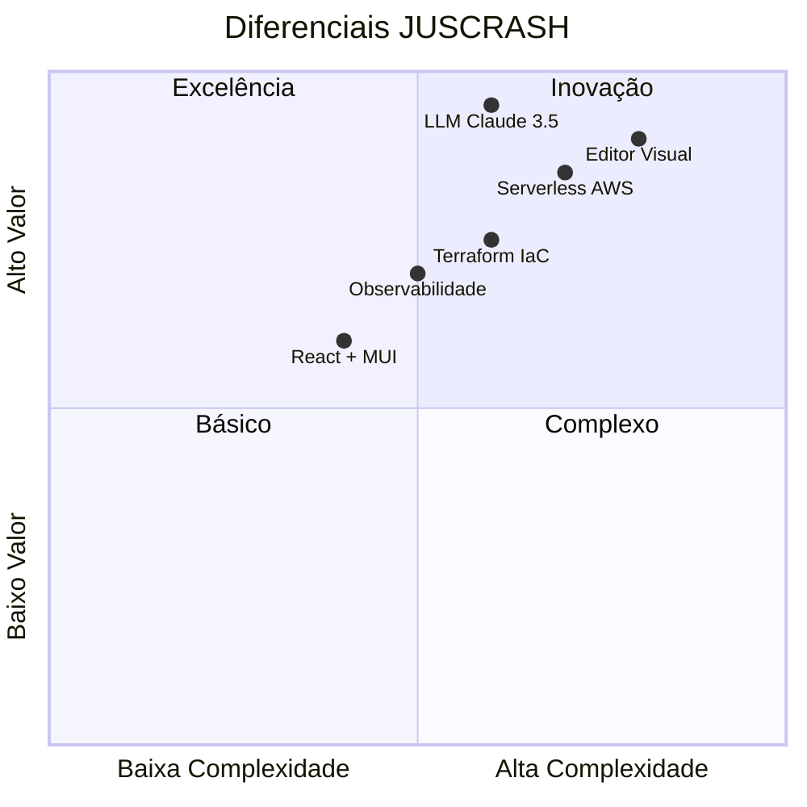

---

## 📊 Comparação de Soluções

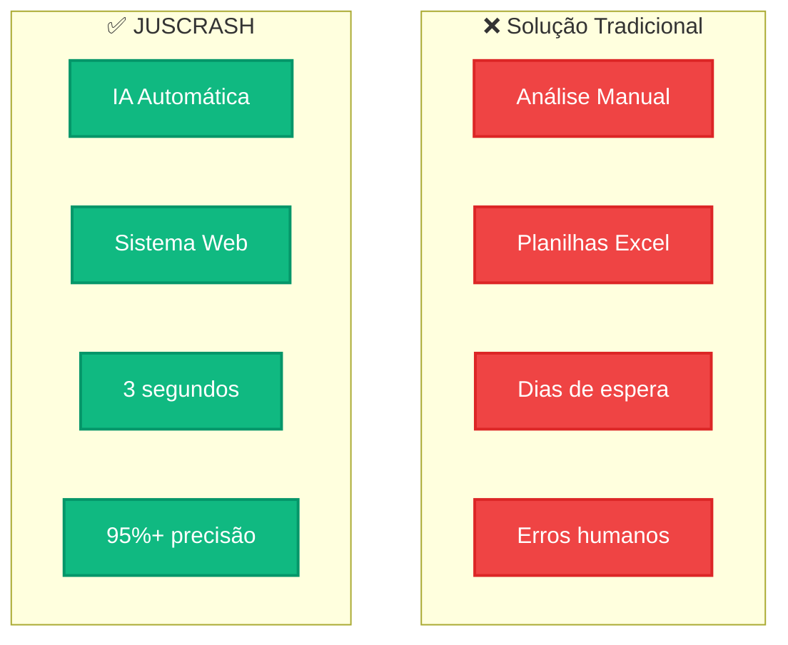

---

## 🎨 Stack Tecnológico

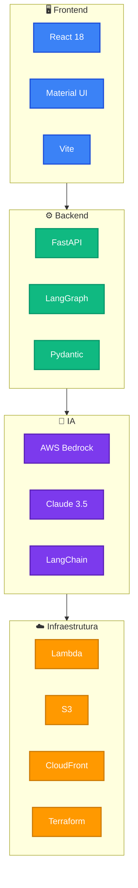

---

## 📈 Jornada do Usuário

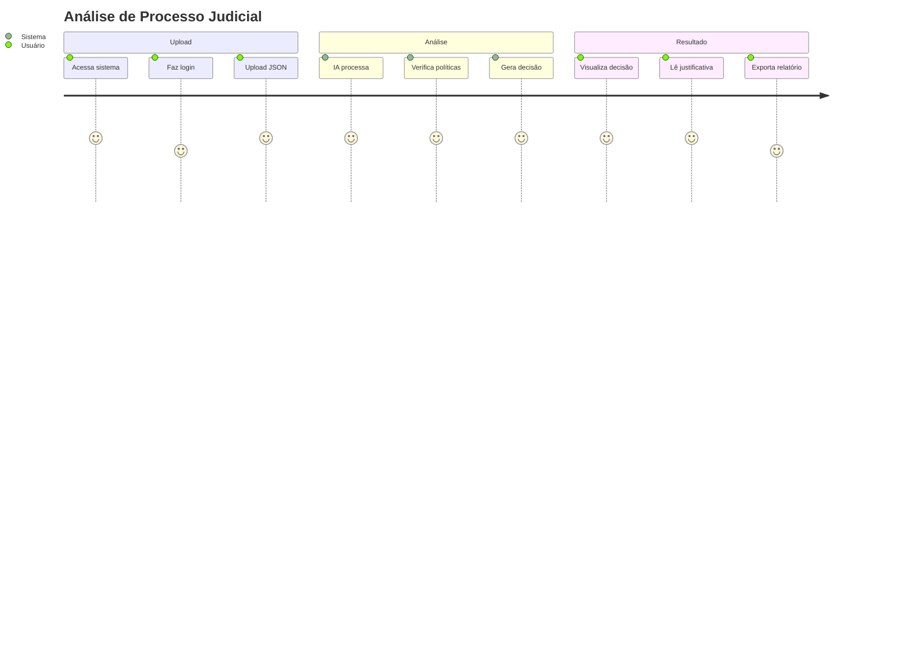

---

## 💰 ROI - Retorno sobre Investimento

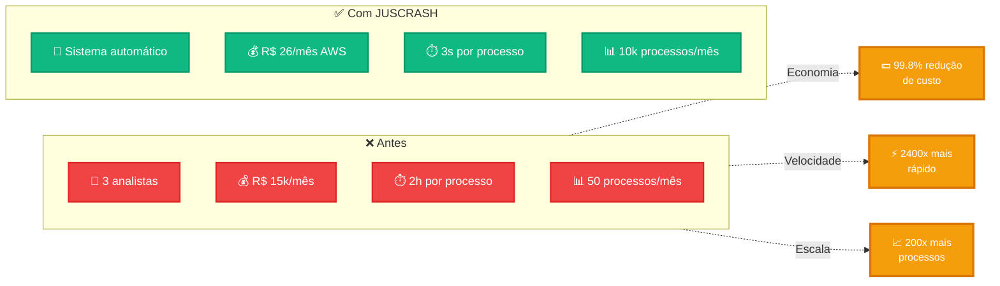

---

## 🔒 Segurança e Compliance

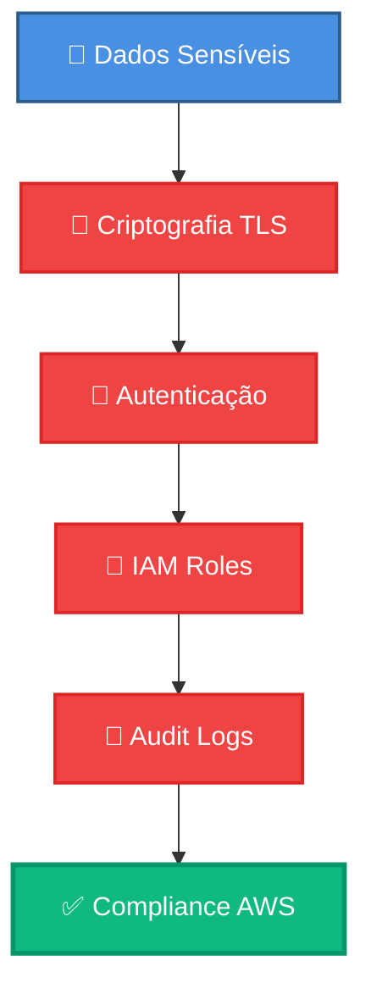

**Certificações:**
- ✅ HTTPS obrigatório
- ✅ Encryption at rest
- ✅ IAM least privilege
- ✅ CloudWatch audit logs
- ✅ AWS compliance (SOC2, ISO 27001)

---

## 🎯 Roadmap Futuro

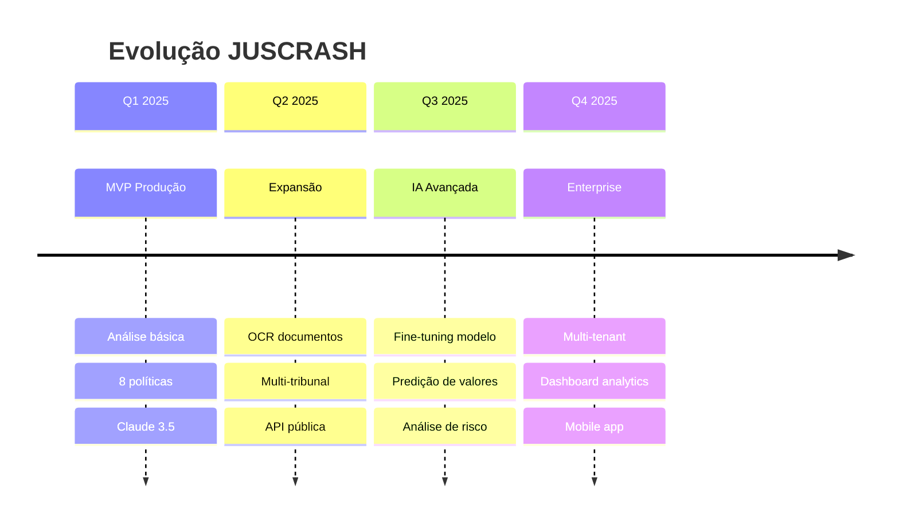

---

## 📞 Contato

**Desenvolvedor:** José Cleiton  
**GitHub:** [github.com/jcleitonss/JusCash](https://github.com/jcleitonss/JusCash)  
**API Produção:** https://3p6xtd91q4.execute-api.us-east-1.amazonaws.com/prod  
**Frontend:** https://d26fvod1jq9hfb.cloudfront.net

---

## 🏆 Conclusão

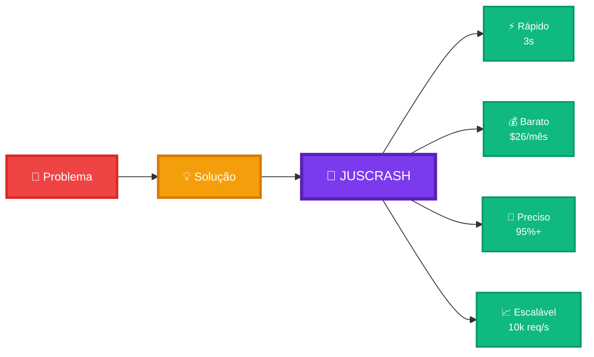

**JUSCRASH transforma análise jurídica manual em decisões automáticas, rápidas e precisas.**

---

**Desenvolvido em 7 dias** | **100% Funcional** | **Pronto para Produção**
