# ⚡ JUSCRASH - Referência Rápida Visual

Guia visual rápido para entender o JusCash em 5 minutos.

---

## 🎯 O que é?

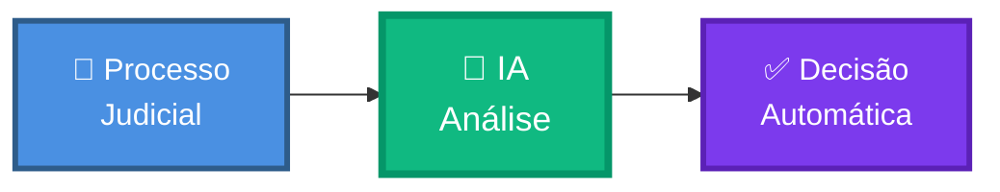

**Sistema que analisa processos judiciais e decide automaticamente se devem ser aprovados para compra de crédito.**

---

## ⚡ Como funciona?


1. **Upload:** Usuário envia JSON do processo
2. **IA Analisa:** Claude 3.5 verifica 8 políticas
3. **Decisão:** Sistema retorna aprovado/rejeitado/incompleto

**Tempo:** 3 segundos | **Custo:** $0.04 | **Precisão:** 95%+

---

## 🎯 3 Decisões Possíveis

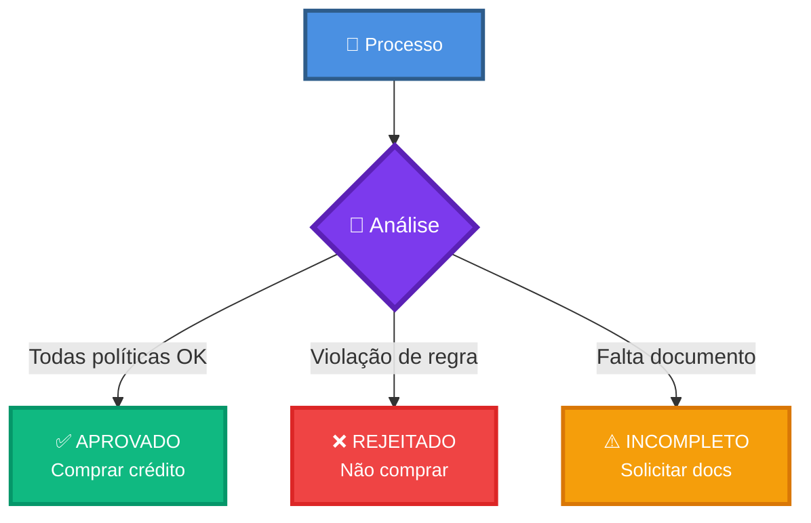

---

## 📜 8 Políticas de Negócio

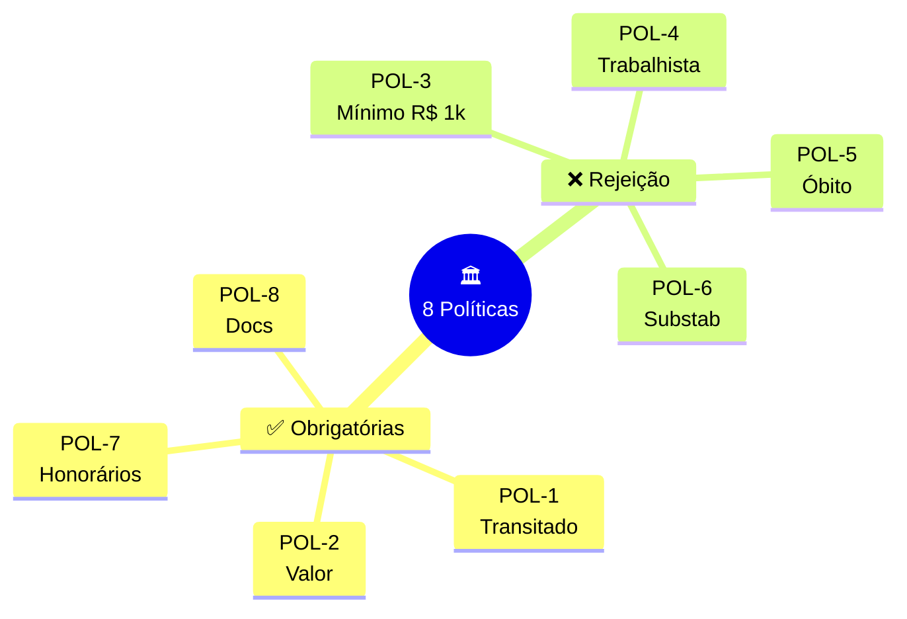

| Tipo | Políticas | Ação |
|------|-----------|------|
| ✅ **Obrigatórias** | POL-1, POL-2, POL-7, POL-8 | Se faltar → INCOMPLETO |
| ❌ **Rejeição** | POL-3, POL-4, POL-5, POL-6 | Se violar → REJEITADO |

---

## 🏗️ Arquitetura (Simplificada)

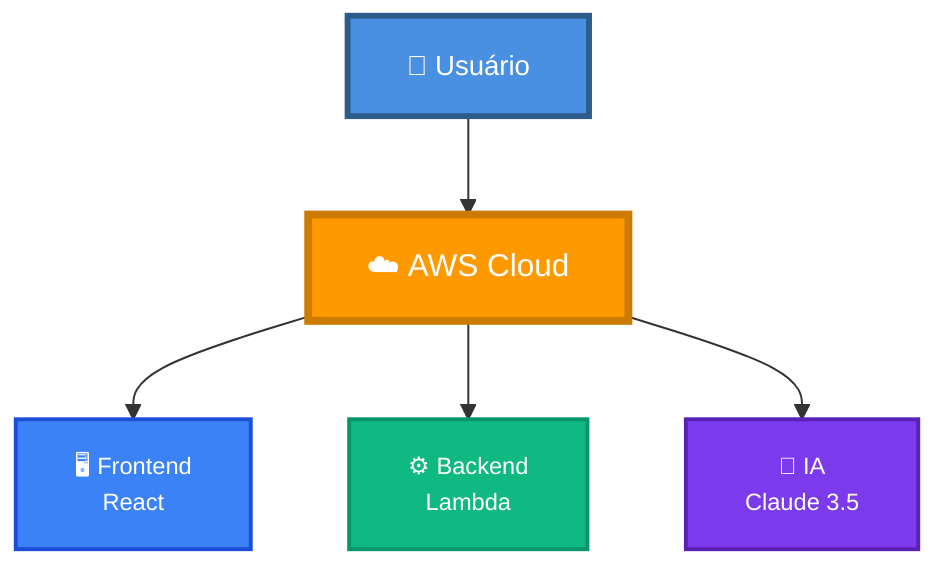

**100% Serverless AWS:**
- Frontend: CloudFront + S3
- Backend: Lambda + API Gateway
- IA: AWS Bedrock (Claude 3.5)

---

## 💰 Custo

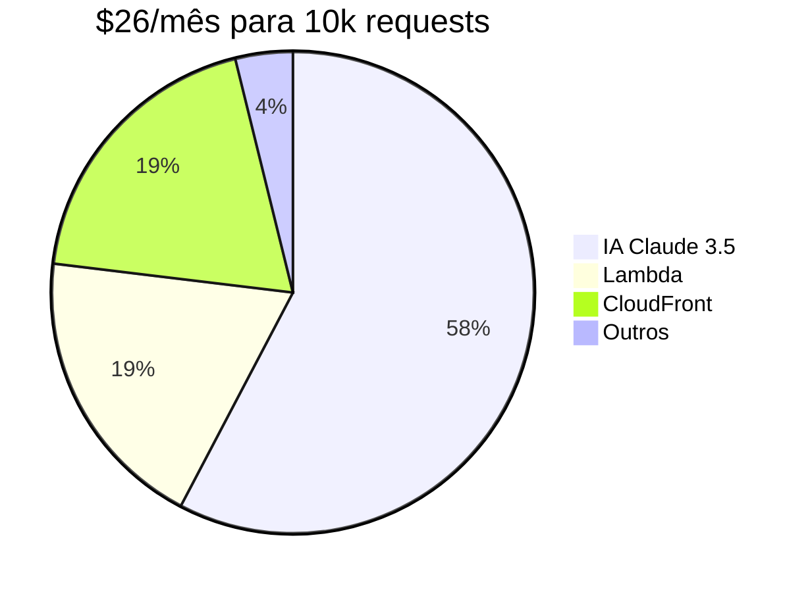

**Comparação:**
- ❌ **Antes:** 3 analistas × R$ 5k = R$ 15.000/mês
- ✅ **Agora:** AWS Serverless = R$ 150/mês (~$26)
- 💰 **Economia:** 99% de redução

---

## 🚀 Stack Tecnológico

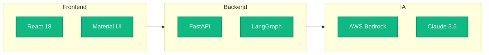

**Principais tecnologias:**
- 🖥️ Frontend: React + Material UI
- ⚙️ Backend: FastAPI + LangGraph
- 🧠 IA: AWS Bedrock + Claude 3.5
- ☁️ Infra: Lambda + Terraform

---

## 📊 Fluxo Completo

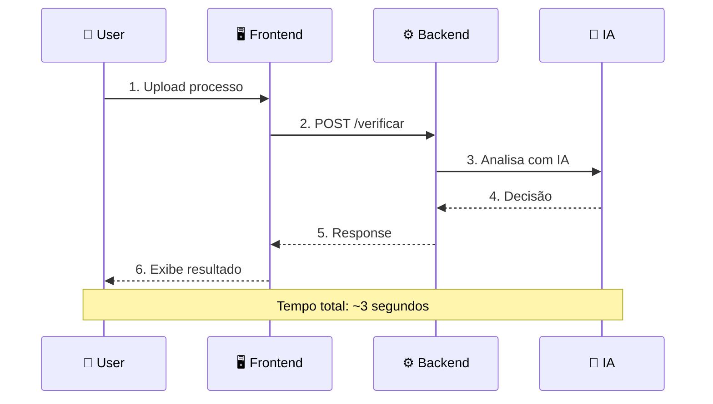

---

## 🎯 Exemplo de Uso

### Input (JSON)
```json
{
  "numeroProcesso": "0001234-56.2023.4.05.8100",
  "classe": "Cumprimento de Sentença",
  "esfera": "Federal",
  "documentos": [
    {
      "nome": "Certidão de Trânsito em Julgado",
      "texto": "Certifico que transitou..."
    }
  ]
}
```

### Output (JSON)
```json
{
  "decision": "approved",
  "rationale": "Processo transitado (POL-1), valor R$ 67.592 informado (POL-2)...",
  "citacoes": ["POL-1", "POL-2"]
}
```

---

## 🐳 Ambiente Local

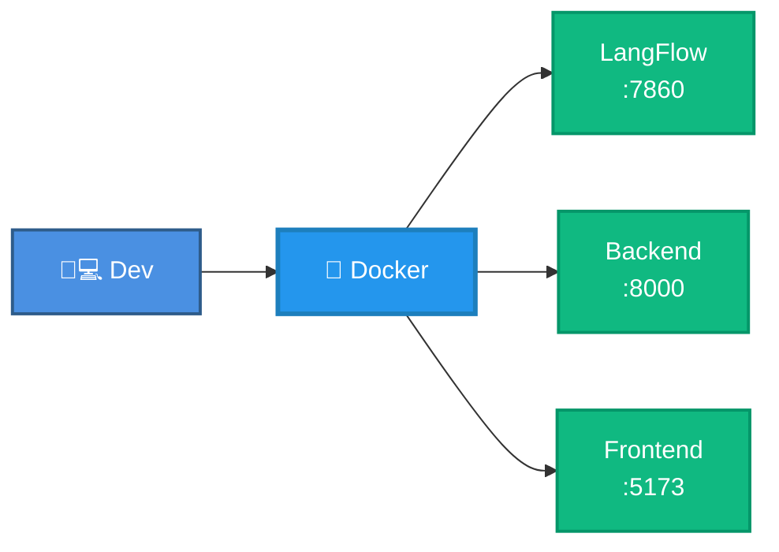

**Comandos:**
```bash
# Subir tudo
docker-compose up --build

# Acessar
http://localhost:5173  # Frontend
http://localhost:8000  # Backend
http://localhost:7860  # LangFlow
```

---

## ☁️ Deploy AWS

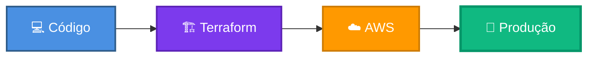

**Comandos:**
```bash
cd app-remoto/infrastructure
make init      # Inicializa
make deploy    # Deploy completo
make logs      # Ver logs
```

---

## 🏆 Diferenciais

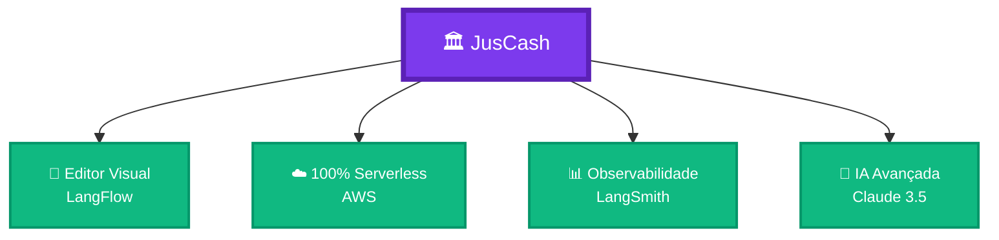

**Único com:**
- ✅ Editor visual drag-and-drop (LangFlow)
- ✅ Arquitetura serverless completa
- ✅ Observabilidade profissional (LangSmith)
- ✅ Frontend moderno (React + MUI)

---

## 📈 ROI

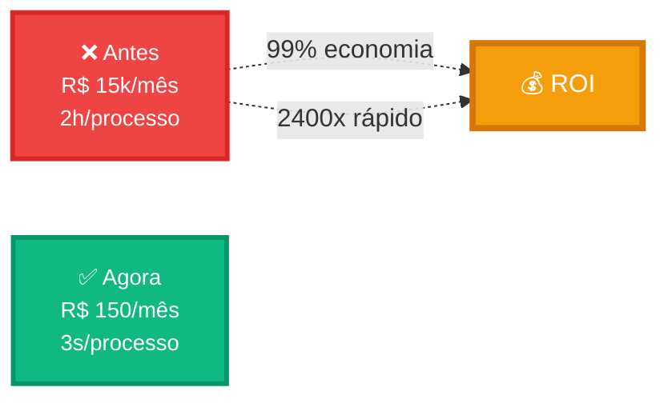

---

## 🔗 Links Rápidos

| Recurso | URL |
|---------|-----|
| 🌐 **Frontend** | https://d26fvod1jq9hfb.cloudfront.net |
| 🔌 **API** | https://3p6xtd91q4.execute-api.us-east-1.amazonaws.com/prod |
| 📖 **Docs** | [/docs](https://3p6xtd91q4.execute-api.us-east-1.amazonaws.com/prod/docs) |
| 📊 **LangSmith** | https://smith.langchain.com |
| 💻 **GitHub** | https://github.com/jcleitonss/JusCash |

---

## 📚 Documentação Completa

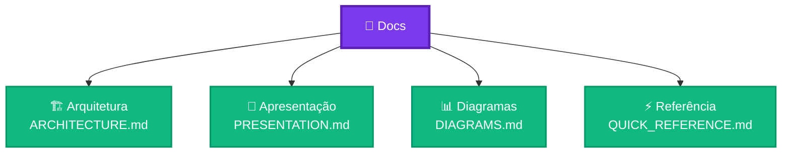

- 🏗️ [ARCHITECTURE.md](ARCHITECTURE.md) - Arquitetura técnica completa
- 🎯 [PRESENTATION.md](PRESENTATION.md) - Apresentação executiva
- 📊 [DIAGRAMS.md](DIAGRAMS.md) - Biblioteca de diagramas
- ⚡ [QUICK_REFERENCE.md](QUICK_REFERENCE.md) - Este guia

---

## 🎓 Próximos Passos


1. **Ler documentação:** [README.md](../README.md)
2. **Testar local:** `docker-compose up`
3. **Deploy AWS:** `make deploy`
4. **Usar em produção:** API + Frontend

---

## 📞 Contato

**Desenvolvedor:** José Cleiton  
**GitHub:** [github.com/jcleitonss/JusCash](https://github.com/jcleitonss/JusCash)  
**Projeto:** JusCash - Verificador Inteligente de Processos Judiciais

---

**⚡ Desenvolvido em 7 dias | 🚀 100% Funcional | ✅ Pronto para Produção**
