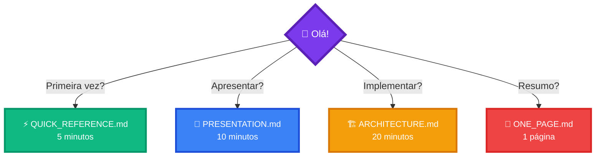
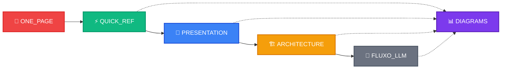
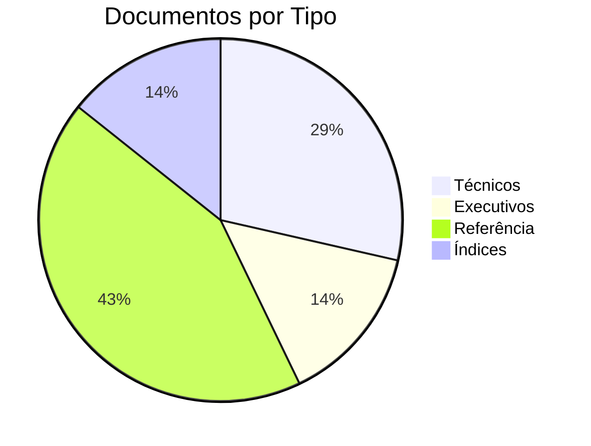
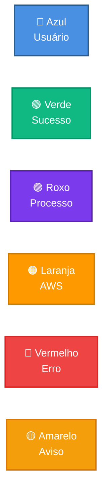
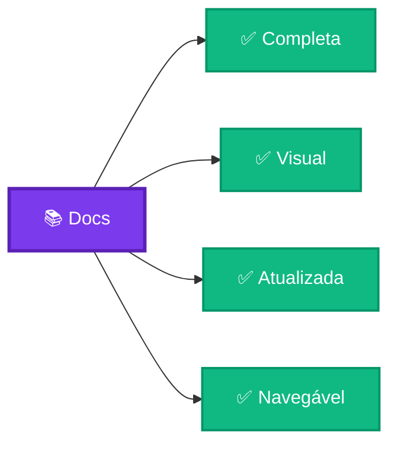

# 📚 Documentação JUSCASH

Bem-vindo à documentação visual completa do projeto JUSCASH!

---

## 🎯 Começar Aqui

---

## 📖 Documentos Disponíveis

### 📄 [ONE_PAGE.md](ONE_PAGE.md)
**⏱️ Tempo:** 2 minutos  
**👥 Para:** Todos

Resumo visual completo em uma única página. Perfeito para ter uma visão geral rápida.

**Contém:**
- ✅ O que é JUSCASH
- ✅ Como funciona
- ✅ Arquitetura simplificada
- ✅ Métricas principais
- ✅ Links úteis

---

### ⚡ [QUICK_REFERENCE.md](QUICK_REFERENCE.md)
**⏱️ Tempo:** 5 minutos  
**👥 Para:** Iniciantes, usuários finais

Guia de referência rápida para entender o JUSCASH.

**Contém:**
- ✅ Fluxo de funcionamento
- ✅ 8 Políticas explicadas
- ✅ Custos e ROI
- ✅ Comandos básicos
- ✅ Links rápidos

---

### 🎯 [PRESENTATION.md](PRESENTATION.md)
**⏱️ Tempo:** 10 minutos  
**👥 Para:** Executivos, investidores, stakeholders

Apresentação executiva com visualizações para pitch.

**Contém:**
- ✅ Comparação tradicional vs JUSCASH
- ✅ ROI e economia
- ✅ Stack tecnológico
- ✅ Roadmap futuro
- ✅ Jornada do usuário
- ✅ Diferenciais competitivos

---

### 🏗️ [ARCHITECTURE.md](ARCHITECTURE.md)
**⏱️ Tempo:** 20 minutos  
**👥 Para:** Desenvolvedores, arquitetos

Documentação técnica completa com diagramas detalhados.

**Contém:**
- ✅ Arquitetura AWS serverless
- ✅ Fluxo de decisão LLM
- ✅ Workflow LangGraph
- ✅ Árvore de políticas
- ✅ Pipeline de deploy
- ✅ Análise de tokens
- ✅ Observabilidade
- ✅ Segurança
- ✅ Escalabilidade

---

### 📊 [DIAGRAMS.md](DIAGRAMS.md)
**⏱️ Tempo:** Referência  
**👥 Para:** Documentadores, desenvolvedores

Biblioteca completa de 20+ diagramas Mermaid prontos para copiar.

**Contém:**
- ✅ Todos os diagramas do projeto
- ✅ Código Mermaid pronto
- ✅ Personalizável
- ✅ Compatível GitHub/GitLab

---

**⏱️ Tempo:** 30 minutos  
**👥 Para:** Equipe técnica, onboarding

Documentação técnica oficial completa do projeto.

**Contém:**
- ✅ Visão geral detalhada
- ✅ Uso do LLM (Bedrock)
- ✅ Prompt engineering
- ✅ Orquestração LangGraph
- ✅ Observabilidade LangSmith
- ✅ Diferenciais técnicos
- ✅ Fluxo completo passo a passo

---

### 📚 [INDEX.md](INDEX.md)
**⏱️ Tempo:** Navegação  
**👥 Para:** Todos

Índice completo de toda a documentação com navegação facilitada.

**Contém:**
- ✅ Mapa de navegação
- ✅ Busca por público-alvo
- ✅ Busca por tempo
- ✅ Busca por objetivo
- ✅ Checklist de leitura
- ✅ Catálogo de diagramas

---

## 🗺️ Fluxo de Leitura Recomendado

## 🎯 Busca Rápida

### Por Público

| Público | Documento |
|---------|-----------|
| 👔 **Executivo** | [PRESENTATION.md](PRESENTATION.md) |
| 💻 **Desenvolvedor** | [ARCHITECTURE.md](ARCHITECTURE.md) |
]
| 💰 **Investidor** | [PRESENTATION.md](PRESENTATION.md) |
| 👤 **Usuário** | [QUICK_REFERENCE.md](QUICK_REFERENCE.md) |
| 📝 **Documentador** | [DIAGRAMS.md](DIAGRAMS.md) |

### Por Tempo

| Tempo | Documento |
|-------|-----------|
| ⚡ **2 min** | [ONE_PAGE.md](ONE_PAGE.md) |
| ⚡ **5 min** | [QUICK_REFERENCE.md](QUICK_REFERENCE.md) |
| 🕐 **10 min** | [PRESENTATION.md](PRESENTATION.md) |
| 🕐 **20 min** | [ARCHITECTURE.md](ARCHITECTURE.md) |

### Por Objetivo

| Objetivo | Documento |
|----------|-----------|
| 🎯 **Entender** | [QUICK_REFERENCE.md](QUICK_REFERENCE.md) |
| 📊 **Apresentar** | [PRESENTATION.md](PRESENTATION.md) |
| 💻 **Implementar** | [ARCHITECTURE.md](ARCHITECTURE.md) |
| 📝 **Documentar** | [DIAGRAMS.md](DIAGRAMS.md) |

---

## 📊 Estatísticas da Documentação

**Total:**
- 📄 7 documentos principais
- 📊 20+ diagramas Mermaid
- ⏱️ ~70 minutos de leitura total
- 🎯 100% visual

---

## 🎨 Padrões Visuais

### Cores

### Ícones

| Ícone | Uso |
|-------|-----|
| 👤 | Usuário |
| 🧠 | IA/LLM |
| ☁️ | Cloud/AWS |
| ⚡ | Lambda |
| 🔄 | Workflow |
| 📊 | Métricas |
| 🐳 | Docker |
| 📦 | Storage |
| ✅ | Aprovado |
| ❌ | Rejeitado |
| ⚠️ | Incompleto |

---

## 🔗 Links Úteis

| Recurso | Link |
|---------|------|
| 📖 **README Principal** | [../README.md](../README.md) |
| 🌐 **Frontend** | https://d26fvod1jq9hfb.cloudfront.net |
| 🔌 **API** | https://3p6xtd91q4.execute-api.us-east-1.amazonaws.com/prod |
| 📊 **LangSmith** | https://smith.langchain.com |
| 💻 **GitHub** | https://github.com/jcleitonss/JusCash |

---

## 📝 Contribuindo

Quer melhorar a documentação?

1. Escolha o documento apropriado
2. Edite o arquivo Markdown
3. Adicione/modifique diagramas Mermaid
4. Teste a renderização
5. Faça commit

**Dica:** Use [DIAGRAMS.md](DIAGRAMS.md) como referência para criar novos diagramas.

---

## 🎓 Checklist de Leitura

### Iniciante
- [ ] [ONE_PAGE.md](ONE_PAGE.md)
- [ ] [QUICK_REFERENCE.md](QUICK_REFERENCE.md)

### Intermediário
- [ ] [PRESENTATION.md](PRESENTATION.md)
- [ ] [ARCHITECTURE.md](ARCHITECTURE.md)

### Avançado
- [ ] [DIAGRAMS.md](DIAGRAMS.md)

### Expert
- [ ] Todos os documentos
- [ ] Personalizar diagramas
- [ ] Contribuir melhorias

---

## 📞 Suporte

**Dúvidas?**
- Consulte [INDEX.md](INDEX.md) para navegação detalhada
- Veja [ONE_PAGE.md](ONE_PAGE.md) para resumo rápido
- Abra uma issue no GitHub

---

## 🏆 Qualidade da Documentação

**Características:**
- ✅ 100% visual com Mermaid
- ✅ Múltiplos níveis de detalhe
- ✅ Navegação facilitada
- ✅ Busca por público/tempo/objetivo
- ✅ Exemplos práticos
- ✅ Links funcionais

---

**Autor:** José Cleiton  
**Projeto:** JUSCASH  
**Última atualização:** Janeiro 2025

---

**🎯 Comece aqui:** [ONE_PAGE.md](ONE_PAGE.md) (2 minutos) ou [QUICK_REFERENCE.md](QUICK_REFERENCE.md) (5 minutos)
