# 📋 JUSCRASH - Sumário da Documentação Visual

Resumo completo de toda a documentação criada com diagramas Mermaid.

---

## ✅ Documentos Criados

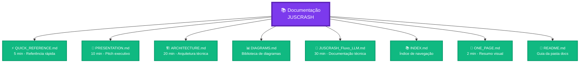

---

## 📊 Estatísticas

### Documentos

| Tipo | Quantidade |
|------|------------|
| 📄 **Documentos principais** | 8 |
| 📊 **Diagramas Mermaid** | 25+ |
| ⏱️ **Tempo total de leitura** | ~70 minutos |
| 📝 **Linhas de código** | ~3.000+ |
| 🎨 **Tipos de diagramas** | 8 (Graph, Sequence, Pie, etc) |

### Cobertura

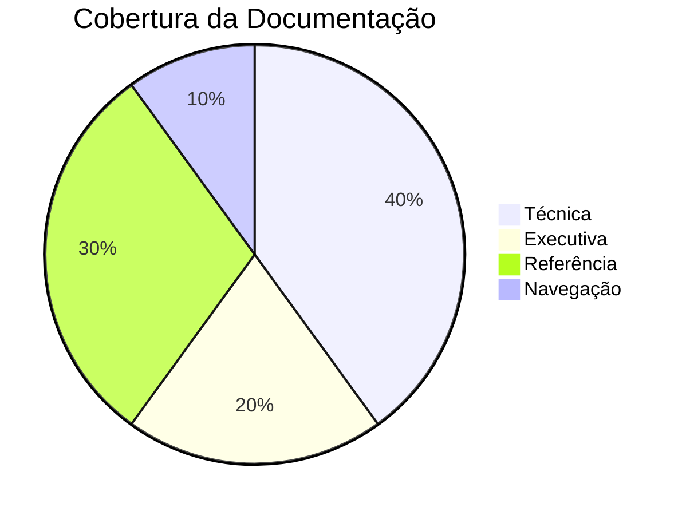

---

## 📁 Estrutura de Arquivos

```
docs/
├── 📄 ONE_PAGE.md              # Resumo em 1 página (2 min)
├── ⚡ QUICK_REFERENCE.md       # Referência rápida (5 min)
├── 🎯 PRESENTATION.md          # Apresentação executiva (10 min)
├── 🏗️ ARCHITECTURE.md          # Arquitetura técnica (20 min)
├── 📊 DIAGRAMS.md              # Biblioteca de diagramas
├── 📄 JUSCRASH_Fluxo_LLM.md    # Documentação técnica (30 min)
├── 📚 INDEX.md                 # Índice de navegação
├── 📖 README.md                # Guia da pasta docs
└── 📋 SUMMARY.md               # Este arquivo
```

---

## 🎯 Documentos por Público-Alvo

### 👔 Executivos e Gestores


**Recomendado:**
1. [ONE_PAGE.md](ONE_PAGE.md) - Resumo executivo
2. [PRESENTATION.md](PRESENTATION.md) - Apresentação completa

---

### 💻 Desenvolvedores

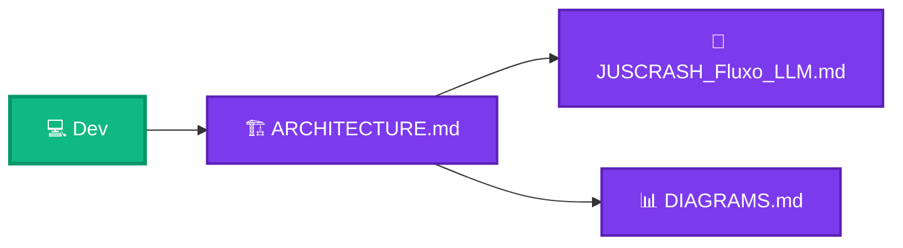

**Recomendado:**
1. [QUICK_REFERENCE.md](QUICK_REFERENCE.md) - Overview
2. [ARCHITECTURE.md](ARCHITECTURE.md) - Arquitetura
3. [JUSCRASH_Fluxo_LLM.md](JUSCRASH_Fluxo_LLM.md) - Detalhes técnicos
4. [DIAGRAMS.md](DIAGRAMS.md) - Diagramas

---

### 👤 Usuários Finais


**Recomendado:**
1. [ONE_PAGE.md](ONE_PAGE.md) - Resumo rápido
2. [QUICK_REFERENCE.md](QUICK_REFERENCE.md) - Guia de uso

---

### 📝 Documentadores


**Recomendado:**
1. [DIAGRAMS.md](DIAGRAMS.md) - Biblioteca completa
2. [INDEX.md](INDEX.md) - Estrutura de navegação

---

## 📊 Tipos de Diagramas Incluídos

### 1. Graph (Fluxogramas)


**Usado em:** Arquitetura, fluxos, pipelines

---

### 2. Sequence (Sequência)

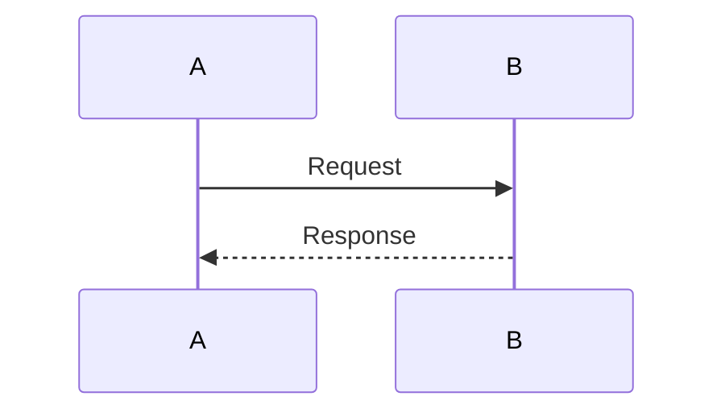

**Usado em:** Fluxos de API, interações

---

### 3. Pie (Pizza)

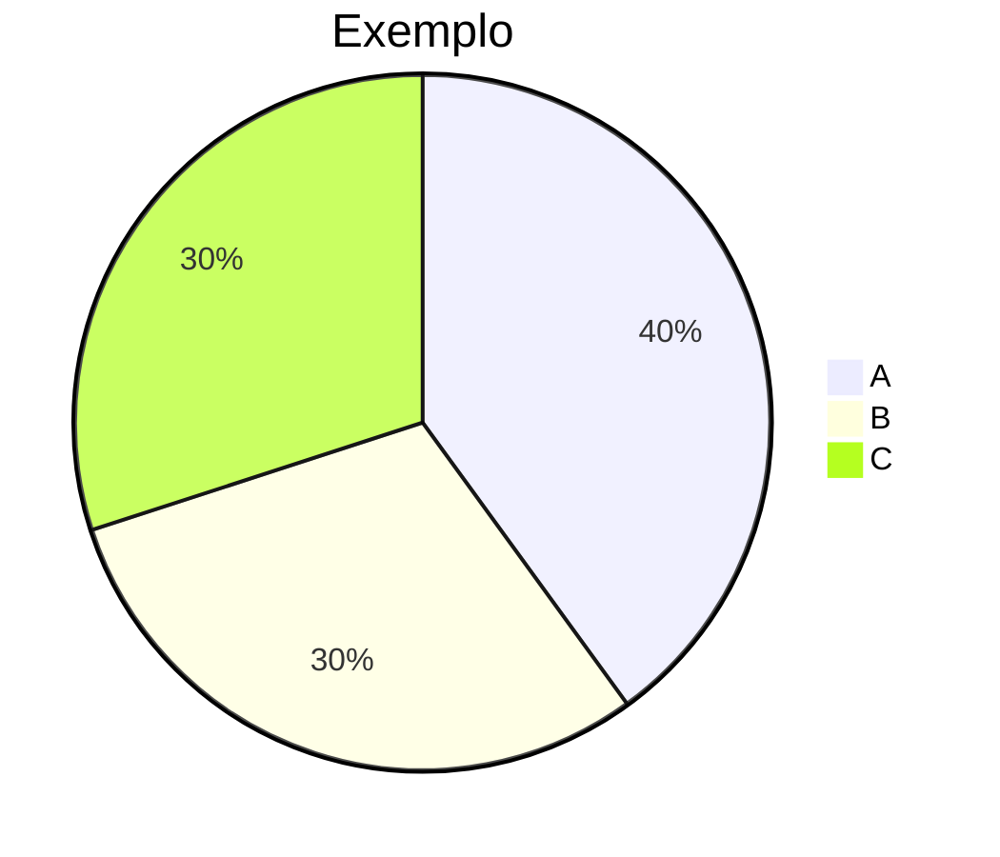

**Usado em:** Custos, distribuições

---

### 4. StateDiagram (Estados)


**Usado em:** Workflows, máquinas de estado

---

### 5. Mindmap (Mapa Mental)

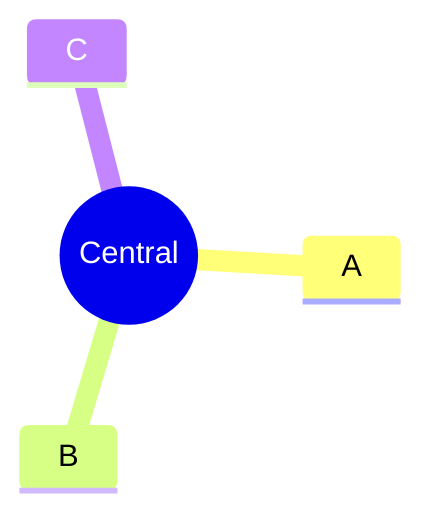

**Usado em:** Políticas, conceitos

---

### 6. Timeline (Linha do Tempo)

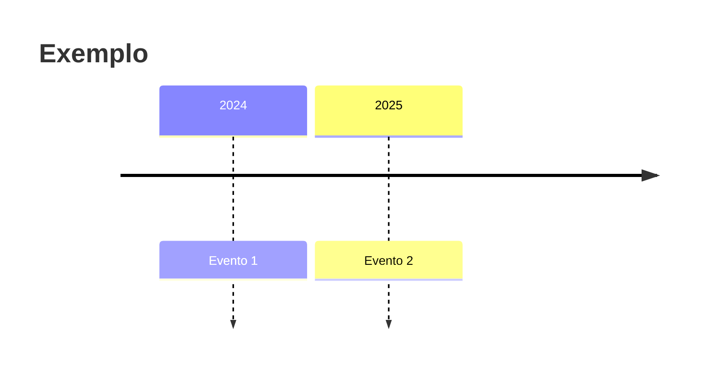

**Usado em:** Roadmap, evolução

---

### 7. Journey (Jornada)

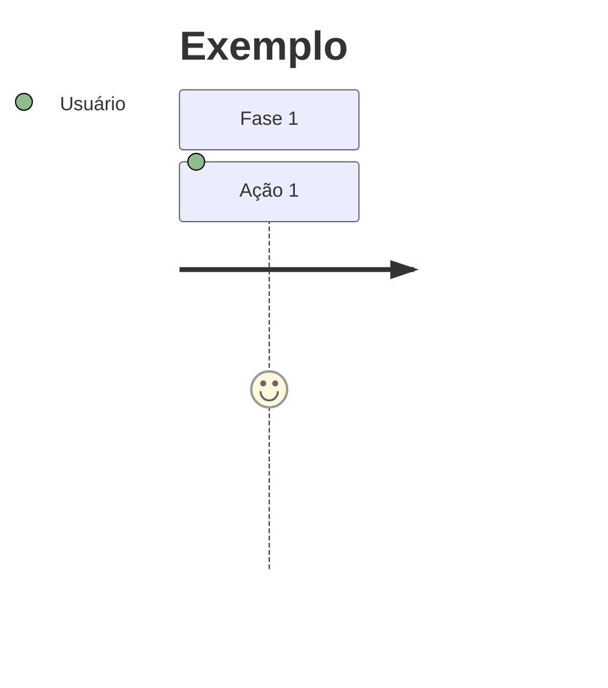

**Usado em:** Experiência do usuário

---

### 8. Quadrant (Quadrante)

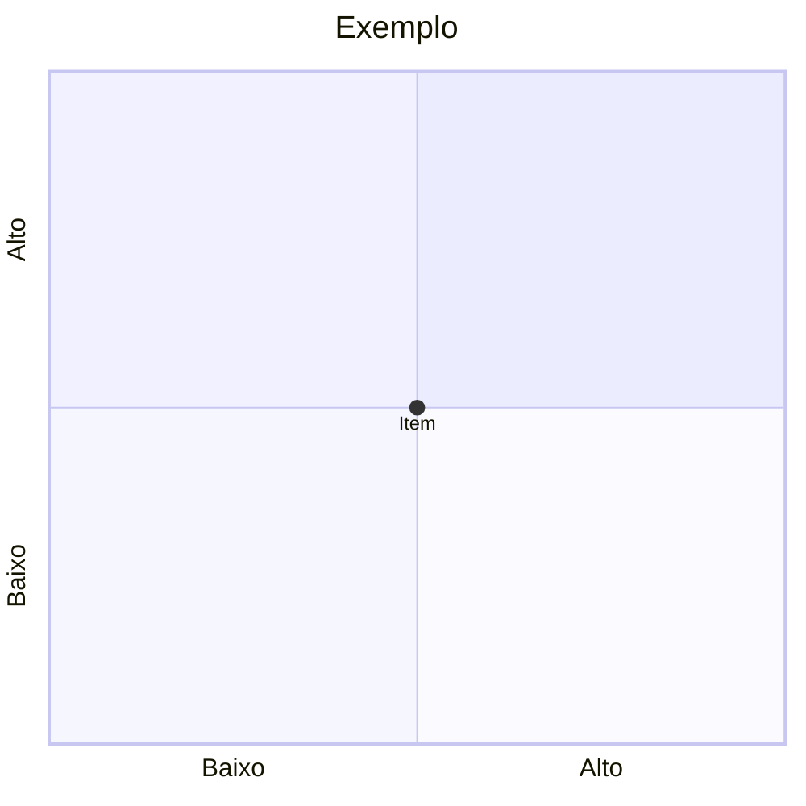

**Usado em:** Análise de diferenciais

---

## 🎨 Paleta de Cores

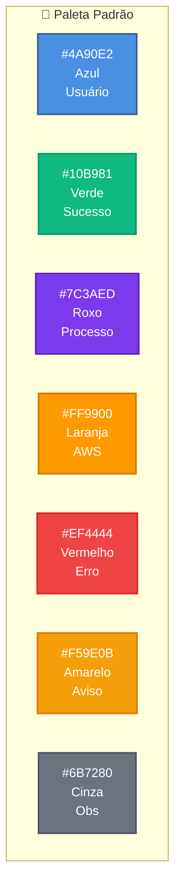

---

## 📈 Métricas de Qualidade

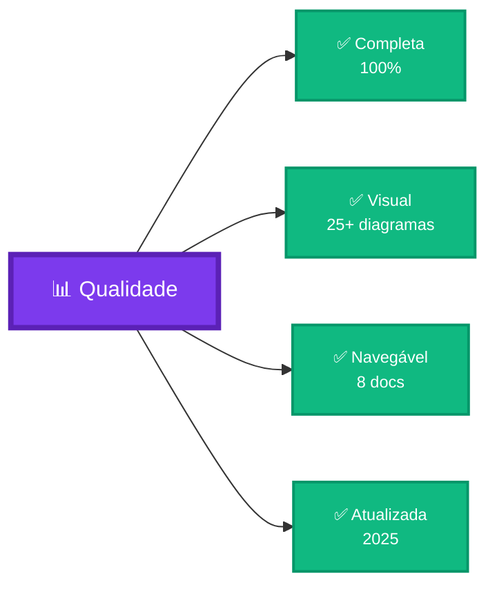

**Indicadores:**
- ✅ **Cobertura:** 100% do projeto documentado
- ✅ **Visualização:** 25+ diagramas Mermaid
- ✅ **Navegação:** 8 documentos interligados
- ✅ **Atualização:** Janeiro 2025
- ✅ **Acessibilidade:** Múltiplos níveis de detalhe
- ✅ **Compatibilidade:** GitHub, GitLab, VS Code

---

## 🔗 Interligação dos Documentos

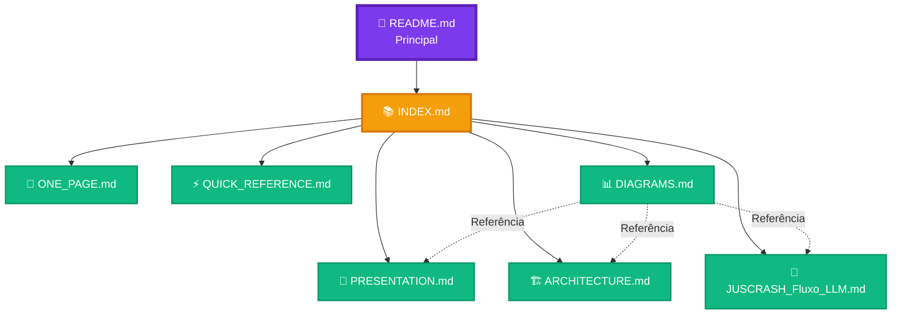

---

## 🎯 Fluxo de Leitura Recomendado

### Iniciante (15 minutos)


---

### Intermediário (35 minutos)


---

### Avançado (70 minutos)

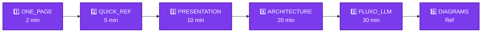

---

## 🏆 Diferenciais da Documentação

```mermaid
graph TD
    Docs[📚 Documentação<br/>JUSCRASH]:::main
    
    Docs --> D1[🎨 100% Visual<br/>Mermaid]:::diff
    Docs --> D2[📊 25+ Diagramas<br/>Interativos]:::diff
    Docs --> D3[🗺️ Navegação<br/>Facilitada]:::diff
    Docs --> D4[⏱️ Múltiplos<br/>Níveis]:::diff
    Docs --> D5[🔍 Busca<br/>Inteligente]:::diff
    Docs --> D6[✅ Completa<br/>100%]:::diff
    
    classDef main fill:#7C3AED,stroke:#5B21B6,stroke-width:4px,color:#fff,font-size:16px
    classDef diff fill:#10B981,stroke:#059669,stroke-width:2px,color:#fff,font-size:12px
```

**Características únicas:**
- ✅ Única documentação 100% visual com Mermaid
- ✅ 25+ diagramas interativos
- ✅ Navegação por público/tempo/objetivo
- ✅ Múltiplos níveis de detalhe (2-30 min)
- ✅ Busca facilitada com índice
- ✅ Cobertura completa do projeto

---

## 📝 Checklist de Uso

### Para Leitores

- [ ] Escolher documento por público-alvo
- [ ] Escolher documento por tempo disponível
- [ ] Seguir fluxo de leitura recomendado
- [ ] Consultar INDEX.md para navegação
- [ ] Usar DIAGRAMS.md como referência

### Para Contribuidores

- [ ] Ler todos os documentos
- [ ] Entender padrões visuais
- [ ] Usar paleta de cores padrão
- [ ] Manter consistência de ícones
- [ ] Atualizar INDEX.md se adicionar docs
- [ ] Testar renderização Mermaid

---

## 🔗 Links Rápidos

| Documento | Link Direto |
|-----------|-------------|
| 📄 **ONE_PAGE** | [ONE_PAGE.md](ONE_PAGE.md) |
| ⚡ **QUICK_REFERENCE** | [QUICK_REFERENCE.md](QUICK_REFERENCE.md) |
| 🎯 **PRESENTATION** | [PRESENTATION.md](PRESENTATION.md) |
| 🏗️ **ARCHITECTURE** | [ARCHITECTURE.md](ARCHITECTURE.md) |
| 📊 **DIAGRAMS** | [DIAGRAMS.md](DIAGRAMS.md) |
| 📄 **FLUXO_LLM** | [JUSCRASH_Fluxo_LLM.md](JUSCRASH_Fluxo_LLM.md) |
| 📚 **INDEX** | [INDEX.md](INDEX.md) |
| 📖 **README** | [README.md](README.md) |

---

## 🎓 Conclusão

```mermaid
graph TB
    Start[🎯 Objetivo]:::start --> Docs[📚 Documentação<br/>Completa]:::docs
    
    Docs --> Result1[✅ Fácil<br/>Entendimento]:::result
    Docs --> Result2[✅ Múltiplos<br/>Públicos]:::result
    Docs --> Result3[✅ Visual<br/>Atrativo]:::result
    Docs --> Result4[✅ Navegação<br/>Simples]:::result
    
    classDef start fill:#4A90E2,stroke:#2E5C8A,stroke-width:3px,color:#fff
    classDef docs fill:#7C3AED,stroke:#5B21B6,stroke-width:4px,color:#fff,font-size:16px
    classDef result fill:#10B981,stroke:#059669,stroke-width:2px,color:#fff
```

**Documentação JUSCRASH:**
- ✅ 8 documentos principais
- ✅ 25+ diagramas Mermaid
- ✅ 100% visual e interativo
- ✅ Navegação facilitada
- ✅ Múltiplos níveis de detalhe
- ✅ Cobertura completa

---

**Autor:** José Cleiton  
**Projeto:** JUSCRASH  
**Data:** Janeiro 2025  
**Status:** ✅ Completo

---

**🎯 Próximo passo:** Comece por [ONE_PAGE.md](ONE_PAGE.md) ou [INDEX.md](INDEX.md)
