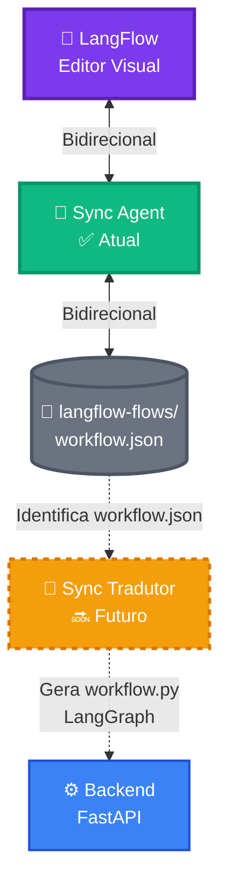
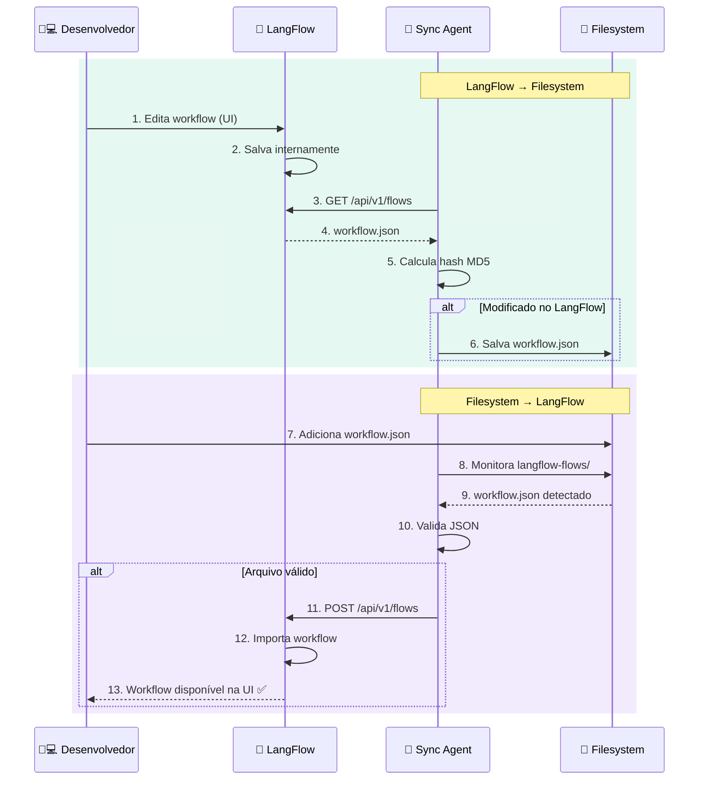

# 🔄 JUSCRASH - Fluxo de Sincronização

Documentação visual do **Sync Agent** e **Sync Tradutor** para sincronização bidirecional e tradução de workflows.

---

## 🎯 Visão Geral

**Componentes:**
- **Sync Agent** (✅ Implementado) - Sincronização bidirecional LangFlow ⇄ Filesystem
- **Sync Tradutor** (🔜 Futuro) - Traduz workflow.json → Python LangGraph

---

## 🔄 1. Sync Agent (Atual)

### Fluxo Bidirecional

---

**Autor:** José Cleiton  
**Projeto:** JUSCRASH  
**Data:** Janeiro 2025
