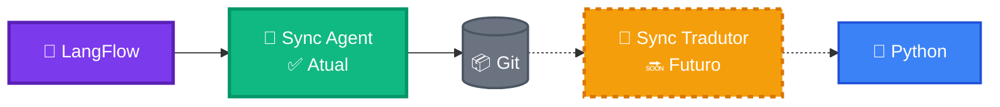
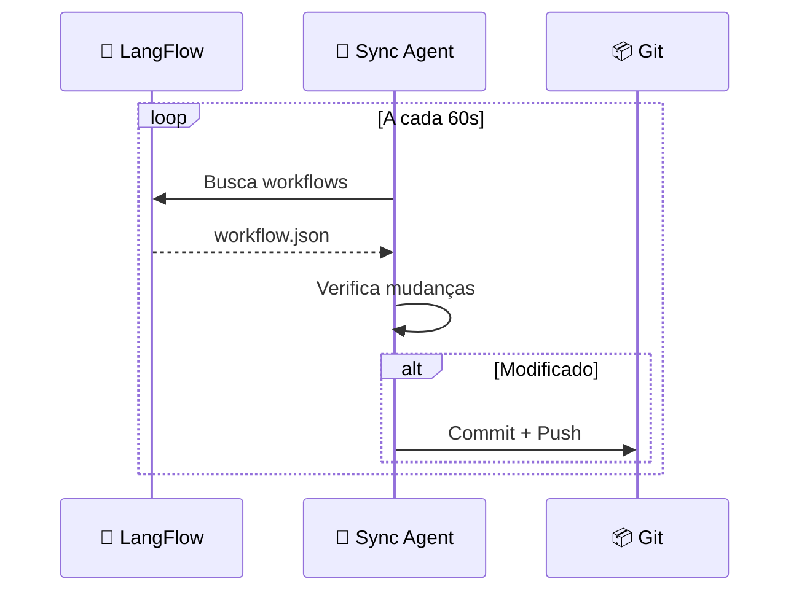
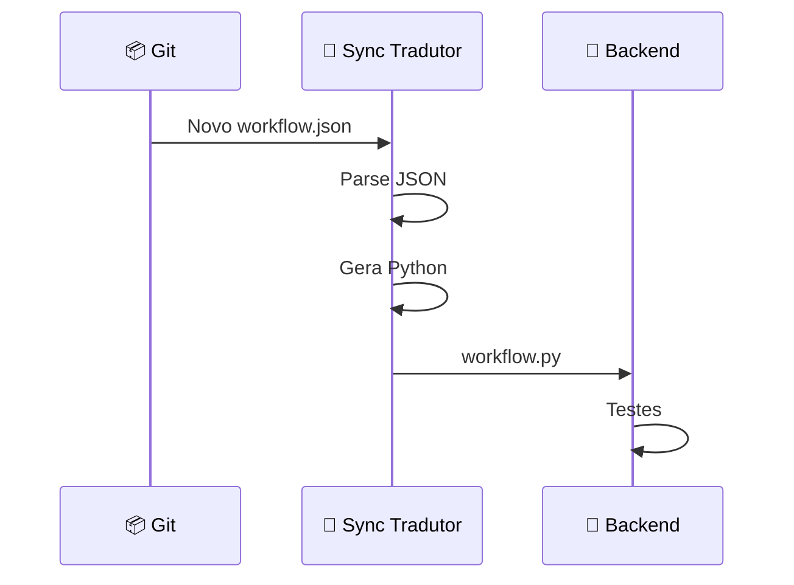

# 🔄 Fluxo de Sincronização - JUSCRASH

## 📊 Visão Geral

```mermaid
graph LR
    LF[🎨 LangFlow]:::lf --> SA[🔄 Sync Agent<br/>✅ Atual]:::current
    SA --> Git[(📦 Git)]:::git
    Git -.-> ST[🔧 Sync Tradutor<br/>🔜 Futuro]:::future
    ST -.-> Code[🐍 Python]:::code
    
    classDef lf fill:#7C3AED,stroke:#5B21B6,stroke-width:3px,color:#fff
    classDef current fill:#10B981,stroke:#059669,stroke-width:3px,color:#fff
    classDef git fill:#6B7280,stroke:#4B5563,stroke-width:2px,color:#fff
    classDef future fill:#F59E0B,stroke:#D97706,stroke-width:3px,color:#fff,stroke-dasharray: 5 5
    classDef code fill:#3B82F6,stroke:#1D4ED8,stroke-width:2px,color:#fff
```

---

## 🔄 Sync Agent (Implementado)

```mermaid
sequenceDiagram
    participant LF as 🎨 LangFlow
    participant SA as 🔄 Sync Agent
    participant Git as 📦 Git
    
    loop A cada 60s
        SA->>LF: Busca workflows
        LF-->>SA: workflow.json
        SA->>SA: Verifica mudanças
        alt Modificado
            SA->>Git: Commit + Push
        end
    end
```

---

## 🔧 Sync Tradutor (Futuro)

```mermaid
sequenceDiagram
    participant Git as 📦 Git
    participant ST as 🔧 Sync Tradutor
    participant Code as 🐍 Backend
    
    Git->>ST: Novo workflow.json
    ST->>ST: Parse JSON
    ST->>ST: Gera Python
    ST->>Code: workflow.py
    Code->>Code: Testes
```

---

**Ver documentação completa:** [SYNC_FLOW.md](SYNC_FLOW.md)
