# ⚙️ Backend - JUSCASH

Deploy e configuração do backend (Lambda + Bedrock + LangGraph) com Terraform.

---

## 🎯 O que é?

**Backend JUSCASH** é uma aplicação serverless que:
- ✅ Recebe processos judiciais via API REST
- ✅ Orquestra análise com LangGraph
- ✅ Invoca Claude 3.5 Sonnet via Bedrock
- ✅ Retorna decisões estruturadas (JSON)
- ✅ Escala automaticamente

**Stack:** FastAPI + LangGraph + AWS Bedrock + Lambda

---

## 🏗️ Arquitetura

```mermaid
graph LR
    User[👤 Usuário]:::user --> API[🚪 API Gateway]:::aws
    API --> Lambda[⚡ Lambda]:::aws
    Lambda --> Bedrock[🧠 Claude 3.5]:::ai
    
    classDef user fill:#4A90E2,stroke:#2E5C8A,stroke-width:3px,color:#fff
    classDef aws fill:#FF9900,stroke:#CC7A00,stroke-width:2px,color:#fff
    classDef ai fill:#10B981,stroke:#059669,stroke-width:3px,color:#fff
```



---

## 🚀 Deploy

### Via Docker (Recomendado)

```bash
cd app-remoto/infrastructure

# Inicializar Terraform
docker compose -f docker-compose.deploy.yml run --rm terraform-init

# Planejar mudanças
docker compose -f docker-compose.deploy.yml run --rm terraform-plan

# Aplicar infraestrutura
docker compose -f docker-compose.deploy.yml run --rm terraform-apply

# Deploy backend (Lambda ZIP)
docker compose -f docker-compose.deploy.yml run --rm deploy-backend
```

**Atalhos via Makefile:**
```bash
make init              # Terraform init
make plan              # Terraform plan
make apply             # Terraform apply
make deploy-backend    # Deploy Lambda ZIP
```

### Via Terraform Direto (sem Docker)

```bash
cd app-remoto/infrastructure

terraform init
terraform plan
terraform apply

# Build e deploy Lambda ZIP manualmente
cd ../agent-core
pip install -r requirements.txt -t package/
cp -r src/* package/
cd package && zip -r ../lambda.zip . && cd ..
aws lambda update-function-code \
  --function-name juscrash-agent-core \
  --zip-file fileb://lambda.zip
```

**Recursos criados:**
- ✅ Lambda Function (`juscrash-agent-core`)
- ✅ API Gateway REST
- ✅ IAM Role com permissões mínimas
- ✅ CloudWatch Log Group
- ✅ S3 Bucket (Lambda ZIP storage)

---

## 🔧 Configuração

### Lambda Function

**Arquivo:** `app-remoto/infrastructure/lambda.tf`

```hcl
resource "aws_lambda_function" "agent_core" {
  function_name    = "juscrash-agent-core"
  role             = aws_iam_role.lambda_role.arn
  runtime          = "python3.11"
  handler          = "handler.handler"
  filename         = "lambda.zip"
  source_code_hash = filebase64sha256("lambda.zip")
  timeout          = 60
  memory_size      = 1024
  
  environment {
    variables = {
      BEDROCK_MODEL_ID     = "anthropic.claude-3-5-sonnet-20241022-v2:0"
      LANGCHAIN_API_KEY    = var.langchain_api_key
      LANGCHAIN_PROJECT    = "juscrash"
    }
  }
}
```

---

## 📦 Estrutura do Código

```
app-remoto/agent-core/
├── src/
│   ├── handler.py           # Lambda entry point
│   ├── workflow_bedrock.py  # LangGraph workflow
│   ├── models.py            # Pydantic schemas
│   ├── llm_service.py       # Bedrock client
│   └── observability.py     # LangSmith setup
├── requirements.txt
├── .env.example
└── build.sh             # Script para gerar lambda.zip
```

### handler.py (Entry Point)

```python
from mangum import Mangum
from fastapi import FastAPI
from src.workflow_bedrock import app_workflow
from src.models import Processo, DecisionResponse

app = FastAPI()

@app.post("/api/v1/verificar", response_model=DecisionResponse)
async def verificar_processo(processo: Processo):
    result = app_workflow.invoke({"processo": processo})
    return result["decision"]

@app.get("/health")
async def health():
    return {"status": "ok", "service": "juscrash-api"}

handler = Mangum(app)
```

---

## 🧪 Testar Backend

```bash
# Health check
curl https://3p6xtd91q4.execute-api.us-east-1.amazonaws.com/prod/health

# Verificar processo
curl -X POST https://3p6xtd91q4.execute-api.us-east-1.amazonaws.com/prod/api/v1/verificar \
  -H "Content-Type: application/json" \
  -d @data/processos_exemplo.json
```

---

## 📊 Monitoramento

```bash
# CloudWatch Logs
make logs

# LangSmith Traces
# https://smith.langchain.com
```

---

## 💰 Custos

**10k requests/mês:** ~$20

- Bedrock: $15
- Lambda: $5
- API Gateway: $0.35

---

## 🔄 Atualizar Backend

```bash
cd app-remoto/infrastructure

# Deploy backend
make deploy-backend

# Ver logs
make logs
```

---

## 🔐 Variáveis de Ambiente

**Arquivo:** `keys/.env`

```bash
AWS_ACCESS_KEY_ID=AKIA...
AWS_SECRET_ACCESS_KEY=...
BEDROCK_MODEL_ID=anthropic.claude-3-5-sonnet-20241022-v2:0
LANGCHAIN_API_KEY=lsv2_pt_...
```

---

## 🐛 Troubleshooting

| Problema | Solução |
|----------|----------|
| Lambda timeout | Aumentar `timeout` em `lambda.tf` |
| Bedrock throttling | Solicitar aumento de quota AWS |
| Erro de permissão | Verificar IAM role no Terraform |

---

## 📚 Referências

- [FRONTEND.md](FRONTEND.md)
- [TERRAFORM.md](TERRAFORM.md)
- [QUICKSTART.md](QUICKSTART.md)

---

**Autor:** José Cleiton  
**Projeto:** JUSCASH  
**Versão:** 1.0
