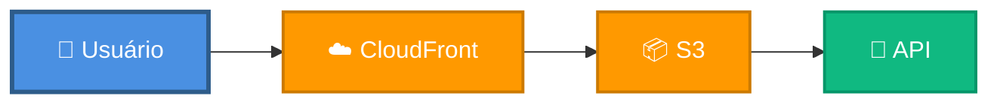

# 🖥️ Frontend - JUSCASH

Deploy e configuração do frontend (React + Material UI + CloudFront + S3) com Terraform.

---

## 🎯 O que é?

**Frontend JUSCASH** é uma aplicação React moderna que:
- ✅ Interface intuitiva para upload de processos
- ✅ Visualização de decisões em tempo real
- ✅ Design responsivo (mobile-first)
- ✅ Material UI components
- ✅ Deploy via CloudFront + S3

**Stack:** React 18 + Material UI + Vite + Axios

---

## 🏗️ Arquitetura



---

## 🚀 Deploy

### Via Docker (Recomendado)

```bash
cd app-remoto/infrastructure

# Deploy frontend
docker compose -f docker-compose.deploy.yml run --rm deploy-frontend

# Ou via Makefile
make deploy-frontend
```

### Via Manual

```bash
cd app-remoto/frontend
npm install
npm run build

aws s3 sync dist/ s3://juscrash-frontend-bucket --delete
aws cloudfront create-invalidation --distribution-id E1234567890ABC --paths "/*"
```

---

## 🔧 Configuração

### S3 Bucket

**Arquivo:** `app-remoto/infrastructure/s3.tf`

```hcl
resource "aws_s3_bucket" "frontend" {
  bucket = "juscrash-frontend-bucket"
}

resource "aws_s3_bucket_website_configuration" "frontend" {
  bucket = aws_s3_bucket.frontend.id
  index_document { suffix = "index.html" }
  error_document { key = "index.html" }
}
```

### CloudFront

**Arquivo:** `app-remoto/infrastructure/cloudfront.tf`

```hcl
resource "aws_cloudfront_distribution" "frontend" {
  enabled             = true
  default_root_object = "index.html"
  
  origin {
    domain_name = aws_s3_bucket_website_configuration.frontend.website_endpoint
    origin_id   = "S3-juscrash-frontend"
  }
  
  custom_error_response {
    error_code         = 404
    response_code      = 200
    response_page_path = "/index.html"
  }
}
```

---

## 📦 Estrutura do Código

```
app-remoto/frontend/
├── src/
│   ├── components/
│   │   ├── ProcessoForm.jsx
│   │   └── ResultCard.jsx
│   ├── services/
│   │   └── api.js
│   └── App.jsx
├── package.json
└── .env.production
```

---

## 🧪 Testar Frontend

```bash
# Local
cd app-remoto/frontend
npm install
npm run dev

# Produção
open https://d26fvod1jq9hfb.cloudfront.net
```

---

## 💰 Custos

**10k usuários/mês:** ~$6

- CloudFront: $5
- S3: $0.50

---

## 🔄 Atualizar Frontend

```bash
cd app-remoto/infrastructure

# Via Docker
docker compose -f docker-compose.deploy.yml run --rm deploy-frontend

# Ou via Makefile
make deploy-frontend
```

---

## 🔐 Variáveis de Ambiente

```bash
# .env.production
VITE_API_URL=https://3p6xtd91q4.execute-api.us-east-1.amazonaws.com/prod
```

---

## 🐛 Troubleshooting

| Problema | Solução |
|----------|---------|
| Cache desatualizado | Invalidar CloudFront |
| CORS error | Configurar API Gateway |
| 404 em rotas | Configurar error_response |

---

## 📚 Referências

- [BACKEND.md](BACKEND.md)
- [TERRAFORM.md](TERRAFORM.md)
- [QUICKSTART.md](QUICKSTART.md)

---

**Autor:** José Cleiton  
**Projeto:** JUSCASH  
**Versão:** 1.0
