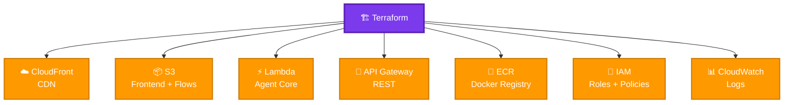
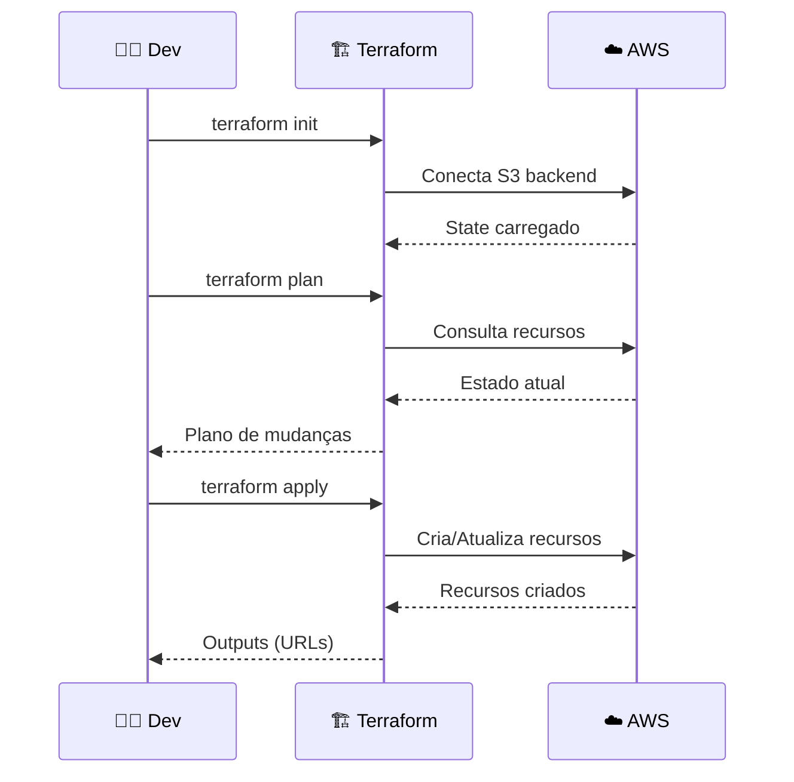

# 🏗️ Terraform - JUSCASH

Infraestrutura como código (IaC) para AWS.

---

## 📦 Recursos Criados



---

## 🚀 Comandos

```bash
cd app-remoto/infrastructure

terraform init      # Inicializar
terraform plan      # Planejar
terraform apply     # Aplicar
terraform output    # Ver URLs
terraform destroy   # Destruir
```

---

## 📁 Arquivos

```
infrastructure/
├── main.tf           # Provider + Backend
├── variables.tf      # Variáveis
├── outputs.tf        # Outputs
├── lambda.tf         # Lambda + IAM
├── apigateway.tf     # API Gateway
├── cloudfront.tf     # CDN
├── s3.tf             # Buckets
└── Makefile          # Comandos
```

---

## 🔧 Configuração

### **Backend S3 (State)**

```bash
# Criar bucket (primeira vez)
aws s3 mb s3://juscrash-terraform-state
aws s3api put-bucket-versioning \
  --bucket juscrash-terraform-state \
  --versioning-configuration Status=Enabled
```

---

### **Variáveis**

Edite `terraform.tfvars`:

```hcl
aws_region   = "us-east-1"
environment  = "prod"
project_name = "juscrash"
langsmith_api_key = "lsv2_pt_..."
```

---

## 📊 Outputs

```bash
terraform output
```

**Saída:**
```
frontend_url = "https://d26fvod1jq9hfb.cloudfront.net"
api_url = "https://3p6xtd91q4.execute-api.us-east-1.amazonaws.com/prod"
lambda_function_name = "juscrash-agent-core"
cloudfront_distribution_id = "E1234567890ABC"
```

---

## 🔄 Fluxo de Deploy



---

## 🧪 Validação

```bash
# Validar sintaxe
terraform validate

# Formatar código
terraform fmt

# Ver estado
terraform show

# Listar recursos
terraform state list
```

---

## 🔄 Atualização

```bash
# Atualizar recurso específico
terraform apply -target=aws_lambda_function.agent_core

# Ver plano sem aplicar
terraform plan -out=tfplan

# Aplicar plano salvo
terraform apply tfplan
```

---


## 🐛 Troubleshooting

### **Erro: Backend not initialized**
```bash
terraform init
```

### **Erro: State locked**
```bash
terraform force-unlock <LOCK_ID>
```

### **Erro: Resource already exists**
```bash
terraform import aws_s3_bucket.frontend juscrash-frontend
```

---

## 📚 Referências

- **Terraform AWS:** https://registry.terraform.io/providers/hashicorp/aws
- **Best Practices:** https://www.terraform-best-practices.com/
- **Backend:** [BACKEND.md](BACKEND.md)
- **Frontend:** [FRONTEND.md](FRONTEND.md)

---

**Autor:** José Cleiton  
**Projeto:** JUSCASH  
**Versão:** 1.0
